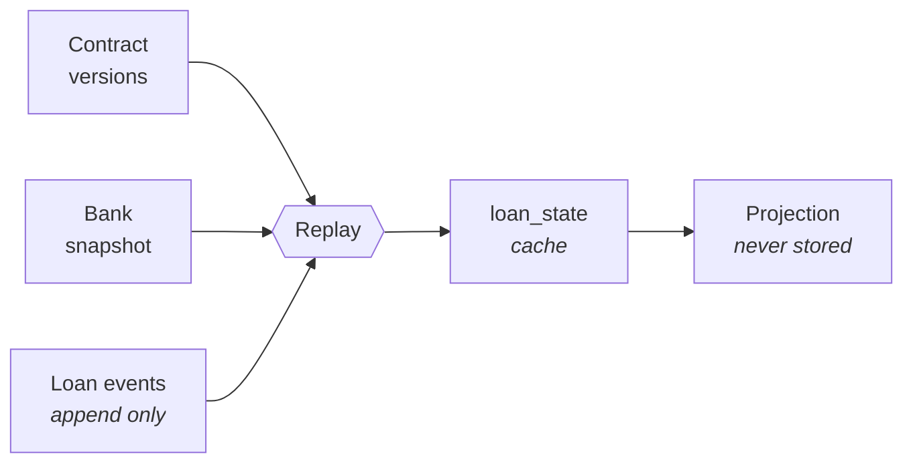
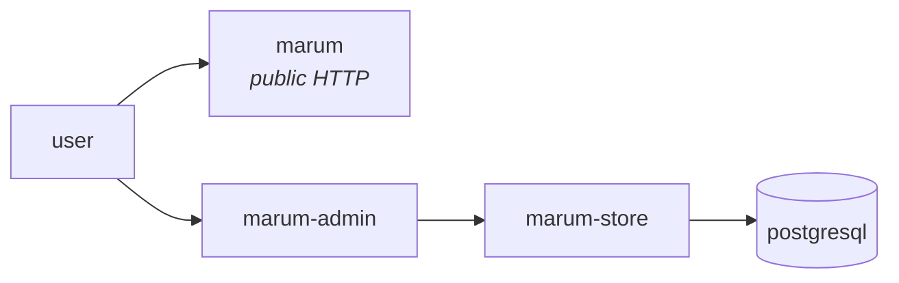

# Marum · Մարում

**Pay off smarter.** An open-source Telegram bot that keeps your loans in one
place, reminds you before every payment, and works out how to clear them for
the least money.

No AI. Every figure comes from a published formula over data you entered, and
the same inputs always produce the same answer.

> Marum is a loan ledger and planner. It does not move money, touch bank
> accounts, refinance, recommend lenders, or replace the lender's official
> balance and repayment schedule.

---

## Contents

- [Status](#status)
- [Quick start](#quick-start)
- [How it works](#how-it-works)
- [Repository layout](#repository-layout)
- [Documentation](#documentation)
- [Development](#development)
- [Releasing and deployment](#releasing-and-deployment)
- [Observability](#observability)
- [Privacy](#privacy)
- [Contributing](#contributing)
- [Licence](#licence)

---

## Status

**Phase 1 — the calculation engine and the ledger.** Nothing is deployed and
there is no public bot yet. The engine, the schema, the admin interface and the
observability stack all run locally.

| Phase | Scope | State |
| --- | --- | --- |
| 0 | Collect real Armenian schedules and lender policies | One lender, two documents |
| **1** | **Money, dates, dated accrual, ledger replay** | **Engine done; a real loan agreement reproduces exactly; the corpus needs more lenders** |
| 2 | Durable Telegram inbox, one loan, reminders, payment recording | Not started |
| 3 | Multiple loans, repayment strategies | Not started |
| 4 | Test environment, Telegram Stars, entitlements | Not started |
| 5 | Fee-aware optimiser, further repayment types | Not started |

Phase 1 cannot close until **ten real repayment schedules from four lenders
reproduce to the minor unit**. That gate sits in front of every user-facing
number, and two of the ten are in place — both of them the same Inecobank
consumer loan, contract M26/029210. The engine reproduces 59 of the 59
non-final rows of the loan agreement exactly — to the luma, the hundredth of a
dram, on interest and on principal; the shorter schedule the bank re-issued
five months later reproduces 52 of its 54. What each fixture proves, and what
it does not, is recorded in [the corpus](testdata/golden/README.md).

---

## Quick start

Docker is the only prerequisite — no local Go toolchain is needed.

```bash
cp .env.example .env             # add a Telegram bot token from @BotFather
make admin-password              # paste the hash into MARUM_ADMIN_PASSWORD_HASH
make up                          # app, database, and the observability stack
make migrate                     # apply the schema
make seed                        # demo data, so the interfaces have content
make test                        # unit tests, race detector on
```

| | Address |
| --- | --- |
| Health, readiness, status | <http://127.0.0.1:8080/healthz> |
| Admin interface | <http://127.0.0.1:8081> |
| Grafana — provisioned, no login | <http://127.0.0.1:3000> |
| PostgreSQL | `127.0.0.1:5432` |

The bot uses **long polling** locally, so no public URL or tunnel is needed.
Production uses webhooks; everything below the transport is the same code.

Full walkthrough: [docs/operations/local-development.md](docs/operations/local-development.md)

---

## How it works

Four things are kept apart, because they change for different reasons:

1. **Contract terms** — immutable, versioned. A restructuring is a new version.
2. **Bank snapshots** — what the lender reported, on a stated date. Never
   inferred, and only a *confirmed* snapshot resets drift.
3. **Loan events** — append-only. What the borrower reported. A mistake is
   voided by another row, never edited.
4. **Derived state** — a rebuildable cache. Delete it and replay produces it
   again, byte for byte.

Schedules and plans are **projections**: computed on demand, never stored.



Two invariants matter more than the rest:

- **Money is `int64` minor units.** Never a float. Interest accrual runs through
  a 128-bit intermediate, because `principal × rate × days` overflows 64 bits
  above roughly 16.5M AMD at 18% — ordinary mortgage territory here — and the
  naive version fails **silently**.
- **Telegram delivery is at-least-once.** The gap between Telegram accepting a
  message and Marum recording it cannot be closed, so reminders are worded to
  read correctly if one arrives twice.

Currencies are supported from the start. A currency's ISO exponent and its
settlement unit are separate facts: AMD has two decimal places on paper and
settles to a tenth of a dram, the yen has none, the dinar has three. AMD
settled in whole drams here until the loan agreement in the corpus refuted it:
it prints an instalment of 125,079.60, and not one of its 60 rows is a whole
dram. Budgets and plans are **per currency** — allocating a dram budget across
a dollar loan needs an exchange rate, and Marum has no validated source for
one.

More: [docs/architecture/01-overview.md](docs/architecture/01-overview.md)

---

## Repository layout

```
cmd/marum/            wiring only — flags, config, signals, shutdown
pkg/core/             the engine: pure, deterministic, no I/O
  money/              Amount, Rate, currencies, rounding, dated accrual
  date/               date-only arithmetic and anchored schedules
  model/              Contract, Snapshot, Event, Buckets, LoanState
  allocation/         per-lender payment allocation policies
  ledger/             replay(contract, snapshot, events) -> state
internal/
  app/                use cases and the read model; owns the port interfaces
  adapter/in/         admin, httpapi, telegram
  adapter/out/        postgres, telegramclient, sysclock
  obs/                OpenTelemetry, redaction, components, metrics
  config/             environment parsing and validation
  corpus/             replays the golden schedules; here, not in pkg/core, since it reads files
queries/              every SQL statement, embedded and named
migrations/           goose SQL, expand-only
testdata/golden/      the correctness corpus: schedules real lenders issued
deploy/               Dockerfile, Cloudflare, Terraform, observability configs
docs/                 architecture, operations, design
```

Dependencies point inward: adapters depend on `internal/app`, which depends on
`pkg/core`. The engine imports nothing from `internal/` — enforced by
`depguard` in [`.golangci.yml`](.golangci.yml) and by a CI job that builds the
engine on its own.

---

## Documentation

Everything lives in [`docs/`](docs/README.md).

| | |
| --- | --- |
| **Architecture** | [Overview](docs/architecture/01-overview.md) · [Domain model](docs/architecture/02-domain-model.md) · [Ledger and replay](docs/architecture/03-ledger-replay.md) · [Money and dates](docs/architecture/04-money-and-dates.md) · [Database](docs/architecture/05-database.md) · [Admin UI](docs/architecture/06-admin-ui.md) · [Messaging](docs/architecture/07-messaging.md) · [Observability](docs/architecture/08-observability.md) |
| **Operations** | [Local development](docs/operations/local-development.md) · [Environments](docs/operations/environments.md) · [Releasing](docs/operations/releases.md) · [Deployment](docs/operations/deployment.md) · [Infrastructure](deploy/terraform/README.md) · [Grafana Cloud](docs/operations/grafana-cloud.md) · [Runbooks](docs/operations/runbooks.md) |
| **Reference** | [Correctness corpus](testdata/golden/README.md) · [Engineering guide](docs/engineering-guide.md) · [Design document (PDF)](docs/design/Marum-MVP-System-and-Architecture-Design.pdf) · [Long-form design](docs/design/reliable-mvp-design.md) · [AGENTS.md](AGENTS.md) |

---

## Development

```bash
make up / up-core / down / reset / logs
make test / test-short / lint / vet / fmt
make migrate / migrate-down / migrate-status / migrate-check
make seed / shell / admin-password
make load / grafana
make tf-plan ENV=dev / tf-apply ENV=dev / tf-output ENV=dev   # deploys apply automatically
```

All targets run inside containers.

### Testing

| Layer | Proves |
| --- | --- |
| Correctness corpus | Marum reproduces a real lender's schedule to the minor unit — today, 59 of the 59 non-final rows of an Inecobank loan agreement |
| Property tests | Money never appears or disappears across allocation buckets |
| Ledger replay | `replay(events) == loan_state`, including under concurrency |
| Integration | Real Postgres: leases, idempotency, migration reversibility |
| Journeys | Whole conversations against a fake Telegram transport |

Every user-reported calculation discrepancy becomes a golden fixture **before**
the fix is written. The corpus is the asset: the engine is replaceable, the
evidence that it matches real paperwork is not. A fixture that fails is worth
more than one that passes, because it names a convention the engine does not
yet know — that is how AMD came to settle to a tenth of a dram rather than to
the whole one. See [testdata/golden](testdata/golden/README.md).

---

## Releasing and deployment

Tags are the trigger and the source of truth. `vMAJOR.MINOR.PATCH`; below
1.0.0 nothing is promised to be stable, and the workflow marks `0.x` as a
pre-release so that is visible rather than assumed.

```bash
git tag -a v0.3.0 -m "reminders and payment recording"
git push origin v0.3.0
```

The release workflow validates the tag, runs the full suite, checks that the
**previous release still works against this schema**, builds a multi-arch image
with an SBOM and provenance, and publishes a GitHub Release. Deployment follows
a published release, never a branch.

Infrastructure is separate and deliberately slower. Terraform owns the
Hyperdrive configs, the backup bucket and the zone's TLS settings; `wrangler`
owns the Worker and its secrets. Cloudflare sells no managed PostgreSQL, so the
database is hosted at Neon and Hyperdrive pools in front of it. Nothing applies
automatically: a pull request gets a plan as a comment, and applying is a manual
run behind the same approval gate as a production deploy.

Details: [releasing](docs/operations/releases.md) · [deployment](docs/operations/deployment.md) · [infrastructure](deploy/terraform/README.md)

---

## Observability

`make up` starts Prometheus, Loki, Tempo, Pyroscope and Grafana alongside the
app, with **datasources and dashboards provisioned from files** — nothing is
clicked into existence, so a rebuilt stack comes back identical.

The application sends OTLP to **one endpoint** in development and production
alike; only the URL differs. A latency spike is one click from the trace that
caused it, a span one click from its logs and from the flame graph of that span.

Marum is one deployable but several independent pieces of work, so each
component reports as its own service and the graph shows the real flow rather
than a single node:



Details: [docs/architecture/08-observability.md](docs/architecture/08-observability.md)

---

## Privacy

Marum never asks for bank credentials, card numbers, CVV codes, passport or
social-card numbers. Input resembling any of those is rejected without being
stored.

Telegram identifiers are encrypted and kept in a separate table from financial
records. No amount, chat ID or lender name reaches a log or a metric label —
the redacting handler strips amounts **by type**, not by field name. Export and
account deletion are always available and always free, and a restored backup
cannot resurrect an erased account.

---

## Contributing

Read the [engineering guide](docs/engineering-guide.md) first; it explains the
five invariants and what enforces each. In short:

- Conventional Commits, subject ≤ 50 characters, sign off with `git commit -s`
- `make lint test` green before opening a pull request
- If it touches money, a golden fixture covers it
- No unbounded metric label, ever

---

## Licence

AGPL-3.0-or-later. The hosted service sells operation — managed infrastructure,
reliable delivery, backups, support — not computation. Anyone running it
themselves gets exactly the same arithmetic.
