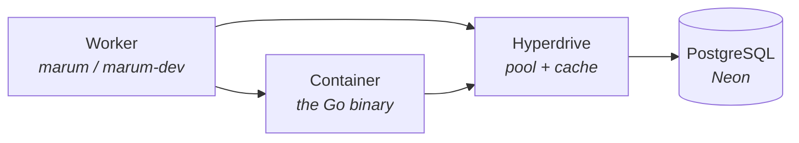

# Infrastructure

Terraform describes the Cloudflare resources Marum needs before a deploy can
work. It is not the deploy: `wrangler` ships the Worker, and this ships what the
Worker binds to.

## Where the database actually lives

**Cloudflare does not sell a managed PostgreSQL.** Its own database product is
D1, which is SQLite. The design rejected D1 because the ledger's arithmetic has
to be identical in development and production, and there is no faithful local
twin of D1 to test against.

So Postgres is hosted elsewhere — Neon by default — and **Hyperdrive** sits in
front of it. Hyperdrive is a connection pooler and query cache, not a database.
It exists because a Worker has no persistent connections and can start in any
Cloudflare location, so without it every isolate would open its own TCP and TLS
handshake to a database sitting in one region.



## Who owns what

| Owner | Resources |
| --- | --- |
| **Terraform** | Hyperdrive configs, the backup bucket and its lifecycle rules, zone TLS and HSTS settings |
| **wrangler** | The Worker, its routes, its DNS record, its secrets, the container |
| **A person, once** | The Neon project, the R2 state bucket, API tokens |

Two of those boundaries are load-bearing:

**Terraform does not create the bot's DNS record.** `custom_domain = true` in
`wrangler.toml` makes Cloudflare create it, and Cloudflare refuses a Custom
Domain on a hostname that already carries a CNAME. A record made here would
break the deploy it was meant to enable.

**Terraform does not create the database.** There is no first-party Neon
provider, and the database is the only resource here whose accidental
destruction cannot be undone by running `apply` again. It is made once by hand
and passed in as a variable.

## Bootstrap

Four things exist before the first `apply`. Each is done once per account.

### 1. The database

Create a Neon project in a region close to your users — `eu-central-1` for
Armenia. Create a database named `marum` and a role named `marum`. Keep the
**direct** connection string, not the pooled one: Hyperdrive is the pooler, and
pooling twice is how you run out of connections while both pools look idle.

### 2. The state bucket

Terraform cannot create the bucket that holds its own state.

```bash
wrangler r2 bucket create marum-terraform-state
```

### 3. Credentials for the state bucket

R2 speaks the S3 API, so Terraform's `s3` backend works against it. In the
Cloudflare dashboard, **R2 → Manage API tokens → Create token**, with *Object
Read & Write* limited to `marum-terraform-state`. Keep the Access Key ID and
Secret Access Key.

### 4. A Cloudflare API token

**My Profile → API Tokens → Create Token**, custom token, with these
permissions on the Marum account and zone:

| Scope | Permission |
| --- | --- |
| Account | Hyperdrive · Edit |
| Account | Workers R2 Storage · Edit |
| Zone | Zone Settings · Edit |

Nothing more. This token cannot deploy a Worker, and it should not be able to.

## Running it

Credentials come from the environment. They never go in a `.tfvars` file — the
files under `envs/` are committed, and everything in them is public anyway.

```bash
cd deploy/terraform

export AWS_ACCESS_KEY_ID=…            # the R2 token from step 3
export AWS_SECRET_ACCESS_KEY=…
export TF_VAR_cloudflare_api_token=…  # the token from step 4
export TF_VAR_cloudflare_account_id=…
export TF_VAR_cloudflare_zone_id=…
export TF_VAR_database='{"host":"ep-….eu-central-1.aws.neon.tech","name":"marum","user":"marum","password":"…"}'

ENV=dev
terraform init \
  -backend-config=envs/$ENV.backend.hcl \
  -backend-config="endpoints={\"s3\":\"https://$TF_VAR_cloudflare_account_id.r2.cloudflarestorage.com\"}"

terraform plan  -var-file=envs/$ENV.tfvars
terraform apply -var-file=envs/$ENV.tfvars
```

`make tf-plan ENV=dev` and `make tf-apply ENV=dev` wrap this in a container, so
no local Terraform install is needed.

Switching environments **requires re-running `init`** with the other backend
config. Terraform will otherwise keep using the state file it initialised with,
and a `dev` apply against `production` state is a bad afternoon.

### After the first apply

```bash
terraform output -raw wrangler_hint
```

Paste the result into `deploy/cloudflare/wrangler.toml`, replacing the
`set-after-creating-…` placeholder for that environment. The ID is stable across
applies; this is a one-time step per environment.

## In CI

The `Infrastructure` workflow plans both environments on every pull request that
touches this directory and comments the result. It never applies automatically.

To apply, run the workflow manually — **Actions → Infrastructure → Run
workflow** — and choose the environment and `apply`. The `production`
environment requires an approver, so the run pauses until a person has read the
plan. The plan is saved to a file and `apply` is given that file, so the change
that was approved is the change that runs.

These are **repository** secrets, not environment ones, and every name is
prefixed `TF_`:

| Secret | What |
| --- | --- |
| `TF_CLOUDFLARE_API_TOKEN` | Step 4 |
| `TF_CLOUDFLARE_ACCOUNT_ID` | Account ID |
| `TF_CLOUDFLARE_ZONE_ID` | Zone ID for the apex domain |
| `TF_R2_ACCESS_KEY_ID` | Step 3 |
| `TF_R2_SECRET_ACCESS_KEY` | Step 3 |
| `TF_DATABASE_DEV` | The `TF_VAR_database` JSON object for dev |
| `TF_DATABASE_PRODUCTION` | The same, for production |

Repository rather than environment, because a GitHub environment is a **deploy
gate**: both of Marum's gates restrict which refs may deploy, so a plan job that
declared one would be refused on every pull request and the plan that exists to
inform the review could never be produced. The gate belongs on `apply`, which is
where it is.

The `TF_` prefix is not decoration. This is a different, narrower token than the
deploy one — Hyperdrive, R2 and zone settings, and no ability to publish a
Worker — and giving the two the same name is how the wrong one eventually gets
used.

## Two settings worth understanding

**`query_cache_max_age` is zero in production, and stays zero.** Marum's whole
claim is that the number it shows is the number its inputs produce. A cached
read served after a payment was recorded breaks that claim in the way least
likely to be noticed. Dev sets five seconds only so the path is exercised
somewhere.

**`origin_connection_limit` must stay below what the origin allows.** Neon's
free tier permits far fewer connections than a paid instance. Exhausting them
does not slow queries down, it fails migrations.

## The lock file

`.terraform.lock.hcl` is committed, with hashes for Linux and both macOS
architectures. CI runs `init -lockfile=readonly`, so a provider upgrade has to
be a deliberate commit rather than something that happens on whichever machine
ran `init` last.

```bash
terraform init -upgrade
terraform providers lock -platform=linux_amd64 -platform=darwin_arm64 -platform=darwin_amd64
```
