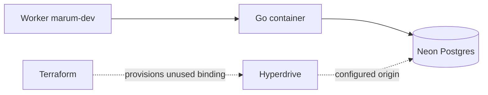

# Infrastructure

Terraform describes the Cloudflare resources Marum needs before a deploy can
work. It is not the deploy: `wrangler` ships the Worker, and this ships what the
Worker binds to.

## Where the database actually lives

Postgres is hosted at Neon. The Go container connects directly using
`MARUM_DATABASE_URL`; the migration runner uses `DATABASE_URL`. Hyperdrive is
still provisioned and bound to the Worker, but its connection string does not
resolve inside the container sandbox and is not used by the application.



Only **dev** has committed environment files and deployed infrastructure. No
production exists; the dormant `prod` workflow/config is incomplete.

## Who owns what

| Owner | Resources |
| --- | --- |
| **Terraform** | Hyperdrive configs, the backup bucket and its lifecycle rules, zone TLS and HSTS settings |
| **wrangler** | The Worker, its routes, its DNS record, its secrets, the container |
| **A person, once** | The Neon project, the R2 state bucket, API tokens |

Two of those boundaries are load-bearing:

**Terraform does not create the bot's DNS record.** `custom_domain = true` in
`wrangler.toml` makes Cloudflare create it, and Cloudflare refuses a Custom
Domain on a hostname that already carries a CNAME. A record made here would
break the deploy it was meant to enable.

**Terraform does not create the database.** Keeping database lifecycle separate
avoids making data destruction an ordinary infrastructure apply. Create the
database by hand and pass its connection details as a variable.

## Bootstrap

Four things must exist before the first dev `apply`. Database setup is per
environment; state bucket and tokens are account-level setup.

### 1. The database

Create a Neon project in the intended region, with a database and role named
`marum`. Keep the
**direct** origin details for `TF_VAR_database` and the migration connection.
Configure the container connection separately as `MARUM_DATABASE_URL`;
Hyperdrive does not pool the container's connections.

### 2. The state bucket

Terraform cannot create the bucket that holds its own state.

```bash
(cd deploy/cloudflare && npm ci && npx wrangler r2 bucket create marum-terraform-state)
```

### 3. Credentials for the state bucket

R2 speaks the S3 API, so Terraform's `s3` backend works against it. In the
Cloudflare dashboard, **R2 → Manage API tokens → Create token**, with *Object
Read & Write* limited to `marum-terraform-state`. Keep the Access Key ID and
Secret Access Key.

### 4. A Cloudflare API token

**My Profile → API Tokens → Create Token**, custom token, with these
permissions on the Marum account and zone:

| Scope | Permission |
| --- | --- |
| Account | Hyperdrive · Edit |
| Account | Workers R2 Storage · Edit |
| Zone | Zone Settings · Edit |

Nothing more. This token cannot deploy a Worker, and it should not be able to.

## Running it

Credentials come from the environment. They never go in a `.tfvars` file — the
files under `envs/` are committed, and everything in them is public anyway.

Inject these names from your credential store into the shell environment:

| Local environment variable | Value |
| --- | --- |
| `AWS_ACCESS_KEY_ID`, `AWS_SECRET_ACCESS_KEY` | R2 state token |
| `TF_VAR_cloudflare_api_token` | Infrastructure API token |
| `TF_VAR_cloudflare_account_id`, `TF_VAR_cloudflare_zone_id` | Account and zone IDs |
| `TF_VAR_database` | JSON object with `host`, `name`, `user`, `password`; optional `port` defaults to 5432 |

From the repository root:

```bash
make tf-init ENV=dev
make tf-plan ENV=dev
make tf-apply ENV=dev
make tf-output ENV=dev
```

These targets run Terraform 1.13.3 in Docker. `tf-init` uses `-reconfigure`, the
committed `envs/dev.backend.hcl`, and an R2 endpoint derived from the account ID.
State is `marum-terraform-state/dev/terraform.tfstate`. `tf-output` reads the
currently initialized backend; `ENV=dev` alone does not switch it. Always run
`tf-init` first. Although Make help mentions production, no production backend
or tfvars exists, so `ENV=production` is not a supported setup.

### The Hyperdrive binding is never pasted by hand

`wrangler.toml` keeps a `set-after-creating-…` placeholder on purpose. The
deploy workflow applies Terraform, reads `hyperdrive_id` from the output, and
writes it into the file just before `wrangler deploy`.

That keeps the ID out of git, where it would go stale the moment an environment
was rebuilt, and removes the one manual step that every environment needs and
nobody remembers. To see the value locally:

```bash
make tf-output ENV=dev
```

## In CI

Two paths, on purpose.

**Every deploy applies.** `deploy.yml` runs `terraform apply` for its
environment before it touches the Worker, then reads the Hyperdrive binding ID
from the applied state.
The job uses the dev GitHub environment and its ref protection. Dev does not
require a reviewer. The reusable deploy currently reads `TF_DATABASE_DEV`.

**Infrastructure pull requests plan dev.** Changes under `deploy/terraform/**`
or to `.github/workflows/infra.yml` trigger formatting, validation and, when
secrets are configured, a dev plan posted to the PR. Without the required
secrets, the real plan is skipped explicitly. Manual **Infrastructure** dispatch
accepts only `environment=dev`, with `action=plan` (default) or `apply`. It
creates a fresh saved plan and applies that file for `action=apply`; this is
separate from the automatic apply inside CD.

```bash
gh workflow run infra.yml --ref main -f environment=dev -f action=plan
# After reviewing the infrastructure change:
gh workflow run infra.yml --ref main -f environment=dev -f action=apply
```

These are **repository** secrets, not environment ones, and every name is
prefixed `TF_`:

| Secret | What |
| --- | --- |
| `TF_CLOUDFLARE_API_TOKEN` | Step 4 |
| `TF_CLOUDFLARE_ACCOUNT_ID` | Account ID |
| `TF_CLOUDFLARE_ZONE_ID` | Zone ID for the apex domain |
| `TF_R2_ACCESS_KEY_ID` | Step 3 |
| `TF_R2_SECRET_ACCESS_KEY` | Step 3 |
| `TF_DATABASE_DEV` | The `TF_VAR_database` JSON object for dev |

Repository rather than environment, because a GitHub environment is a **deploy
gate**: dev restricts which refs may deploy, so a plan job that
declared one would be refused on every pull request and the plan that exists to
inform the review could never be produced. The gate belongs on `apply`, which is
where it is.

The `TF_` prefix is not decoration. This is a different, narrower token than the
deploy one — Hyperdrive, R2 and zone settings, and no ability to publish a
Worker — and giving the two the same name is how the wrong one eventually gets
used.

## Two settings worth understanding

**Dev's Hyperdrive cache max age is 5 seconds, with an origin connection limit
of 5.** The default cache max age is zero (disabled). These settings affect the
Hyperdrive resource, not the application's direct Postgres connection. Size
origin and application connection pools against the database's actual limit.

**Dev owns zone TLS/HSTS settings** through `local.manages_zone`. There is no
production state owning them. A future environment must not manage those same
zone-wide resources concurrently.

Terraform creates `marum-dev-backups` with seven-day expiry under `dumps/`
and aborts incomplete multipart uploads after one day. Creating the bucket does
not create a backup schedule: no dump/upload job is implemented here.

## The lock file

`.terraform.lock.hcl` is committed, with hashes for Linux and both macOS
architectures. CI runs `init -lockfile=readonly`, so a provider upgrade has to
be a deliberate commit rather than something that happens on whichever machine
ran `init` last.

With a local Terraform install, run these from `deploy/terraform` after backend
initialization; alternatively use the pinned container:

```bash
terraform init -upgrade
terraform providers lock -platform=linux_amd64 -platform=darwin_arm64 -platform=darwin_amd64
```
