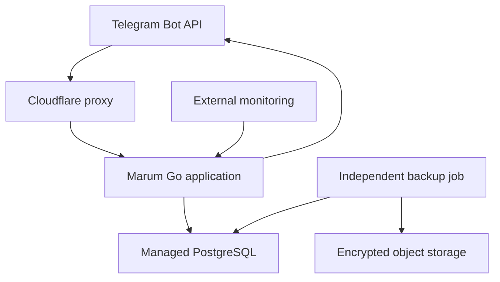
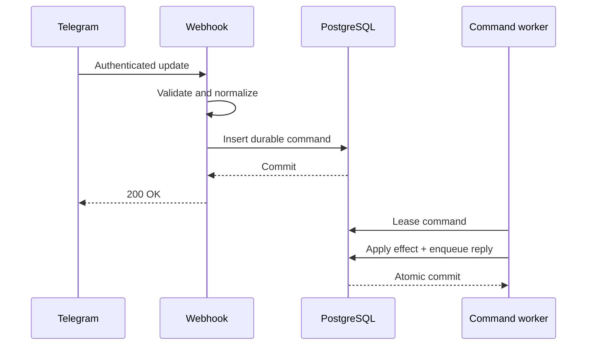
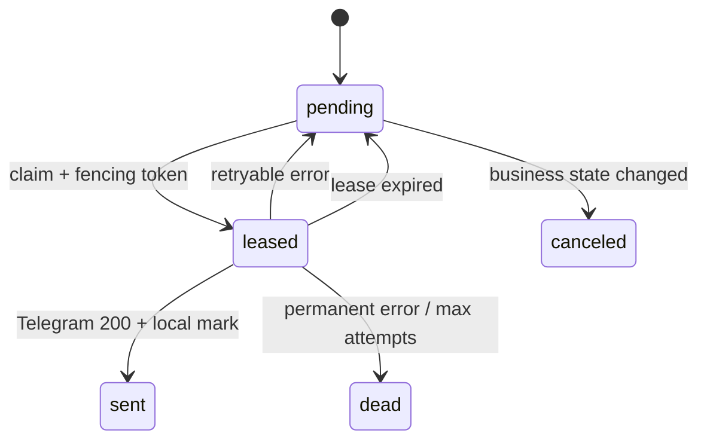
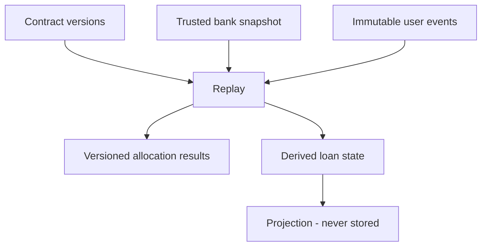
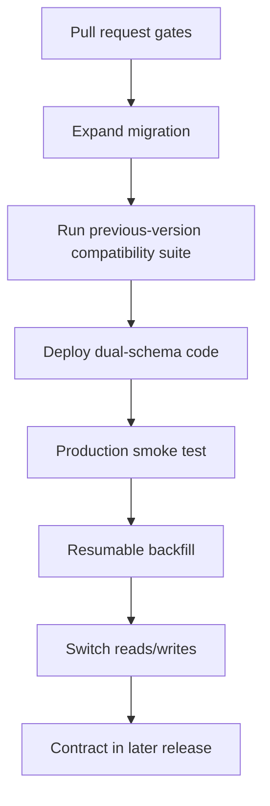

# Marum Reliable MVP - Technical Design v0.3.1

**Status:** Proposed implementation target  
**Product:** Marum / Մարում  
**Date:** 26 August 2026  
**Primary market:** Armenia  
**Languages:** Armenian and English  
**Runtime:** One always-on Go application plus managed PostgreSQL  
**Core constraint:** No AI. Every financial result is deterministic and explainable.  
**Commercial model:** 60-day full trial; short expiry grace period; then reminders and calculations pause. Export and erasure always remain available.

> Marum is a loan ledger, reminder, and repayment-planning tool. It does not move money, access bank accounts, refinance loans, recommend lenders, or replace the lender's official balance and repayment schedule.

---

## 0. Executive decision

The MVP will optimize for **financial-state correctness and recoverability**, not minimum infrastructure cost and not maximum feature count.

The implementation has four important boundaries:

1. Telegram updates become durable commands before Telegram receives `200 OK`.
2. User-entered facts are append-only; calculated allocations and current balances are rebuildable.
3. A bank-confirmed snapshot is the authoritative anchor for a loan. Marum never invents historical bank state.
4. Telegram delivery is at-least-once. Rare duplicate messages are accepted and measured.

The MVP intentionally excludes fee-aware global optimization, variable-rate loans, delinquent-loan optimization, document OCR, bank integrations, payment execution, and Telegram Stars. Those return only after the ledger and repayment engine have been proven against real Armenian loan schedules.

---

## 1. Scope

### 1.1 Included in the MVP

- Fixed-rate annuity loans denominated in AMD.
- Contract terms entered manually by the borrower.
- A bank-reported balance and `as_of` date required as the initial anchor.
- Versioned loan contracts.
- Append-only payment history, with voids and bank snapshots as the correction mechanism.
- Bank-balance confirmation and reconciliation.
- Single-loan dated amortization schedule.
- Extra-payment simulation when the lender's prepayment behavior is known.
- Multiple-loan avalanche and snowball comparisons.
- Monthly budget with per-month overrides.
- Per-loan payment reminders.
- Manual payment recording.
- Armenian and English messages.
- Data export and account erasure.
- 60-day full-feature trial.

### 1.2 Explicitly excluded from the MVP

- Moving money or initiating bank payments.
- Bank credentials, card details, statement scraping, or open-banking access.
- Loan or lender recommendations.
- Variable or floating rates.
- Declining-principal loans.
- Revolving credit cards without a fixed repayment schedule.
- Loans currently in delinquency, litigation, restructuring, payment holiday, or penalty accrual.
- Cross-currency portfolio optimization.
- Fee-aware `min_cost` beam search.
- Effective annual rate/XIRR comparison.
- OCR or automatic contract extraction.
- Telegram Stars and paid entitlements.

### 1.3 Safe degradation

Marum must refuse to produce a confident plan when it lacks the state necessary to do so.

| Condition | Behavior |
|---|---|
| Allocation policy unknown | Record the payment fact, mark the derived balance as needing confirmation, ask for the new bank-reported balance. |
| Loan has unpaid interest, penalties, or overdue principal | Reminders may continue, but optimization is disabled. Ask for an official currentization/payoff figure. |
| Contractual installment omitted | Solve it from the dated schedule, label it as calculated, and show the assumption. |
| Bank balance is stale | Show the age of the balance, label projections as stale, and request confirmation. |
| Prepayment requires a bank request | Show the operational step; do not reduce projected principal until a later bank snapshot confirms it. |
| Contract behavior is unsupported | Keep the ledger and reminders; do not show savings or a debt-free date. |

---

## 2. Reliability principles and invariants

These are implementation requirements, not aspirations.

### R1 - Acknowledgement means durable acceptance

Marum returns `200 OK` to Telegram only after a normalized command has committed to PostgreSQL. A crash after the response cannot lose the action.

### R2 - One Telegram update causes at most one business effect

`telegram_update_id` is permanently unique. Every financial event also carries an independent idempotency key derived from the command. Retrying any layer cannot record a second payment.

### R3 - Facts are append-only

Payments, user corrections, bank snapshots, void operations, and billing events are never silently edited. A mistaken entry is superseded or voided by another record.

### R4 - Derived state is disposable

`loan_state` and calculated payment allocations are caches. They can be deleted and rebuilt from the latest trusted bank snapshot plus the active event set.

### R5 - A bank snapshot outranks Marum's reconstruction

A confirmed snapshot establishes a new replay anchor. Drift is measured, not hidden. Marum does not add a second financial correction on top of the same snapshot.

### R6 - No silent financial assumptions

Every projection carries an assumption ledger: day-count convention, rounding, contract version, snapshot date, payment-allocation policy, prepayment behavior, and unsupported fields.

### R7 - Delivery is at-least-once

The gap between Telegram accepting a message and Marum recording Telegram's `message_id` cannot be closed. Duplicates are rare, expected, harmlessly worded, and measured.

### R8 - No network I/O inside a database transaction

Telegram, object storage, and monitoring calls occur only after the database transaction commits.

### R9 - Money is never a floating-point value

Amounts are signed 64-bit integers in currency minor units. Rates use a fixed decimal/rational representation in the core. Every multiplication checks overflow and applies an explicit rounding policy.

### R10 - Business dates are not timestamps

Due dates and value dates use a date-only type. Time zones are applied only when converting a local reminder slot to an instant.

### R11 - Deletion survives restore

An encrypted deletion journal is stored outside the primary database backup chain. Restoring an old database must not resurrect an erased account.

### R12 - Unsupported or stale state cannot produce a confident plan

The planner checks state eligibility before calculation. This guard is centralized and cannot be bypassed by a Telegram handler.

---

## 3. System architecture



### 3.1 Components

| Component | Responsibility |
|---|---|
| Cloudflare proxy | DNS, TLS, basic WAF/DDoS protection. No business logic and no application secrets beyond origin configuration. |
| Go application | Telegram webhook, command inbox processor, conversation state machine, scheduler, delivery sender, API, financial core, export generation. |
| Managed PostgreSQL | System of record, durable inbox, ledger, state cache, reminder occurrences, delivery outbox, subscription ledger. |
| Independent backup job | Direct `pg_dump -Fc`, encryption, upload, verification, restore drill. Does not share the application process or database credentials. |
| External monitoring | Public synthetic check plus an authenticated status endpoint whose body is produced from bounded database queries: tick heartbeat, inbox and outbox backlog age, expired-lease count, reconciliation mismatches. It does **not** connect to PostgreSQL directly — see §15.2. |

### 3.2 Deployment shape

- One application image and one language.
- At least one always-on application instance.
- A second instance may be deployed for webhook availability.
- Inbox processing is safely concurrent through leases.
- Reminder scheduling uses a transaction-scoped advisory lock per tick.
- Exactly one active Telegram sender holds a dedicated session-level advisory lock so the in-memory global token bucket is genuinely global.
- The sender stops as soon as it observes that its lock-holding database session has disconnected. Detection is not instantaneous, so a brief window exists in which a departing leader and a new one both believe they hold the role. Two consequences are accepted deliberately: the global send rate may briefly exceed 28/second, which Telegram absorbs as ordinary throttling, and a delivery may be attempted twice — which the fencing token turns into one successful mark and one rejected one, leaving at-least-once behaviour unchanged.
- No Redis, message broker, Hyperdrive, serverless container, or internal microservice is required.

### 3.3 Application packages

```text
cmd/marum
internal/app
    commandservice
    loanservice
    paymentservice
    planservice
    reminderservice
    userservice
internal/adapters/in
    telegramwebhook
    commandworker
    scheduler
    httpapi
internal/adapters/out
    postgres
    telegramclient
    objectstore
    observability
pkg/core
    money
    date
    model
    accrual
    amortization
    allocation
    planning
```

`pkg/core` has no database, network, filesystem, environment, clock, randomness, logging, or telemetry dependency. Time enters through parameters.

---

## 4. End-to-end processing model

### 4.1 Telegram inbound path



The webhook does not store the raw Telegram payload. It performs bounded parsing and writes a normalized command. If input resembles credentials or card data, it stores only a `reject_sensitive_input` command without the original value.

### 4.2 Business command transaction

For a payment-recording command, one transaction performs:

1. Lock the command using its lease token.
2. Lock the loan event counter/state row.
3. Confirm no financial event already uses the command idempotency key.
4. Insert the immutable payment fact.
5. Rebuild or advance derived state.
6. Version any calculated allocation results.
7. Cancel and regenerate affected future reminder occurrences.
8. Enqueue a Telegram reply delivery.
9. Mark the command completed using its fencing token.
10. Commit.

No Telegram call occurs in this transaction.

### 4.3 Outbound path



The send/mark ambiguity remains: if Telegram accepts the message and the application dies before the local mark, the delivery may be sent again.

---

## 5. Financial domain model

Marum separates facts from interpretations.



### 5.1 Loan identity

`loans` represents the enduring user-owned loan record. It contains no changing financial terms and no calculated balance.

### 5.2 Contract versions

A restructuring, rate change, repayment-type change, or maturity change creates a new contract version. Existing versions remain immutable.

Each financial event records the contract version under which it was interpreted. Contract effective periods may not overlap.

### 5.3 Bank snapshots

A bank snapshot is an observation of the lender's state at the end of a stated business date. It contains independently allocatable balance buckets:

- Principal
- Accrued interest
- Unpaid interest
- Current fees
- Overdue fees
- Penalties
- Overdue principal
- Advance-installment credit
- Next installment
- Next due date
- Remaining installments

A snapshot has a trust level:

| Trust | Meaning |
|---|---|
| `user_entered` | User typed a number but did not confirm it against current bank information. |
| `bank_confirmed` | User explicitly confirmed the number from the bank's app, statement, or official schedule. |
| `imported_verified` | Imported from a supported source and confirmed by the user. Not part of the initial MVP. |

Only `bank_confirmed` snapshots reset drift and make a loan fully eligible for planning.

### 5.4 Immutable loan events

Events record what the user says happened, not Marum's permanent interpretation of it.

MVP event kinds:

- `payment_reported`
- `prepayment_reported`
- `bank_fee_reported`
- `entry_voided`
- `loan_closed_reported`

There is no generic `correction` event. A new bank snapshot corrects state. There is no `snapshot_recorded` loan event duplicating the snapshot table.

### 5.5 Calculated allocation results

The split of a payment into interest, fees, penalties, overdue principal, scheduled principal, extra principal, or advance credit is a derived interpretation.

It is stored separately from the immutable payment fact with:

- Allocation policy version
- Contract version
- Engine version
- Replay generation
- Result buckets
- Confidence (`estimated` or `bank_confirmed`)
- Superseded allocation ID

If a late earlier event changes a later payment's calculated split, Marum inserts a new allocation result and supersedes the old one. It never rewrites the old calculation silently.

### 5.6 Derived state

`loan_state` is a cache generated from:

```text
latest trusted snapshot
+ active events not covered by that snapshot
+ current allocation-policy interpretation
= derived current state
```

The cache includes an `event_set_hash`. A nightly reconciliation recalculates the hash and state. Any mismatch rebuilds the cache and creates an operational alert.

---

## 6. Replay and reconciliation rules

### 6.1 Snapshot boundary

A snapshot is interpreted as lender state at the end of its `as_of` date in the loan's local business timezone.

When an event is recorded with `value_date <= latest_snapshot.as_of`, Marum must ask:

> Was this transaction already included in the bank balance you confirmed on `<date>`?

- If yes, an immutable snapshot-coverage assertion links the event to that snapshot; the event remains in history but is not applied again.
- If no or unknown, the loan becomes `needs_reconciliation`. Marum requests a new bank snapshot and does not calculate an updated plan from ambiguous history.

This prevents double-applying a late-entered payment.

### 6.2 Event ordering

Events have two orders:

- `recorded_seq`: gapless per loan; causal order in which Marum learned facts.
- Financial replay order: `value_date`, then `bank_order` when the lender
  supplies an intra-day sequence, then `recorded_seq` as deterministic
  tie-break.

`bank_order` is a nullable integer, not the free-text `bank_reference`.
Ordering by an arbitrary reference string is not well defined, is not covered by
the replay index, and would make replay depend on how a lender happens to format
its identifiers. `bank_reference` stays as an opaque human-facing label.

The two orders are deliberately not conflated.

### 6.3 Voiding a mistaken entry

`entry_voided` references exactly one earlier event. Replay excludes the voided event and the void marker from financial arithmetic but retains both for audit.

Voiding causes all later derived allocations and current state to be recalculated. It is not restricted to undoing only the last event.

### 6.4 New bank confirmation

When the user provides a new confirmed snapshot:

1. Calculate drift between Marum's pre-snapshot state and the bank snapshot.
2. Store the drift in `reconciliation_runs` for diagnostics.
3. Make the new snapshot the authoritative replay anchor.
4. Mark earlier applicable events as covered when explicitly confirmed.
5. Rebuild state from the new anchor.

Do not also create a financial delta correction; doing both would apply reconciliation twice.

### 6.5 Planning eligibility

A loan is eligible only when all are true:

- It has a current supported contract version.
- It has a bank-confirmed snapshot.
- The snapshot is not older than the configured freshness threshold, initially 35 days.
- It has no ambiguous pre-snapshot event.
- It has no unsupported overdue/penalty state.
- Its payment-allocation and prepayment policies are known for the operation being simulated.
- Derived replay succeeded under the current engine version.

The eligibility function returns machine-readable reasons displayed to the user.

### 6.6 Eligibility is graded, not binary

A single confirmed-and-fresh gate in front of every calculation is a product
risk large enough to sink the MVP. A borrower confirms a balance at onboarding
and, 36 days later, every screen stops answering. Most users will be outside a
35-day window most of the time, and a tool that usually refuses is a tool people
stop opening.

Eligibility therefore produces a **tier**, and the tier controls what may be
claimed rather than whether anything may be shown:

| Tier | Condition | May show | Must not show |
|---|---|---|---|
| `confident` | All §6.5 conditions hold | Plans, savings, debt-free dates, strategy comparison | — |
| `indicative` | Confirmed snapshot older than the freshness threshold, nothing else wrong | Projections labelled with the snapshot date and its age, next payment, reminders | Savings figures, strategy recommendations, debt-free dates presented as fact |
| `blocked` | Ambiguous pre-snapshot event, unsupported overdue/penalty state, unknown allocation policy, or failed replay | The ledger, the reminders, and the exact reason | Any projection |

`indicative` is the state that keeps the product usable between confirmations,
and it is also the state that earns the confirmation: every indicative screen
carries a one-tap "confirm your balance" action that promotes the loan back to
`confident`. Staleness is surfaced continuously, never discovered at the moment
a user wanted an answer.

`blocked` remains binary and uncompromising — those conditions mean Marum does
not know what it does not know.

---

## 7. Money, rates, dates, and rounding

### 7.1 Money representation

AMD uses ISO minor units internally: 100 minor units equal 1 dram. User-entered whole-drams are multiplied by 100.

The default settlement rounding unit for AMD is therefore **100 minor units**, not 1. A lender-specific rule may differ only when confirmed by a real schedule.

```go
type Amount struct {
    minor int64
    cur   Currency
}
```

All operations:

- Reject currency mismatch with a typed error at application boundaries.
- Check overflow before addition and multiplication.
- Require an explicit rounding policy for rate multiplication.
- Never convert an amount through `float64`.

### 7.2 Rates

Rates are represented in the core as scaled integers or rationals, for example parts per billion. PostgreSQL stores validated decimal strings in `numeric(12,9)`. The adapter converts them without passing through binary floating point.

### 7.3 Dates

The pure core uses a date-only value. Due-date clamping is centralized:

- A payment due on the 31st falls on the final calendar day of a shorter month.
- The following month returns to the contractual day where it exists.

### 7.4 Dated accrual

For each period:

```text
interest = round(
    opening_principal × annual_rate × days_in_period / day_count_denominator,
    lender_rounding_policy
)
```

**This expression must not be evaluated in 64-bit arithmetic.** With money in AMD
minor units and rates in parts per billion, the intermediate product
`principal × rate × days` exceeds `int64` for ordinary Armenian mortgages:

| Loan | `principal × rate` | `× 31 days` | int64 |
|---|---:|---:|---|
| 4,000,000 AMD @ 18% | 7.2 × 10¹⁶ | 2.2 × 10¹⁸ | fits |
| 16,529,340 AMD @ 18% | — | 9.22 × 10¹⁸ | last value that fits |
| 30,000,000 AMD @ 18% | 5.4 × 10¹⁷ | 1.7 × 10¹⁹ | **overflow** |
| 80,000,000 AMD @ 18% | 1.44 × 10¹⁸ | 4.5 × 10¹⁹ | **overflow** (66 bits) |

At a credit-card 26% the ceiling falls to about 11,443,389 AMD. Mortgages and
larger consumer loans in this market routinely exceed both.

Required implementation:

- Compute the numerator in a **128-bit intermediate** — `math/bits.Mul64` plus a
  128-by-64 division, or `big.Int` where clarity matters more than speed — then
  divide by the day-count denominator and apply the rounding policy exactly once.
- Never reorder into `(principal × days) / denominator × rate` to dodge the
  range problem. That rounds twice and silently changes the schedule.
- Overflow is a typed error, never a wrap. A property test asserts that every
  loan up to 1,000,000,000 AMD at 40% over a 31-day period accrues correctly.

Supported day counts in the engine may include Actual/365, Actual/360, and 30/360, but a convention is enabled for production only after a real schedule validates it.

### 7.5 Solving the installment

The engine solves the smallest installment in minor units that reduces the dated schedule to zero within the stated number of installments.

It uses integer bisection over the same schedule builder used for projection. The upper bound is grown safely until it closes the loan; all bounds are overflow checked.

The closed-form annuity formula is used only as a test cross-check or initial bound. It is not authoritative for irregular dated periods.

### 7.6 Projection restrictions

The MVP does not calculate an optimized repayment plan for a loan with penalties, overdue principal, uncertain payment allocation, or unresolved prepayment status. It explains why and continues ordinary reminders.

---

## 8. PostgreSQL data model

The following is the design-level schema. Version-controlled migrations remain authoritative.

### 8.1 Users and identities

```sql
CREATE TABLE users (
    id                 uuid PRIMARY KEY,
    locale             text NOT NULL DEFAULT 'hy',
    timezone           text NOT NULL DEFAULT 'Asia/Yerevan',
    trial_ends_at      timestamptz NOT NULL,
    access_state       text NOT NULL DEFAULT 'trial'
        CHECK (access_state IN ('trial','grace','active','paused')),
    created_at         timestamptz NOT NULL DEFAULT now(),
    deletion_requested_at timestamptz,
    deleted_at         timestamptz
);

CREATE TABLE identities (
    user_id             uuid PRIMARY KEY REFERENCES users(id) ON DELETE CASCADE,
    telegram_user_enc   bytea NOT NULL,
    telegram_user_hmac  text NOT NULL UNIQUE,
    telegram_chat_enc   bytea NOT NULL,
    telegram_chat_hmac  text NOT NULL UNIQUE,
    key_version         smallint NOT NULL,
    linked_at           timestamptz NOT NULL DEFAULT now()
);
```

The hosted bot operates only in private chats during MVP. Telegram user and chat identifiers are still stored separately rather than assuming they are always equal.

### 8.2 Loans and contracts

```sql
CREATE TABLE loans (
    id              uuid PRIMARY KEY,
    user_id         uuid NOT NULL REFERENCES users(id) ON DELETE CASCADE,
    name            text NOT NULL,
    lender          text,
    currency        char(3) NOT NULL CHECK (currency = 'AMD'),
    next_event_seq  bigint NOT NULL DEFAULT 1,
    created_at      timestamptz NOT NULL DEFAULT now(),
    archived_at     timestamptz
);

CREATE TABLE allocation_policy_versions (
    id              uuid PRIMARY KEY,
    policy_key      text NOT NULL,
    version         integer NOT NULL,
    definition      jsonb NOT NULL,
    definition_schema_version integer NOT NULL,
    source_reference text NOT NULL,
    created_at      timestamptz NOT NULL DEFAULT now(),
    UNIQUE (policy_key, version)
);

CREATE TABLE loan_contract_versions (
    id                  uuid PRIMARY KEY,
    loan_id             uuid NOT NULL REFERENCES loans(id) ON DELETE CASCADE,
    version             integer NOT NULL,
    effective_from      date NOT NULL,
    effective_until     date,
    nominal_rate        numeric(12,9) NOT NULL,
    day_count           text NOT NULL,
    repayment_type      text NOT NULL CHECK (repayment_type = 'annuity'),
    start_date          date NOT NULL,
    maturity_date       date NOT NULL,
    payment_day         smallint NOT NULL CHECK (payment_day BETWEEN 1 AND 31),
    scheduled_payment_minor bigint,
    rounding_mode       text NOT NULL,
    rounding_unit_minor integer NOT NULL DEFAULT 100,
    allocation_policy_version_id uuid NOT NULL
        REFERENCES allocation_policy_versions(id),
    prepayment_policy   jsonb NOT NULL,
    prepayment_schema_version integer NOT NULL,
    created_at          timestamptz NOT NULL DEFAULT now(),
    CHECK (effective_until IS NULL OR effective_until >= effective_from),
    UNIQUE (loan_id, version)
);
```

The application and migration tests enforce non-overlapping effective periods per loan. Financial JSON documents use a required schema version and strict decoding; unknown fields fail validation.

### 8.3 Bank snapshots

```sql
CREATE TABLE loan_snapshots (
    id                         uuid PRIMARY KEY,
    loan_id                    uuid NOT NULL REFERENCES loans(id) ON DELETE CASCADE,
    contract_version_id        uuid NOT NULL REFERENCES loan_contract_versions(id),
    as_of                      date NOT NULL,
    captured_at                timestamptz NOT NULL DEFAULT now(),
    trust                      text NOT NULL
        CHECK (trust IN ('user_entered','bank_confirmed','imported_verified')),
    principal_minor            bigint NOT NULL,
    accrued_interest_minor     bigint NOT NULL DEFAULT 0,
    unpaid_interest_minor      bigint NOT NULL DEFAULT 0,
    current_fees_minor         bigint NOT NULL DEFAULT 0,
    overdue_fees_minor         bigint NOT NULL DEFAULT 0,
    penalties_minor            bigint NOT NULL DEFAULT 0,
    overdue_principal_minor    bigint NOT NULL DEFAULT 0,
    advance_credit_minor       bigint NOT NULL DEFAULT 0,
    next_installment_minor     bigint,
    next_due_date              date,
    remaining_installments     smallint,
    source_note                text,
    idempotency_key            text NOT NULL UNIQUE,
    CHECK (principal_minor >= 0)
);

CREATE INDEX loan_snapshots_latest
    ON loan_snapshots (loan_id, as_of DESC, captured_at DESC);
```

### 8.4 Immutable financial events

```sql
CREATE TABLE loan_events (
    id                    uuid PRIMARY KEY,
    loan_id               uuid NOT NULL REFERENCES loans(id) ON DELETE CASCADE,
    contract_version_id   uuid NOT NULL REFERENCES loan_contract_versions(id),
    recorded_seq          bigint NOT NULL,
    kind                  text NOT NULL
        CHECK (kind IN (
            'payment_reported',
            'prepayment_reported',
            'bank_fee_reported',
            'entry_voided',
            'loan_closed_reported'
        )),
    value_date            date NOT NULL,
    recorded_at           timestamptz NOT NULL DEFAULT now(),
    amount_minor          bigint,
    bank_order            integer,   -- lender intra-day sequence, when supplied
    bank_reference        text,      -- opaque label; never an ordering key
    voids_event_id        uuid REFERENCES loan_events(id),
    source_command_id     uuid,
    idempotency_key       text NOT NULL UNIQUE,
    fact_payload          jsonb NOT NULL DEFAULT '{}',
    fact_schema_version   integer NOT NULL,
    UNIQUE (loan_id, recorded_seq)
);

CREATE INDEX loan_events_replay
    ON loan_events (loan_id, value_date, bank_order NULLS LAST, recorded_seq);

-- User-confirmed assertion that a bank snapshot already includes an event.
-- Kept separately so the immutable event row never needs an UPDATE.
CREATE TABLE snapshot_event_coverage (
    snapshot_id       uuid NOT NULL REFERENCES loan_snapshots(id) ON DELETE CASCADE,
    event_id          uuid NOT NULL REFERENCES loan_events(id) ON DELETE CASCADE,
    confirmed_at      timestamptz NOT NULL DEFAULT now(),
    source_command_id uuid,
    PRIMARY KEY (snapshot_id, event_id),
    UNIQUE (event_id)
);
```

The application role is denied `UPDATE` and `DELETE` on facts and snapshots. Account erasure uses a separate narrowly scoped maintenance role.

### 8.5 Versioned calculated allocations

```sql
CREATE TABLE loan_event_allocations (
    id                         uuid PRIMARY KEY,
    event_id                   uuid NOT NULL REFERENCES loan_events(id) ON DELETE CASCADE,
    replay_generation          uuid NOT NULL,
    contract_version_id        uuid NOT NULL REFERENCES loan_contract_versions(id),
    allocation_policy_version_id uuid NOT NULL REFERENCES allocation_policy_versions(id),
    engine_version             text NOT NULL,
    confidence                 text NOT NULL
        CHECK (confidence IN ('estimated','bank_confirmed')),
    interest_minor             bigint NOT NULL DEFAULT 0,
    fees_minor                 bigint NOT NULL DEFAULT 0,
    penalties_minor            bigint NOT NULL DEFAULT 0,
    overdue_principal_minor    bigint NOT NULL DEFAULT 0,
    scheduled_principal_minor  bigint NOT NULL DEFAULT 0,
    extra_principal_minor      bigint NOT NULL DEFAULT 0,
    advance_credit_minor       bigint NOT NULL DEFAULT 0,
    supersedes_allocation_id   uuid REFERENCES loan_event_allocations(id),
    calculated_at              timestamptz NOT NULL DEFAULT now()
);

CREATE INDEX loan_event_allocations_history
    ON loan_event_allocations (event_id, calculated_at DESC);
```

### 8.6 Derived loan state

```sql
CREATE TABLE loan_state (
    loan_id                    uuid PRIMARY KEY REFERENCES loans(id) ON DELETE CASCADE,
    state_version              bigint NOT NULL DEFAULT 0,
    anchor_snapshot_id         uuid NOT NULL REFERENCES loan_snapshots(id),
    replay_generation          uuid NOT NULL,
    event_set_hash             bytea NOT NULL,
    last_recorded_seq          bigint NOT NULL,
    balance_as_of              date NOT NULL,
    principal_minor            bigint NOT NULL,
    accrued_interest_minor     bigint NOT NULL DEFAULT 0,
    unpaid_interest_minor      bigint NOT NULL DEFAULT 0,
    current_fees_minor         bigint NOT NULL DEFAULT 0,
    overdue_fees_minor         bigint NOT NULL DEFAULT 0,
    penalties_minor            bigint NOT NULL DEFAULT 0,
    overdue_principal_minor    bigint NOT NULL DEFAULT 0,
    advance_credit_minor       bigint NOT NULL DEFAULT 0,
    reliability_state          text NOT NULL
        CHECK (reliability_state IN (
            'confirmed','estimated','stale','needs_reconciliation','unsupported'
        )),
    reliability_reasons        jsonb NOT NULL DEFAULT '[]',
    engine_version             text NOT NULL,
    rebuilt_at                 timestamptz NOT NULL DEFAULT now()
);
```

### 8.7 Budget, reminder policy, and conversation state

Three tables the earlier draft describes in prose but never defines. Each is
referenced by §9.4, §11.2, and §12.1 respectively.

```sql
-- §11.2. One active budget per user. Overrides are month-keyed.
CREATE TABLE budgets (
    user_id                uuid PRIMARY KEY REFERENCES users(id) ON DELETE CASCADE,
    monthly_amount_minor   bigint NOT NULL CHECK (monthly_amount_minor >= 0),
    reserve_floor_minor    bigint NOT NULL DEFAULT 0,
    overrides              jsonb  NOT NULL DEFAULT '{}',  -- {"2026-12": 40000000}
    overrides_schema_version integer NOT NULL,
    updated_at             timestamptz NOT NULL DEFAULT now()
);

-- §12.1. What the user wants reminded, per loan. Occurrences are generated
-- from these rules; deleting a rule cancels its future occurrences.
CREATE TABLE reminder_rules (
    id             uuid PRIMARY KEY,
    loan_id        uuid NOT NULL REFERENCES loans(id) ON DELETE CASCADE,
    offset_days    smallint NOT NULL CHECK (offset_days BETWEEN -30 AND 30),
    send_at_local  time NOT NULL DEFAULT '10:00',
    enabled        boolean NOT NULL DEFAULT true,
    UNIQUE (loan_id, offset_days)
);

-- §9.4. Optimistic-versioned so a redelivered update cannot advance the
-- conversation twice. Written in the same transaction that completes its command.
CREATE TABLE conversation_states (
    user_id        uuid PRIMARY KEY REFERENCES users(id) ON DELETE CASCADE,
    state_name     text NOT NULL,
    state_version  bigint NOT NULL DEFAULT 0,
    collected      jsonb NOT NULL DEFAULT '{}',
    collected_schema_version integer NOT NULL,
    updated_at     timestamptz NOT NULL DEFAULT now()
);
```

Plans themselves are **not stored.** A plan is a projection (§5), recomputed
from the budget, the eligible loans, and the chosen strategy. What persists is
the input — the budget above — and the assumption ledger rendered with each
result. Storing a plan would create a fourth thing that can disagree with the
ledger.

### 8.8 Reconciliation diagnostics

```sql
CREATE TABLE reconciliation_runs (
    id                         uuid PRIMARY KEY,
    loan_id                    uuid NOT NULL REFERENCES loans(id) ON DELETE CASCADE,
    previous_state_version     bigint,
    new_snapshot_id            uuid NOT NULL REFERENCES loan_snapshots(id),
    principal_drift_minor      bigint NOT NULL,
    interest_drift_minor       bigint NOT NULL,
    fee_drift_minor            bigint NOT NULL,
    penalty_drift_minor        bigint NOT NULL,
    engine_version             text NOT NULL,
    created_at                 timestamptz NOT NULL DEFAULT now()
);
```

---

## 9. Durable Telegram command inbox

### 9.1 Why a durable inbox is mandatory

A deduplication table containing only `update_id` is unsafe. If the application inserts the ID and crashes before applying the action, Telegram's retry would be discarded as a duplicate.

The durable inbox stores the normalized command and its processing state.

```sql
CREATE TABLE telegram_commands (
    id                  uuid PRIMARY KEY,
    telegram_update_id  bigint NOT NULL UNIQUE,
    -- SET NULL, not CASCADE: erasing a user must not delete the row that carries
    -- the permanently unique update ID (R2). The payload is cleared instead.
    user_id             uuid REFERENCES users(id) ON DELETE SET NULL,
    command_kind        text NOT NULL,
    command_payload     jsonb NOT NULL,
    payload_schema_version integer NOT NULL,
    status              text NOT NULL DEFAULT 'pending'
        CHECK (status IN ('pending','leased','completed','dead')),
    attempts            smallint NOT NULL DEFAULT 0,
    next_attempt_at     timestamptz NOT NULL DEFAULT now(),
    lease_owner         text,
    lease_token         uuid,
    lease_until         timestamptz,
    received_at         timestamptz NOT NULL DEFAULT now(),
    completed_at        timestamptz,
    last_error_code     text
);

CREATE INDEX telegram_commands_claimable
    ON telegram_commands (next_attempt_at)
    WHERE status = 'pending';

CREATE INDEX telegram_commands_expired
    ON telegram_commands (lease_until)
    WHERE status = 'leased';
```

Completed commands retain the unique update ID. Their normalized payload is cleared after the diagnostic retention window, but the ID, type, timestamps, and completion status remain to preserve idempotency.

Account erasure follows the same rule: the command row survives with
`user_id = NULL` and an emptied payload. Deleting it would break R2's claim that
`telegram_update_id` is *permanently* unique, and a redelivery after erasure
would be processed as new.

### 9.2 Webhook algorithm

1. Require Telegram's secret-token header before reading the body.
2. Enforce a small request-body limit.
3. Decode bounded JSON.
4. Normalize the update into an allowed command type.
5. Reject sensitive-looking values without persisting the value.
6. `INSERT ... ON CONFLICT (telegram_update_id) DO NOTHING` in a short transaction.
7. Return `200` only after commit.
8. If PostgreSQL is unavailable, return a retryable non-2xx response so Telegram retries.

### 9.3 Command leasing and fencing

Every lease gets a random `lease_token`. Completion and retry updates require the same token:

```sql
UPDATE telegram_commands
SET status = 'completed', completed_at = now(),
    lease_owner = NULL, lease_token = NULL, lease_until = NULL
WHERE id = $1
  AND status = 'leased'
  AND lease_owner = $2
  AND lease_token = $3;
```

This prevents a stale worker from completing a command after its lease expired and another worker reclaimed it.

### 9.4 Conversation state

Conversation state is persisted and optimistic-versioned. Applying a text answer and moving to the next state occurs in the same transaction as completing its command. A repeated Telegram update therefore cannot advance the conversation twice.

---

## 10. Payment recording and allocation

### 10.1 Payment input

The bot collects:

- Loan
- Amount
- Value date
- Whether the user intended an ordinary installment or a prepayment
- Whether the bank already shows it as processed
- Optional bank reference

It does not ask the user to manually split interest and principal unless reading that split directly from a bank statement.

### 10.2 Unknown allocation policy

When policy is unknown:

1. Store the immutable payment fact.
2. Do not create a confident allocation.
3. Mark state `needs_reconciliation`.
4. Ask for the new bank-reported balance.
5. Use the confirmed snapshot as the new anchor.

### 10.3 Known allocation policy

When policy is known:

1. Apply the policy to the dated pre-payment state.
2. Store a versioned calculated allocation.
3. Rebuild state.
4. Label the result estimated until a later bank snapshot confirms it.
5. Track drift per lender/product.

Repeated drift automatically disables confident planning for that policy version until reviewed.

### 10.4 Prepayment lifecycle

Prepayment intent and confirmed principal reduction are different states.

| Policy | Treatment |
|---|---|
| Immediate principal reduction | Apply estimated allocation; confirm at next snapshot. |
| Held as future installment | Increase advance credit; do not claim interest savings. |
| Requires bank request | Record action as pending; do not reduce principal until confirmed snapshot. |
| Unknown | Explain uncertainty and request bank confirmation. |

---

## 11. Planning

### 11.1 MVP strategies

The MVP exposes strategy names rather than unsupported optimization claims:

| Strategy | Meaning |
|---|---|
| Highest rate first | Allocate eligible surplus to the eligible loan with the highest validated effective monthly cost under fee-free, unrestricted prepayment assumptions. |
| Smallest balance first | Allocate surplus to the smallest eligible principal balance. |
| Close selected loan | Allocate surplus to a user-selected eligible loan. |
| Custom | Validate and simulate a user-entered allocation. |

The UI does not call any of these `least cost` unless an exact or clearly bounded fee-aware optimizer exists.

### 11.2 Budget semantics

The user provides:

- Normal monthly debt budget
- Month-specific overrides
- Optional minimum cash reserve

The plan never assumes that every dram not assigned to minimum payments must be spent. Reserved or unused cash remains explicit.

### 11.3 Plan output

Every plan shows:

- Snapshot date and age
- Monthly minimum total
- Proposed extra allocation
- Projected debt-free date
- Projected interest and supported fees
- Comparison baseline
- Assumptions and missing information
- Whether each prepayment requires a bank action
- Engine version

### 11.4 Deferred fee-aware optimizer

A future optimizer state must include:

```text
date
loan balance buckets
reserved cash carried forward
prepayment windows
flat and percentage fees
pending bank actions
```

Candidate generation must include `hold cash this month`. Without it, minimum-prepayment and flat-fee cases can produce the wrong recommendation.

---

## 12. Reminder scheduling and message delivery

Scheduling and sending are separate models.

### 12.1 Reminder occurrences

One occurrence means one loan-related fact is due to be reminded.

```sql
CREATE TABLE reminder_occurrences (
    id                  uuid PRIMARY KEY,
    user_id             uuid NOT NULL REFERENCES users(id) ON DELETE CASCADE,
    loan_id             uuid NOT NULL REFERENCES loans(id) ON DELETE CASCADE,
    due_date            date NOT NULL,
    offset_days         smallint NOT NULL,
    target_send_at      timestamptz NOT NULL,
    status              text NOT NULL DEFAULT 'scheduled'
        CHECK (status IN ('scheduled','attached','satisfied','canceled')),
    idempotency_key     text NOT NULL UNIQUE,
    created_at          timestamptz NOT NULL DEFAULT now()
);
```

Occurrences are generated ahead of time, initially 35 days. Payment recording, snapshot confirmation, contract changes, and loan archival cancel and regenerate affected future occurrences transactionally.

### 12.2 Aggregated deliveries

One Telegram delivery can contain several occurrences for the same user.

```sql
CREATE TABLE notification_deliveries (
    id                  uuid PRIMARY KEY,
    user_id             uuid NOT NULL REFERENCES users(id) ON DELETE CASCADE,
    delivery_kind       text NOT NULL,
    priority            smallint NOT NULL,
    scheduled_at        timestamptz NOT NULL,
    group_key           text NOT NULL UNIQUE,
    payload             jsonb NOT NULL,
    payload_schema_version integer NOT NULL,
    status              text NOT NULL DEFAULT 'pending'
        CHECK (status IN ('pending','leased','sent','dead','canceled')),
    attempts            smallint NOT NULL DEFAULT 0,
    next_attempt_at     timestamptz NOT NULL,
    lease_owner         text,
    lease_token         uuid,
    lease_until         timestamptz,
    telegram_message_id bigint,
    sent_at             timestamptz,
    last_error_code     text
);

CREATE TABLE notification_delivery_items (
    delivery_id         uuid NOT NULL REFERENCES notification_deliveries(id) ON DELETE CASCADE,
    occurrence_id       uuid NOT NULL REFERENCES reminder_occurrences(id) ON DELETE CASCADE,
    PRIMARY KEY (delivery_id, occurrence_id)
);

-- An occurrence may be attached to at most one LIVE delivery, but must be
-- re-attachable if that delivery dies or is canceled. A plain UNIQUE on
-- occurrence_id would strand the reminder permanently after a dead delivery.
CREATE UNIQUE INDEX notification_delivery_items_live
    ON notification_delivery_items (occurrence_id)
    WHERE delivery_id IN (
        SELECT id FROM notification_deliveries
         WHERE status IN ('pending','leased','sent'));

CREATE INDEX notification_deliveries_claimable
    ON notification_deliveries (priority, next_attempt_at)
    WHERE status = 'pending';
```

A delivery row is created by the scheduler shortly before its send bucket, not
when the occurrence is generated 35 days ahead — otherwise the frozen payload
would carry a balance that is weeks stale by send time. When a delivery reaches
`dead` or `canceled`, its still-valid occurrences return to `scheduled` and are
regrouped on a later tick.

The scheduler groups occurrences by user and local send bucket before a delivery becomes claimable. The delivery payload is fixed at creation so a retry sends the same content. Financial payloads are treated as sensitive database data and never logged.

### 12.3 Quiet hours and jitter

- Default quiet hours: 21:00-09:00 in the user's timezone.
- Deferred reminders are grouped into a 09:00 delivery.
- Deterministic jitter spreads eligible delivery time across a configurable window.
- Jitter is derived from a stable occurrence ID, not randomness.

### 12.4 Send-time guard

Immediately before sending a reminder delivery, the sender checks whether at least one attached occurrence remains valid. If all were satisfied or canceled, the delivery is canceled.

A payment can still arrive after this guard and before the Telegram call. Reminder text therefore says, in effect, “If you have already paid, you can ignore or record it here.”

### 12.5 Sender leadership

The sender:

1. Acquires a PostgreSQL session advisory lock on a dedicated connection.
2. Cancels its sender context immediately if that connection dies.
3. Claims a small batch that can finish well inside the lease.
4. Uses 28 messages/second globally and 1 message/second per chat.
5. Claims more work only as capacity becomes available.

The initial batch is at most 20 deliveries with a 120-second lease. The worker renews a lease if remaining processing time approaches half the lease duration.

Every mark, retry, or cancellation includes `lease_token`. A stale sender cannot modify a row reclaimed by another worker.

### 12.6 Retry policy

| Result | Action |
|---|---|
| Telegram `200` | Mark sent and store `message_id`. |
| `429` | Return to pending with Telegram's `retry_after`; do not block other chats. |
| Timeout or `5xx` | Exponential backoff with jitter; maximum six attempts. |
| User blocked bot (`403`) | Mark dead and suspend that user's reminders. |
| Permanent malformed request | Mark dead and alert if caused by Marum data. |
| Process dies after Telegram `200` | Lease expires; duplicate may be sent. Accepted at-least-once behavior. |

`telegram_message_id` enables later edits only when it was successfully stored. It cannot solve the send/mark crash gap.

---

## 13. Access, trial, and future billing

### 13.1 Trial lifecycle

| State | Behavior |
|---|---|
| `trial` | All MVP features for 60 days. |
| `grace` | Seven days. Existing reminders continue; the bot asks the user to subscribe. |
| `paused` | Calculations, payment recording, and loan reminders pause. Export, account deletion, and subscription remain available. |
| `active` | Paid entitlement; all subscribed features available. |

Continuing reminders forever while payment recording is disabled would create stale and misleading loan state. Therefore reminders pause after grace.

When a paused account becomes active again, Marum requires a fresh bank-confirmed snapshot before resuming plans and balance-bearing reminders.

### 13.2 Billing design - Phase 4 only

Telegram Stars is not implemented until a separate cloud test bot and database exist.

Billing uses:

- Immutable provider events
- Permanent unique provider event ID
- Original provider timestamp
- Raw provider payload encrypted or minimized according to retention policy
- Derived entitlement cache
- Rebuildable entitlement calculation
- Refund, cancellation, chargeback, duplicate, and out-of-order tests

No break-even estimate is treated as confirmed until a real payout verifies net proceeds.

---

## 14. Security and privacy

### 14.1 Telegram boundary

- Secret-token header validated before body parsing.
- High-entropy webhook path as defense in depth.
- Private chats only in MVP.
- Input length and numeric bounds enforced.
- Telegram text escaped through one audited renderer.
- No raw request body logging.
- No interpolation into SQL.

### 14.2 Data protection

- Telegram user and chat IDs encrypted with a versioned application key.
- Keyed HMAC used only for deterministic lookup.
- Stable internal user IDs are pseudonymous and excluded from ordinary logs and metrics.
- Logs use short-lived request IDs.
- Financial amounts, lender names, Telegram IDs, payloads, tokens, and exports are never logged.
- Database and backups use different encryption keys.

### 14.3 Export

The user requests export from the authenticated private chat. Marum generates JSON and CSV, sends them as a Telegram document, and deletes local temporary bytes after the Telegram call.

The bot warns that the document remains in the Telegram chat history. A later web export must use a single-use, short-lived link and audited download.

### 14.4 Erasure

Erasure covers:

- Identity links and HMACs
- Users, loans, contracts, snapshots, events, derived state, plans, occurrences, deliveries, and commands
- Generated exports and temporary files
- Dead-letter payloads
- Application logs/traces after their configured retention
- Billing data except fields legally required to be retained

Before primary database deletion, the erasure worker writes a subject tombstone to a separately encrypted append-only deletion journal outside the database backup chain. The operation is retryable and idempotent.

During restore:

1. Restore into a new isolated database.
2. Apply every deletion-journal entry newer than and included in the backup.
3. Verify erased subject HMACs are absent.
4. Run integrity tests.
5. Only then promote the restored database.

---

## 15. Operations

### 15.1 Scheduler

The application ticks every 60 seconds. Each tick uses a transaction-scoped advisory lock, scans all overdue work, and is idempotent.

On startup, it immediately performs a catch-up tick. It never assumes the previous minute ran.

### 15.2 Monitoring signals

Externally observable signals:

- Public health/synthetic request
- Timestamp of last successful scheduler tick
- Oldest pending command age
- Oldest pending delivery age
- Count of expired leases
- Dead command and delivery counts
- Database connection/query latency
- Reconciliation mismatch count
- Duplicate-reminder reports
- Snapshot age distribution

Monitoring must not require exposing PostgreSQL publicly. A small external monitor calls an authenticated status endpoint whose response is produced from bounded database queries, or a separately deployed monitor queries PostgreSQL over a private/allow-listed path.

### 15.3 Service objectives

| SLO | Target |
|---|---|
| Telegram webhook durable acknowledgement | 99.9% under 2 seconds over 30 days |
| Durable command completion | 99% within 5 seconds; 99.9% within 60 seconds |
| Reminder delivery | 99% within 15 minutes of scheduled slot |
| Ledger/cache reconciliation | 100% nightly; zero unresolved mismatches older than 24 hours |
| Backup recovery point | 15 minutes or better when paid users exist |
| Restore time | Under 2 hours, measured monthly |

### 15.4 Backups

Two recovery layers are required:

1. Managed PostgreSQL continuous recovery/PITR for operational loss, target RPO at most 15 minutes once beta contains real financial history.

   **This is a cost decision, not only a technical one.** Free managed Postgres
   tiers generally do not offer point-in-time recovery, so the 15-minute RPO in
   §15.3 forces a paid plan from the moment beta holds real financial history —
   roughly $19–25/month at current provider pricing. That is the correct trade
   for a ledger, but it must be budgeted at Phase 2 rather than discovered at
   Phase 4. Until real user data exists, layer 2 alone is sufficient.
2. Nightly `pg_dump -Fc`, separately encrypted, retained as 30 daily and 6 monthly copies for logical corruption and provider escape.

The backup job uses its own read-only credential and direct database endpoint.

A successful backup is one that has been restored and passed:

- Schema/migration verification
- Foreign-key and constraint checks
- Application startup
- Sample identity decryption for each active key version
- Ledger replay equals `loan_state`
- Command and delivery claim queries
- Entitlement rebuild when billing exists
- Deletion-journal application
- Representative read-only user journey

Row counts alone do not verify a backup.

### 15.5 Capacity

Capacity tests use burst traffic, not monthly averages.

Required scenarios:

- 09:00 release after quiet hours
- Common salary/payment day
- 24-hour Telegram outage recovery
- 60-minute database outage recovery
- Mass `429` retry wave
- Deployment while commands and deliveries are leased
- Ten times the expected launch-user count

Scale triggers:

- Sender utilization above 70% during peak windows
- p99 reminder lag above 10 minutes
- Inbox/outbox recovery exceeding the SLO after a one-hour outage
- Database connection saturation

Partitioning senders does not increase Telegram's bot-wide rate limit; it only improves ordering and concurrency management. A higher Telegram allowance or multiple separately valid bot identities would be a product/platform decision, not an internal sharding trick.

---

## 16. Release and migration strategy



Rules:

- Schema expands before new code uses it.
- Expand migrations are additive and compatible with the previous binary.
- CI runs the previous release's integration suite against the expanded schema.
- Backfills are separate, idempotent, resumable, observable jobs.
- Binary rollback never requires a schema rollback.
- Destructive contract migrations happen only after at least one later release proves nothing reads the old representation.
- Immutable financial data is never mechanically rewritten without a versioned migration report and replay comparison.

Production and test use the same binary, PostgreSQL major version, and migration path. The cloud test environment has a separate bot token and database before public beta; Stars adds additional provider-level tests before Phase 4.

---

## 17. Testing strategy

### 17.1 Financial golden corpus

No user-facing projection launches until at least ten real schedules across at least four Armenian lenders reproduce to the dram.

Each fixture records:

- Sanitized contract terms
- Source type
- Dated opening balance
- Scheduled payments
- Day-count convention
- Rounding mode and unit
- Fee behavior
- Prepayment behavior if tested
- Expected rows and final balance

Coverage is per supported product behavior, not merely per lender name.

### 17.2 Core property tests

- Sum of principal allocations equals principal reduction.
- No money appears or disappears across allocation buckets.
- Final balance reaches zero only through a valid payment.
- Payment solver returns the smallest closing installment.
- Increasing a fee-free principal prepayment cannot increase projected interest.
- Currency mismatch and arithmetic overflow return errors.
- Month-end and leap-year transformations are deterministic.

### 17.3 Ledger/replay tests

- Replay from a snapshot equals cached state.
- A voided payment is excluded and later allocations are superseded.
- A late pre-snapshot event cannot be double-applied.
- An ambiguous late event sets `needs_reconciliation`.
- A new confirmed snapshot becomes the sole correction anchor.
- Contract version changes apply to the correct events.
- Concurrent commands allocate unique `recorded_seq` values without lost updates.
- Replaying twice yields byte-identical current state and event-set hash.

### 17.4 Failure-injection tests

Kill the process at every boundary:

- Before command insert commit
- After command commit, before webhook response
- After webhook response, before command lease
- During business transaction
- After business commit, before reply send
- After Telegram `200`, before delivery mark
- After lease expiry while stale worker still runs
- During database reconnect and advisory-lock loss

Expected outcomes are specified for every failpoint. The only accepted duplicate effect is a Telegram message; financial events remain exactly-once by idempotency.

### 17.5 Integration and journey tests

- Real PostgreSQL with migrations
- Two concurrent command workers
- Two application instances competing for sender leadership
- One payment command retried many times
- Conversation restart across process termination
- Add loan -> confirm snapshot -> receive reminder -> record payment -> reconcile -> recompute plan
- Trial -> grace -> pause -> reactivate -> require fresh snapshot
- Export and full erasure
- Restore followed by deletion-journal replay

---

## 18. Delivery roadmap

| Phase | Scope | Exit gate |
|---|---|---|
| 0 - Evidence | Collect contracts and official schedules; document lender policies. | Ten schedules, four lenders, supported behaviors confirmed to the dram. |
| 1 - Core | Money/date engine, dated solver, snapshots, immutable events, replay, allocation versions. | Golden and property tests pass; late-event and reconciliation cases proven. |
| 2 - Reliable bot | Durable inbox, conversation state, one loan, reminders, payment recording, export/erasure. | Ten beta users complete two cycles; no lost commands; discrepancy reports resolved. |
| 3 - Portfolio | Multiple loans, highest-rate-first, smallest-balance-first, selected-loan and custom plans. | Real portfolio comparisons reviewed; 10x burst test passes. |
| 4 - SaaS | Test environment, Telegram Stars event ledger, entitlement derivation, trial/grace/pause. | Purchase, renewal, refund, cancellation, chargeback, duplicate and out-of-order cases proven. |
| 5 - Advanced engine | Carried-cash fee-aware optimizer, additional repayment types, effective rate. | Driven by real contracts and repeated user demand; brute-force comparison on small portfolios. |

---

## 19. Open questions that block implementation

| Question | Needed by | Why it matters |
|---|---|---|
| Exact day-count and rounding behavior per supported lender/product | Phase 1 | Changes every schedule row. |
| Payment-allocation order per product | Phase 1 | Determines whether Marum can derive current state. |
| Meaning of a bank balance's `as_of` date and inclusion of same-day transactions | Phase 1 | Defines the snapshot replay boundary. |
| Whether ordinary excess payments reduce principal, advance installments, or require a request | Phase 2 | Determines whether interest savings may be shown. |
| Default freshness threshold for a confirmed balance | Phase 2 | Controls when plans become stale. |
| Required legal retention for subscription records after account erasure | Phase 4 | Changes erasure semantics. |
| Actual Telegram Stars net proceeds and subscription event behavior | Phase 4 | Required for price and entitlement design. |

---

## 20. Implementation acceptance checklist

The MVP is not ready for public beta until all are true:

- [ ] Durable command inbox survives crash-after-ack without losing an action.
- [ ] Repeated Telegram update produces one financial event.
- [ ] Loan facts are immutable under the application role.
- [ ] Latest confirmed snapshot plus active events rebuilds `loan_state` exactly.
- [ ] Late pre-snapshot events cannot be double-counted.
- [ ] Derived payment allocations can be superseded without rewriting history.
- [ ] Every event is tied to an applicable contract version.
- [ ] Unsupported or stale state blocks confident planning.
- [ ] Ten real schedules from four lenders match to the dram.
- [ ] Reminder occurrences aggregate into one user delivery where appropriate.
- [ ] Command and delivery leases use fencing tokens.
- [ ] Sender leadership uses a dedicated connection and stops on lock loss.
- [ ] Duplicate-message failpoint is tested and accepted as at-least-once behavior.
- [ ] A 10x burst and outage-recovery test meets reminder SLOs.
- [ ] PITR and logical backup restore drills pass.
- [ ] Restoring a backup does not resurrect erased accounts.
- [ ] Trial expiry cannot leave users receiving stale financial reminders indefinitely.
- [ ] Export and erasure remain accessible without payment.
- [ ] Interest accrual is exact for an 80,000,000 AMD loan over a 31-day period.
- [ ] A dead delivery releases its occurrences instead of stranding them.
- [ ] Erasing a user preserves `telegram_update_id` uniqueness.
- [ ] A stale confirmed balance degrades to `indicative`, not to a blank screen.

---

## 21. Revision history

### v0.3.1 - 26 August 2026

Three defects that would have reached production, and five gaps.

| Severity | Change | Section |
|---|---|---|
| Critical | Accrual must use a 128-bit intermediate. `principal × rate × days` overflows `int64` above ~16.5M AMD at 18% and ~11.4M at 26%; local mortgages routinely exceed both, and the failure is a silent wrap. | 7.4 |
| Critical | `UNIQUE (occurrence_id)` on delivery items permanently stranded a reminder once its delivery reached `dead`. Replaced with a partial unique index over live deliveries only. | 12.2 |
| Critical | Erasure cascaded `telegram_commands` away, destroying the permanent uniqueness of `telegram_update_id` that R2 depends on. Now `ON DELETE SET NULL` with the payload cleared. | 9.1, 14.4 |
| Significant | Planning eligibility was binary on a 35-day-fresh confirmed snapshot, which would leave most users refused most of the time. Graded into `confident` / `indicative` / `blocked`. | 6.6 |
| Significant | Added the three tables described in prose but never defined: `budgets`, `reminder_rules`, `conversation_states`. Recorded explicitly that plans are not stored. | 8.7 |
| Significant | Replay tie-break moved from free-text `bank_reference` to a nullable integer `bank_order`; replay index updated. | 6.2, 8.4 |
| Moderate | Stated when a delivery row is created, so a frozen payload cannot carry a 35-day-old balance. | 12.2 |
| Moderate | PITR at a 15-minute RPO forces a paid database tier from Phase 2; budgeted rather than discovered. | 15.4 |
| Moderate | Architecture diagram showed monitoring connecting to PostgreSQL, contradicting §15.2. Removed. | 3.1 |
| Minor | Sender-leadership overlap window during disconnect detection made explicit. | 3.2, 12.5 |
| Minor | "Correction history" reworded — there is no generic correction event. | 1.1 |

---

## 22. Final design position

Marum's competitive advantage is not an elaborate optimizer or a cheap cloud topology. It is the ability to say:

> This is the balance the bank reported on this date; these are the payments you recorded afterward; this is exactly how Marum interpreted them; and these assumptions produce this projection.

If any link in that chain is uncertain, the product says so and asks for confirmation. That constraint makes the system simpler, safer, testable, and worthy of trust.
