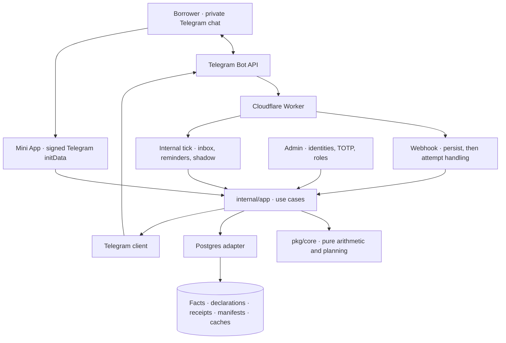

# System overview

This audit describes development **v2.0.4**, commit
`e6814ce406d2a7aea86b09c76429292165f0273f`, schema **22**, engine **`plan/5`**.
There is no production deployment. The
[development acceptance evidence](../design/v3/development-acceptance.md)
defines the supported bounds and remaining field validation. The
[release checklist](../design/v3/release-checklist.md) records the completed rollout.

Marum is a Telegram loan repayment planner: one Go binary and PostgreSQL.
Arithmetic is deterministic; there is no AI in the product. The public listener
serves the Telegram webhook, authenticated Mini App, internal tick and bounded
health/status endpoints. Admin has a separate authenticated listener, exposed on the development admin
hostname; it is not a loopback-only service.

## The parts

| Component | Source | Responsibility |
| --- | --- | --- |
| Wiring and tick | [cmd/marum/main.go](../../cmd/marum/main.go) | Compose services; drain inbox and invoke reminder/shadow work through the internal tick. |
| Webhook | [telegram/webhook.go](../../internal/adapter/in/telegram/webhook.go) | Authenticate, normalize private-chat updates, persist, then attempt immediate handling within a bounded request. |
| Command worker | [app/worker.go](../../internal/app/worker.go) | Lease and process commands; complete/fail using a fencing token. |
| Mini App | [miniapp](../../internal/adapter/in/miniapp) | Borrower UI and authenticated loan, payment, budget, planning and preference workflows. |
| Reminders | [app/reminders.go](../../internal/app/reminders.go) | Generate occurrences and deliver due required/optional reminders; see [messaging](07-messaging.md). |
| Telegram client | [telegramclient/client.go](../../internal/adapter/out/telegramclient/client.go) | Outbound Bot API calls; the current client is not a distributed rate-limited sender queue. |
| Admin | [admin UI](06-admin-ui.md) | Role-scoped inspection, support, policy review/publication and access management. |
| Engine | [pkg/core](../../pkg/core) | Money, dates, amortisation, allocation, ledger replay and dated portfolio planning. |
| Store | [postgres](../../internal/adapter/out/postgres) | Database access using SQL from [queries](../../queries). |

## Rules that shape everything else

1. **Dependencies point inward:** adapters → app → core. Core imports no
   `internal` package and performs no I/O or randomness.
2. **Money is integer minor units.** The unchanged float-exception policy
   and its obsolete package reference are explained in the
   [engineering guide](../engineering-guide.md#11-the-five-invariants).
3. **Time is supplied.** `time.Now()` belongs only in the system-clock adapter;
   the engine receives business dates explicitly.
4. **Financial facts are append-only.** Corrections append voids/reversals and
   replacement facts. `loan_state` is a rebuildable, version-guarded cache.
5. **No amount or personal identifier in logs or metric labels.** Use request
   correlation; restricted audit records are a separate data surface.
6. **Transactions belong to use cases; no network call inside one.** A durable
   receipt and its mutation commit together. This does not mean the entire bot
   conversation, including its Telegram reply, is one database transaction.
7. **Derived projections are recomputed; audit inputs survive.** Original budget
   declarations, policies, scenario changes, activation manifests and hashes are
   retained. “Plans are never persisted” is not the storage contract.

## Evidence and limits

The [golden manifest](../../testdata/golden/MANIFEST.json) records exact-row
coverage and provisional/experimental support per fixture. It includes two
Inecobank documents, a Unibank worked schedule and a CBA regulatory example;
none establishes lender-wide coverage. Unknown allocation rules remain
`unknown/v0` or cause explicit refusal.

`plan/5` separates funding from spending permission. Search certificates state
what was searched and what remains unknown; reduced-domain dynamic and inverse
proofs are not general optimality guarantees. See [domain model](02-domain-model.md)
and [money and dates](04-money-and-dates.md).

## Where to go next

- [Domain model](02-domain-model.md) · [Ledger and replay](03-ledger-replay.md)
- [Money and dates](04-money-and-dates.md) · [Database](05-database.md)
- [Admin UI](06-admin-ui.md) · [Messaging](07-messaging.md) · [Observability](08-observability.md)
