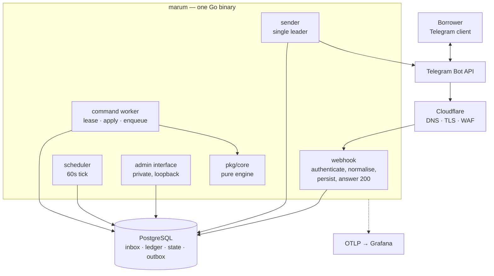

# System overview

Marum is one Go binary and one Postgres database. Everything else — the
Telegram webhook, the command worker, the scheduler, the message sender, the
calculation engine and the admin interface — lives inside that binary and is
selected by configuration rather than by deployment.

That is a deliberate reversal of an earlier design. Splitting into services
multiplied cold starts, idle cost and failure modes without solving the risk
that actually threatens this product, which is arithmetic being wrong.

## The parts

| Component | Package | Responsibility |
| --- | --- | --- |
| webhook | `internal/adapter/in/telegram` | Verify the secret token, normalise the update, persist it, answer 200. Nothing expensive. |
| command worker | `internal/adapter/in/telegram` | Lease a command, apply the whole effect in one transaction, complete it with a fencing token. |
| scheduler | `internal/adapter/in/tick` | 60-second tick under an advisory lock. Generates reminders, groups deliveries, reconciles. |
| sender | `internal/adapter/out/telegramclient` | Exactly one active instance. 28 msg/s globally, 1 msg/s per chat. |
| admin | `internal/adapter/in/admin` | Private interface for the operator. See [admin UI](06-admin-ui.md). |
| engine | `pkg/core` | Pure, deterministic, no I/O. See [money and dates](04-money-and-dates.md). |
| store | `internal/adapter/out/postgres` | The only package that talks to the database. |

## Rules that shape everything else

1. **Dependencies point inward.** Adapters depend on `internal/app`, which
   depends on `pkg/core`. The engine imports nothing from `internal/`, enforced
   by `depguard` and by a CI job that builds the engine on its own.
2. **Acknowledgement means durable acceptance.** Telegram gets its 200 only
   after the command has committed. A crash after the answer cannot lose the
   action.
3. **No network call inside a transaction.** Telegram, object storage and
   telemetry all happen after the commit.
4. **Facts are append-only.** A mistake is superseded or voided, never edited.
5. **Derived state is disposable.** Delete `loan_state` and replay rebuilds it
   byte for byte.

## Where to go next

- [Domain model](02-domain-model.md) — what a loan actually is here
- [Ledger and replay](03-ledger-replay.md) — how a balance is derived
- [Money and dates](04-money-and-dates.md) — the arithmetic, and where it bites
- [Database](05-database.md) — the schema
- [Admin UI](06-admin-ui.md) · [Messaging](07-messaging.md) · [Observability](08-observability.md)
