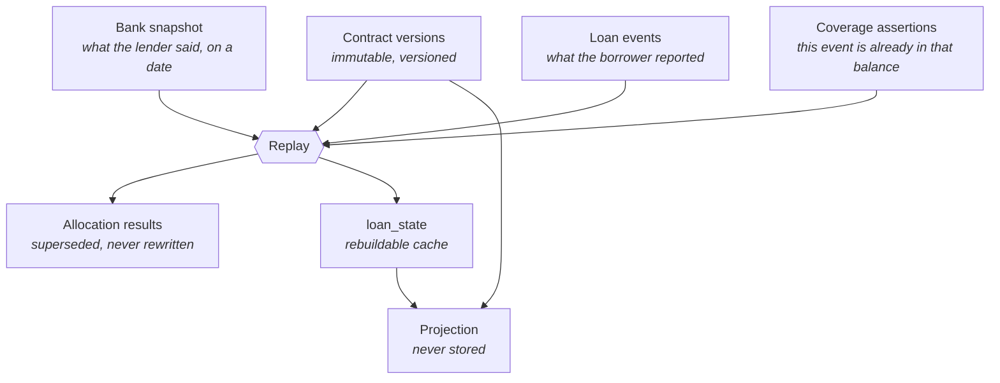

# Domain model

The central idea: **Marum separates what it was told from what it worked out.**
Four things change for different reasons, at different times, from different
sources, so they are four different tables and four different Go types.

## The four layers

### 1. Contract terms — `model.Contract`

What the agreement says: rate, day count, repayment type, payment day,
maturity, rounding policy, the allocation policy that governs it.

Immutable and versioned. A restructuring or a rate change creates a **new
version**; the old one stays, because an event recorded last year must still be
interpretable under the terms that applied then. Effective periods may not
overlap.

### 2. Bank snapshot — `model.Snapshot`

An observation of the lender's own state at the end of a stated business date,
split into buckets that are settled independently: principal, accrued interest,
unpaid interest, current fees, overdue fees, penalties, overdue principal,
advance credit.

It carries a **trust level**, and only one of them counts:

| Trust | Meaning |
| --- | --- |
| `user_entered` | A number the borrower typed. Usable, labelled, does not reset drift. |
| `bank_confirmed` | Confirmed against the bank's app, statement or schedule. **The only kind that anchors a confident plan.** |
| `imported_verified` | Imported from a supported source and confirmed. Not in the MVP. |

Marum never infers a snapshot. If it does not have one it says so.

### 3. Loan events — `model.Event`

What the borrower reported happened. Five kinds, and no generic "correction":

`payment_reported` · `prepayment_reported` · `bank_fee_reported` ·
`entry_voided` · `loan_closed_reported`

A wrong **number** is corrected by a new snapshot. A wrong **entry** is undone
by a void. Neither edits history.

Every event carries **two orderings, never conflated**:

- `recorded_seq` — gapless per loan, the order Marum *learned* things. Survives
  clock skew and out-of-order entry.
- `value_date` — when the lender *applies* it, and what drives replay.

A payment made on the 3rd and entered on the 7th accrues from the 3rd.
Conflating the two mis-states interest by four days.

### 4. Derived state — `model.LoanState`

A cache with an `event_set_hash` and an optimistic-lock `state_version`. A
nightly job recomputes it; a mismatch rebuilds the cache and raises an alert,
because the two disagreeing means one of them is wrong and it is not the
ledger.

## Reliability is part of the state

Because it gates what the product may *claim*, reliability is computed by
replay rather than decided by the interface.

| Reliability | Tier | May show |
| --- | --- | --- |
| `confirmed` | confident | plans, savings, debt-free dates |
| `estimated` | indicative | projections, labelled with the anchor's age |
| `stale` | indicative | same, plus a prompt to confirm the balance |
| `needs_reconciliation` | blocked | the ledger and the exact reason |
| `unsupported` | blocked | the ledger and the exact reason |

Grading rather than a single gate is deliberate: a confirmed-and-fresh check in
front of every calculation would refuse most users most of the time, and a tool
that usually refuses is one people stop opening.

## Buckets, not a balance

`model.Buckets` holds eight components rather than one number, because a
payment is allocated across them in a lender-defined order. "You owe 1,840,000"
is a different statement from a principal, an accrued interest and a fee — and
only the second can be checked against a bank statement.

`AdvanceCredit` is money the lender is *holding*, so it reduces what is owed
rather than being a debt.
