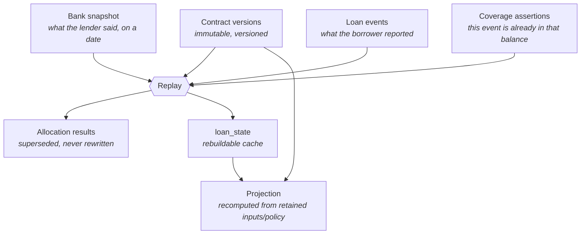

# Domain model

The central idea: **Marum separates what it was told from what it worked out.**
The loan ledger separates contract terms, bank observations, reported events
and derived state. Budget declarations, payment posting facts and plan history
add distinct records around those core types.

## The four layers

### 1. Contract terms — `model.Contract`

What the agreement says: rate, day count, repayment type, payment day,
maturity, rounding policy, the allocation policy that governs it.

Immutable and versioned. A restructuring or a rate change creates a **new
version**; the old one stays, because an event recorded last year must still be
interpretable under the terms that applied then. At the shared boundary date
of a revision, replay selects the version with the latest effective start;
accrual splits intervals at version boundaries. See
[replay implementation](../../pkg/core/ledger/helpers.go).

### 2. Bank snapshot — `model.Snapshot`

An observation of the lender's own state at the end of a stated business date,
split into buckets that are settled independently: principal, accrued interest,
unpaid interest, current fees, overdue fees, penalties, overdue principal,
advance credit.

It carries a **trust level**:

| Trust | Meaning |
| --- | --- |
| `user_entered` | A number the borrower typed. Usable, labelled, does not reset drift. |
| `bank_confirmed` | Confirmed against the bank's app, statement or schedule. Eligible for confirmed replay grading, subject to other checks. |
| `imported_verified` | Recognized as confirmed by core replay; this does not establish an available verified-import workflow. |

Marum never infers a snapshot. If it does not have one it says so.

### 3. Loan events — `model.Event`

What the borrower reported happened. Five kinds, and no generic "correction":

`payment_reported` · `prepayment_reported` · `bank_fee_reported` ·
`entry_voided` · `loan_closed_reported`

A wrong **number** is corrected by a new snapshot. A wrong **entry** is undone
by a void. Neither edits history.

Every event carries **two orderings, never conflated**:

- `recorded_seq` — gapless per loan, the order Marum *learned* things. Survives
  clock skew and out-of-order entry.
- `value_date` — when the lender *applies* it, and what drives replay.

A payment made on the 3rd and entered on the 7th accrues from the 3rd.
Conflating the two mis-states interest by four days.

### 4. Derived state — `model.LoanState`

A cache with an `event_set_hash` and an optimistic-lock `state_version`.
`ledger.Replay` provides deterministic reconstruction from original facts. The
current tick wiring does not run a nightly full-cache replay/repair job; do not
confuse that intended operational check with implemented statement reconciliation.

## Reliability is part of the state

Because it gates what the product may *claim*, reliability is computed by
replay rather than decided by the interface.

| Reliability | Tier | May show |
| --- | --- | --- |
| `confirmed` | confident | eligible for plans, savings and dates within supported planner bounds |
| `estimated` | indicative | projections, labelled with the anchor's age |
| `stale` | indicative | same, plus a prompt to confirm the balance |
| `needs_reconciliation` | blocked | the ledger and the exact reason |
| `unsupported` | blocked | the ledger and the exact reason |

Grading rather than a single gate is deliberate: a confirmed-and-fresh check in
front of every calculation would refuse most users most of the time, and a tool
that usually refuses is one people stop opening.

## Buckets, not a balance

`model.Buckets` holds eight components rather than one number, because a
payment is allocated across them in a lender-defined order. "You owe 1,840,000"
is a different statement from a principal, an accrued interest and a fee — and
only the second can be checked against a bank statement.

`AdvanceCredit` is money the lender is *holding*, so it reduces what is owed
rather than being a debt.

## Payment posting and reconciliation

The [payment use case](../../internal/app/payments.go) adds reported, pending
and posted lifecycle facts around the core ledger. Original transaction/value
dates remain explicit. A bank-reported principal/interest/fee allocation is
optional and must sum to the payment; absence means unknown, not an inferred
principal reduction. User-entered “posted” does not promote trust to
bank-confirmed.

Corrections append a reversal/void and replacement, rather than overwriting a
financial fact. [Reconciliation](../../internal/app/payment_reconciliation.go)
records the statement, event coverage, declared after-payment cash and spending
atomically, guarded by loan and budget versions. A correction to a covered
payment requires a fresh statement.

## Budget: permission is not funding

[Budget funding](../../internal/app/budget_funding.go) says which cash is
available and when. Spending permission says how much may be used in an
independent spending period. Confirmed cash, expected receipts, reserve and
already-spent totals are separate. New calculations require an explicit funding
declaration; original historical manifests retain their original interpretation.

[Effective-dated policies](../../internal/app/budget_policies.go) support
fixed/percentage changes with caps, whole-period replacements, carry and
confirmed released-payment rules. Future-funding edits preserve reconciled cash,
spent totals, reserve and permission. Routing declarations can pool, earmark,
split an entire cash event, or hold it until a date/threshold; past routing needs
explicit retained-cash reconfirmation, never an assumption that cash remains.

## Planning, scenarios and activation

[plan.Input](../../pkg/core/plan/input.go) supplies the dated portfolio simulator
with loan positions, cash and spending rules. Required payments, reserve and
permission constrain optional actions. Comparison normalizes one source input;
activating a named baseline preserves that policy and does not borrow the
optimizer winner's certificate.

Projections are recomputed, but **original plan inputs and decisions persist**.
[PlanManifest](../../internal/app/plan_manifest.go) records source identity,
schema/engine version, input, goal, selected policy, input/result hashes and
budget version. Activation appends a version and activation event with a durable
receipt and expected revision; it checks sources and valuation date before a
new activation.

[Scenarios](../../internal/app/plan_scenarios.go) retain the original manifest,
budget declaration, changes, selected policy and result hash. Preview/save do
not activate. Activation applies the budget declaration and plan together under
source/version checks. Historical replay checks original hashes and refuses an
unavailable engine rather than substituting current rules.

The [acceptance bounds](../design/v3/development-acceptance.md) remain explicit:
inverse proof is limited to the supported fee-free zero-interest domain;
dynamic proof covers a reduced independent-oracle domain. Unknown lender
clauses, posting calendars or fee maxima stay unknown/refused. Search coverage
and unknown bounds must remain visible; there is no lender-wide or general
optimality claim.
