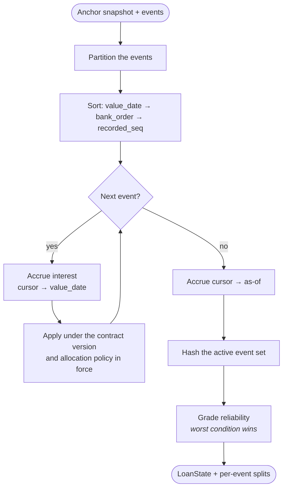

# Ledger and replay

`ledger.Replay` is the definition of what Marum believes. Everything else is a
memo of it.

```go
func Replay(in ledger.Input) (ledger.Result, error)
```

It takes a value and returns a value: no clock, no store, no network. `AsOf` is
a parameter precisely so the same inputs always produce the same output.

## The algorithm



## Partitioning — what takes part in the arithmetic

Decided once, before any arithmetic, so every exclusion has a recorded reason.

| Condition | Outcome |
| --- | --- |
| The event is an `entry_voided` marker | Kept for audit, excluded from the sum |
| The event was voided by a later entry | Kept for audit, excluded from the sum |
| A coverage assertion says the anchor already includes it | Kept, excluded — applying it would double-count |
| `value_date` precedes the anchor, with no assertion | **Excluded, and the loan is blocked** |
| Otherwise | Active |

### The double-counting trap

An event dated before the anchor is genuinely ambiguous. Applying it might
count a payment twice; ignoring it might lose one. Replay refuses to guess: it
excludes the event, sets `needs_reconciliation`, and asks for a fresh balance.

A user confirming *"yes, that payment was already in the balance you saw"*
writes a coverage assertion, which resolves the ambiguity without applying
anything again.

## Ordering

Two orderings, never conflated:

```
replay order:  value_date, then bank_order (when the lender supplies one),
               then recorded_seq as a deterministic tie-break
causal order:  recorded_seq alone
```

`bank_order` is a nullable integer, not the free-text `bank_reference`.
Ordering by an arbitrary reference string is not well defined and would make
replay depend on how a lender happens to format its identifiers.

The sort is **total and stable**. A test rotates the input through every
starting arrangement and asserts the output is identical — without that,
`event_set_hash` means nothing.

## Accrual during replay

Interest accrues on principal **and overdue principal**, between the cursor and
each event's value date. It does **not** compound onto unpaid interest, because
compounding is a contract term the MVP does not model and assuming it would
overstate every balance.

## Voids recalculate everything after them

A void is not "undo the last thing". It removes its target from the arithmetic
and every subsequent allocation is recomputed, because a payment that landed
after it may now settle different buckets. The test asserts the result matches
a ledger that never contained the voided payment.

## The event set hash

A SHA-256 over the anchor plus the fields that change the arithmetic: event ID,
sequence, kind, value date, amount, currency.

**Recording timestamps are excluded on purpose.** Re-entering the same payment
later must not look like a different ledger.

## Reliability grading

Most severe wins. A loan with arrears is `unsupported` even if its anchor was
confirmed this morning.

```
arrears present            → unsupported
ambiguous pre-anchor event → needs_reconciliation
allocation policy unknown  → needs_reconciliation
anchor not confirmed       → estimated
anchor older than 35 days  → stale
otherwise                  → confirmed
```

## Allocation

Where a payment settles first is a **fact about the lender**, not a convention,
so it is data: a versioned `allocation.Policy` with a bucket order and an
excess rule.

| Excess rule | What happens to money paid beyond what is owed |
| --- | --- |
| `reduce_principal` | Applied to principal immediately |
| `hold_as_advance` | Parked as a future instalment — **no interest saving may be shown** |
| `requires_bank_request` | Nothing, until the borrower files a request |
| `unknown` | Nothing is settled; ask for a bank balance |

The default policy is the one that admits it does not know. It moves no bucket,
records the payment as a fact, and marks the loan `needs_reconciliation`. That
is safe degradation, not a failure.

**Money is conserved.** A split always totals exactly the payment, with
anything uninterpretable recorded as `Unapplied` rather than dropped. A test
asserts the buckets fall by precisely what the split claims was applied.
