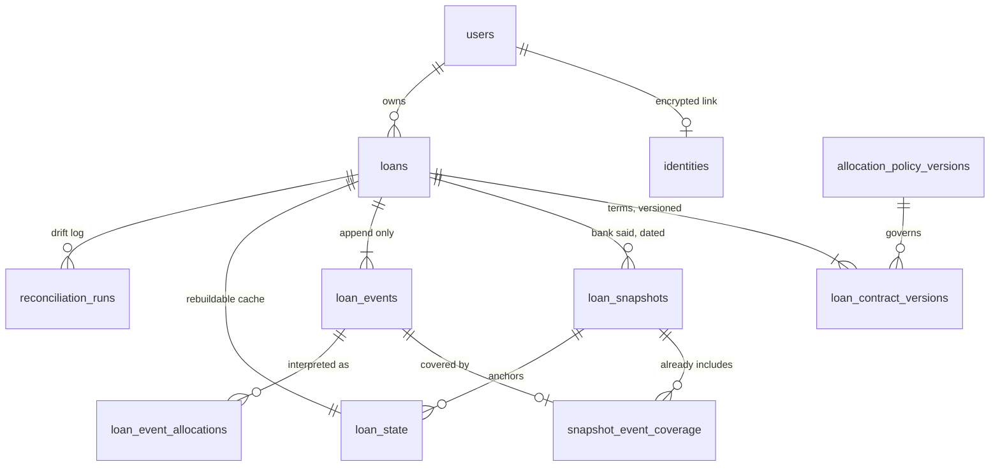

# Database

The local stack uses PostgreSQL 17. The current development schema is **22**
(the migration version, not a table count). Goose migrations live in
[migrations](../../migrations) and are expand-only. SQL lives in
[queries](../../queries), embedded and looked up by name by the current adapter;
no SQL string is written in Go. See [query loading](../../queries/embed.go).

## Conventions

| Concern | Rule |
| --- | --- |
| Money | `bigint` in minor units, with the currency on the owning row. Never `numeric`, never a float. |
| Rates | `numeric(12,9)` |
| Instants | `timestamptz` |
| Business dates | `date`, interpreted in the user's timezone |
| Enumerations | `text` + `CHECK`, not Postgres enums — adding a value to an enum is a migration hazard for no benefit |
| Currency | validated by shape here, against the engine's registry in code |

## The loan domain



## Operations


## Columns worth explaining

| Column | Why it exists |
| --- | --- |
| `identities.key_version` | Which key encrypted the row. Without it, key rotation is guesswork across a table nobody can read. |
| `loan_contract_versions.scheduled_payment_minor` | `NULL` means the borrower did not supply the instalment and the engine must solve for it. Not the same as zero. |
| `loan_events.value_date` vs `recorded_at` | When the lender applies it, versus when we learned of it; `value_date` is nullable for unknown posting. See [replay](03-ledger-replay.md). |
| `loan_events.bank_order` | The lender's intra-day sequence. A nullable integer, deliberately not the free-text reference. |
| `loan_event_allocations.*_minor` | The breakdown as computed *then*. A later engine version must never silently restate history. |
| `loan_state.state_version` | Optimistic lock. Two payments recorded at once cannot lose one another's update. |
| `loan_state.event_set_hash` | Event-set fingerprint from core replay; not a complete plan input/policy hash. |
| `telegram_commands.trace_context` | W3C `traceparent`, so one trace survives the queue. |
| `telegram_commands.user_id` | `ON DELETE SET NULL` preserves inbox deduplication on erasure; completed commands still have a seven-day retention policy. |
| `budgets` PK | `(user_id, currency)`. A dram budget cannot fund a dollar loan without an exchange rate. |
| `deletion_tombstones.subject_hmac` | Erasure marker intended for restore reconciliation; the column alone does not establish an automatic restore workflow. |

## Existing ledger and delivery constraints

**The delivery-item schema has unique occurrence attachments.** The intended
formulation — a partial unique index predicated on the parent's status — is not
expressible: Postgres index predicates may reference only columns of the
indexed table and may not contain a subquery. The current reminder path sends
directly and does not implement that delivery bundling lifecycle. These tables and inspection queries must not be read as
evidence of a running regrouping/outbox worker; see [messaging](07-messaging.md).

**The ledger is append-only.** No `UPDATE`, no `DELETE` on `loan_events`,
`loan_snapshots` or `billing_events`. A test scans every embedded statement and
fails the build if one mutates them.

## Declarations, decisions and retry receipts

| Records | What persists and why |
| --- | --- |
| `budgets`, `budget_versions` | Current budget and immutable versioned declarations, including funding and effective-dated permission policies. Triggers capture each source revision. |
| `loan_command_receipts` | Owner/command key, request hash, loan ID and resulting mutation version; retries return the committed receipt. |
| `budget_command_receipts` | Owner/idempotency key, request hash and budget version, committed atomically with the declaration. |
| `plan_versions` | Original manifest: source identity, schema/engine, inputs, goal, selected policy, budget version and input/result hashes. |
| `plan_activation_events` | Append-only activation intent, revision and retry identity; active plan is selected from activation history per currency. |
| `plan_scenarios` | Original manifest/budget, user changes, selected policy and result hash. Saved scenarios are not active plans. |
| `user_preference_receipts` | Preference/snooze command identity and original result; timezone/quiet choices and occurrence state are versioned. |
| Admin security records | Individual identities and role assignments, reviewed policy revisions, controls/cases and immutable audit events. |

Projections and candidate timelines are rebuilt, not authoritative stored payment
rows. That does **not** mean entire plans are never persisted: manifests and
scenario declarations preserve the original inputs and decisions required for
replay, alongside their hashes. Other tables such as legacy approvals and shadow
recommendations have their own roles; they do not replace immutable activation
history.

Loan `mutation_version` and budget `version` guard user mutations. Loan source
inserts invalidate stale forms; `loan_state.state_version` separately protects
the derived cache. Owner locks and hash-checked receipts prevent a retry from
restoring an older declaration or consuming another revision. See
[loan command storage](../../internal/adapter/out/postgres/loan_commands.go) and
[budget command storage](../../internal/adapter/out/postgres/budget_commands.go).

Activation locks sources and checks the expected revision; scenario activation
changes the budget and appends the manifest/activation in one transaction.
Historical replay uses retained versions and checks hashes, refusing an
unavailable engine. Source changes mark approvals outdated; a date rollover
alone does not invalidate an approved dated timeline.

Migrations [10](../../migrations/00010_budget_versions.sql),
[14](../../migrations/00014_budget_policies.sql),
[16](../../migrations/00016_plan_history.sql),
[17](../../migrations/00017_plan_scenarios.sql),
[21](../../migrations/00021_loan_commands.sql) and
[22](../../migrations/00022_budget_command_receipts.sql) define these boundaries.
History/receipt rollback paths preserve evidence. Account-erasure cascades have
explicit exceptions, including [budget history](../../migrations/00019_budget_history_erasure.sql);
these are not permission to rewrite a live account’s financial history.

## Working with it

```bash
make migrate         # apply
make migrate-status  # what is applied
make migrate-check   # up, down, up
make shell           # psql
make seed            # demo data
```
