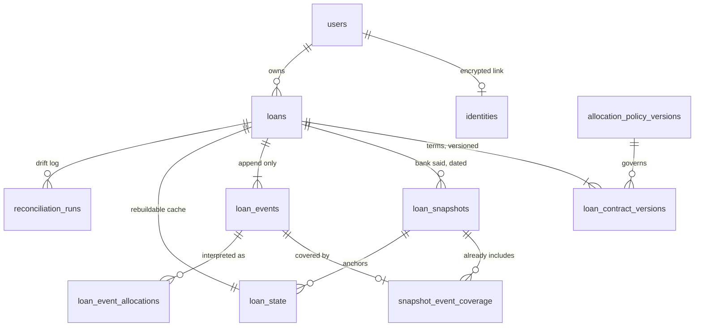
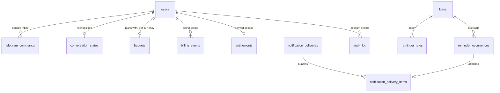

# Database

PostgreSQL 17. 22 tables. Migrations are goose SQL in `migrations/`,
expand-only, and every statement the application runs lives in `queries/*.sql`
— no SQL string is written in Go.

## Conventions

| Concern | Rule |
| --- | --- |
| Money | `bigint` in minor units, with the currency on the owning row. Never `numeric`, never a float. |
| Rates | `numeric(12,9)` |
| Instants | `timestamptz` |
| Business dates | `date`, interpreted in the user's timezone |
| Enumerations | `text` + `CHECK`, not Postgres enums — adding a value to an enum is a migration hazard for no benefit |
| Currency | validated by shape here, against the engine's registry in code |

## The loan domain



## Operations



## Columns worth explaining

| Column | Why it exists |
| --- | --- |
| `identities.key_version` | Which key encrypted the row. Without it, key rotation is guesswork across a table nobody can read. |
| `loan_contract_versions.scheduled_payment_minor` | `NULL` means the borrower did not supply the instalment and the engine must solve for it. Not the same as zero. |
| `loan_events.value_date` vs `recorded_at` | When the lender applies it, versus when we learned of it. See [replay](03-ledger-replay.md). |
| `loan_events.bank_order` | The lender's intra-day sequence. A nullable integer, deliberately not the free-text reference. |
| `loan_events.split` (in allocations) | The breakdown as computed *then*. A later engine version must never silently restate history. |
| `loan_state.state_version` | Optimistic lock. Two payments recorded at once cannot lose one another's update. |
| `loan_state.event_set_hash` | Fingerprint of the facts that produced the position. The nightly job recomputes it. |
| `telegram_commands.trace_context` | W3C `traceparent`, so one trace survives the queue. |
| `telegram_commands.user_id` | `ON DELETE SET NULL`, not cascade — erasing a user must not destroy the permanently unique `telegram_update_id`. |
| `budgets` PK | `(user_id, currency)`. A dram budget cannot fund a dollar loan without an exchange rate. |
| `deletion_tombstones.subject_hmac` | Re-applied after any restore, so a backup cannot resurrect an erased account. |

## Two constraints that are enforced by lifecycle, not by SQL

**An occurrence attaches to at most one live delivery.** The obvious
formulation — a partial unique index predicated on the parent's status — is not
expressible: Postgres index predicates may reference only columns of the
indexed table and may not contain a subquery. So moving a delivery to `dead` or
`canceled` **deletes its item rows in the same transaction**, freeing every
still-valid occurrence to regroup. The delivery row keeps the history; the item
row records only a current attachment.

**The ledger is append-only.** No `UPDATE`, no `DELETE` on `loan_events`,
`loan_snapshots` or `billing_events`. A test scans every embedded statement and
fails the build if one mutates them.

## Working with it

```bash
make migrate         # apply
make migrate-status  # what is applied
make migrate-check   # up, down, up
make shell           # psql
make seed            # demo data
```
