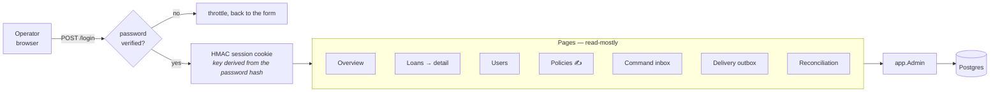

# Admin interface

A private, server-rendered interface on `127.0.0.1:8081` for one operator. Go
`html/template`, no JavaScript framework, no third-party asset of any kind.

**Without `MARUM_ADMIN_PASSWORD_HASH` the interface does not start**, so a
misconfigured deployment has no admin interface rather than an open one.

## Why it exists

It is read-mostly by design. The **one write** is recording a lender's
allocation policy — where a payment settles first, and what happens to money
paid beyond what is owed. That is read off a real contract by a person, and
there is no other surface that can capture it.

Everything else is inspection: the ledger has to be legible, or a discrepancy
report cannot be answered.

## Pages

| Page | Shows |
| --- | --- |
| Overview | Counts, work in flight, oldest pending command and delivery, schema version |
| Loans | Every loan with the reliability its derived state carries |
| Loan detail | Contract versions, bank snapshots, the full ledger with each event's state |
| Users | Internal identities only — Telegram identifiers are never displayed |
| Policies | Every recorded policy, plus the form to add one |
| Command inbox | The durable inbox: status, attempts, leases, errors |
| Delivery outbox | Reminders and replies, with `telegram_message_id` where sent |
| Reconciliation | Drift per bucket at each new confirmed snapshot |

## Security

Deliberately plain, because one operator on loopback does not need more:

- **PBKDF2-HMAC-SHA256**, 210,000 rounds, from the standard library. Generate
  with `make admin-password`; the password never appears on a command line.
- The encoded hash uses `:` separators, not the conventional `$`, because a
  `$` in an environment value is interpolated by Docker Compose, shells and
  systemd, and the value silently loses characters.
- **Session key derived from the password hash**, so changing the password
  invalidates every existing session with no second secret to configure.
- Stateless signed cookie — one operator does not need a session table, and a
  stateless token survives a restart.
- Failed-attempt backoff, geometric and capped.
- Strict CSP: `default-src 'none'`. The interface loads nothing external, so
  the policy can be absolute rather than negotiated.
- **Never exposed through the Cloudflare Worker** — requests to `/admin` from
  the public edge get a 404.

## Rendering

The stylesheet is served as the shared design tokens
(`internal/design/tokens.css`) followed by the admin's own sheet,
so the admin and the Mini App cannot drift apart in colour. The loan page
opens with "What the borrower sees", the Mini App's hero and rows rendered
from the same read model, before the record behind it. See
[Interface v1.1](../design/ui-v1.1.md).

Each page gets its **own template set** containing the layout and itself.
Parsing them all into one set makes the last file parsed win, because every
page defines a template called `content` — which is exactly what happened the
first time, and every page rendered as *Users*.

Pages render into a buffer before writing, so a template error cannot leave a
half-written body behind a 200.
