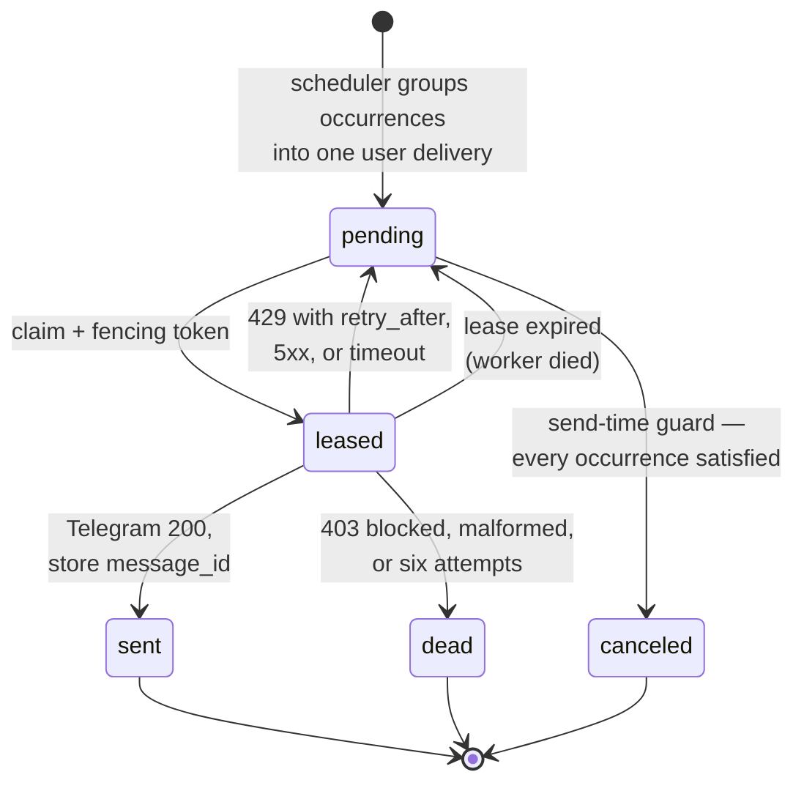

# Messaging

Everything Telegram touches, in both directions. This is where the delivery
guarantees live, and where the design is most explicit about what it cannot
promise.

## Inbound: acknowledgement means durable acceptance

```mermaid
sequenceDiagram
    participant T as Telegram
    participant W as webhook
    participant D as PostgreSQL
    participant C as command worker
    participant S as sender

    T->>W: update (secret token header)
    W->>W: verify, bound, normalise
    W->>D: INSERT ON CONFLICT (telegram_update_id) DO NOTHING
    D-->>W: commit
    W-->>T: 200 OK — only after the commit
    Note over W,T: Crash before this point: Telegram retries.<br/>Crash after: the command is already durable.
    C->>D: lease command (fencing token)
    C->>C: apply effect: event, allocation, state, reminders
    C->>D: one transaction; complete with the same token
    Note over C: No Telegram call inside this transaction.
    S->>D: claim reply delivery
    S->>T: sendMessage
    S->>D: mark sent + message_id
```

### Why a durable inbox, not a dedup table

A table holding only `update_id` is unsafe. Insert the ID, crash before
applying the action, and Telegram's retry is discarded as a duplicate — the
user's payment is silently lost. The inbox stores the **normalised command and
its processing state**, so a retry finds work still pending.

### Leases and fencing

Claiming sets `status='leased'` and a `lease_token`. Completion requires the
same token:

```sql
UPDATE telegram_commands
   SET status = 'completed', completed_at = now()
 WHERE id = $1 AND status = 'leased' AND lease_owner = $2 AND lease_token = $3;
```

A stale worker whose lease expired cannot complete a command another worker has
already reclaimed.

## Outbound: at-least-once, stated plainly



**The gap cannot be closed.** If Telegram accepts a message and the process
dies before the local mark, the message is sent again. There is no idempotency
key Telegram will honour.

Three consequences, all of them product decisions rather than code:

1. Reminder text must read correctly if it arrives twice. No "as I mentioned",
   no sequence numbers.
2. Where a recent identical reminder exists for the same chat, the sender edits
   it via `telegram_message_id` rather than posting again.
3. The runbook does not say "should be impossible". A duplicate is a known,
   rare, accepted outcome, and it is measured.

## Never drop a financial action

An earlier design answered `204` to throttled updates. Telegram treats that as
delivered, which **destroys** the update — potentially a recorded payment or a
deletion confirmation.

Instead:

1. **Deduplicate** on `update_id` — a conflict means already handled.
2. **Persist** before any throttling decision.
3. **Throttle by cost, not by packet.** A plan recomputation is rate limited;
   tapping "Paid in full" is not.
4. **Answer the user** when limited, never silently.

## Exactly one sender

An in-process token bucket only bounds the process it lives in. Two instances
would allow 56 msg/s against Telegram's ~30. The sender takes a Postgres
session advisory lock at startup; only the holder sends.

```go
ok, err := db.TryAdvisoryLock(ctx, lockKey("marum-sender"))
// ok == false: another instance is the sender; this one serves webhooks only.
```

Detection of a dead leader is not instantaneous, so a brief overlap exists.
Two consequences are accepted: the rate may briefly exceed 28/s, which Telegram
absorbs as throttling; and a delivery may be attempted twice, which the fencing
token turns into one successful mark and one rejection.

## Scheduling

| Rule | Behaviour |
| --- | --- |
| Offsets | −7, −3, −1, 0 days, plus an overdue notice at +1. Per loan, editable, disableable. |
| Quiet hours | Nothing sent outside 09:00–21:00 local. A reminder due at 03:00 waits for 09:00. |
| Jitter | Deterministic, seeded from the occurrence ID — spreads the 09:00 spike without becoming irreproducible. |
| Collapsing | Several loans due the same day become **one** message. |
| Send-time guard | Immediately before sending, at least one attached occurrence must still be valid. |

### Collapsing is a capacity decision, not formatting

The binding case is the 09:00 release after quiet hours on a salary day.

| Users | Collapsed | Not collapsed |
| ---: | ---: | ---: |
| 5,000 | 54 s | 5.4 min |
| 20,000 | 3.6 min | **21 min — breaches the SLO** |
| 50,000 | 8.9 min | **54 min — breaches** |
