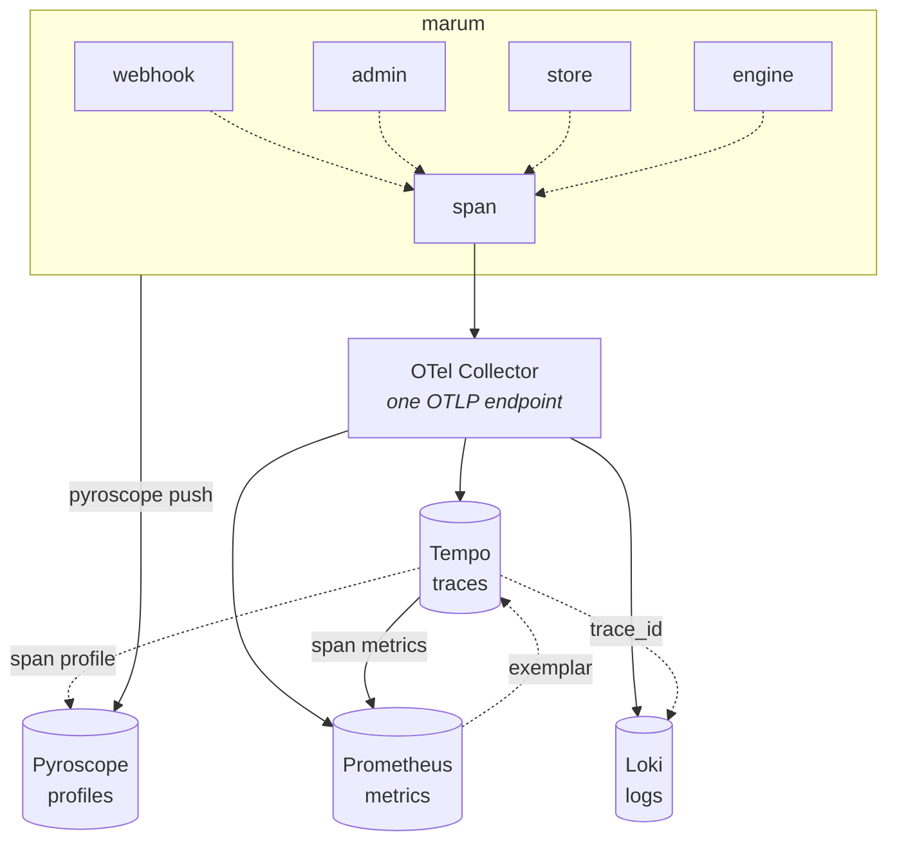

# Observability

Five signals, correlated by one trace ID. `make up` brings the whole stack up
locally; production sends the same OTLP to Grafana Cloud. **Only the URL
differs**, so what is exercised on a laptop is what runs in production.



## Local endpoints

| Service | Address |
| --- | --- |
| Grafana | <http://127.0.0.1:3000> — no login, provisioned |
| Prometheus | `:9090` · Loki `:3100` · Tempo `:3200` · Pyroscope `:4040` |
| OTLP in | `:4318` |

## Correlation, in practice

| Starting from | Path |
| --- | --- |
| A latency spike | Exemplar on the panel → the exact trace → its spans → each span's logs |
| An error alert | Alert annotation carries `trace_id` → trace → the failing span |
| A user quotes a correlation ID | Loki filter on structured metadata → `trace_id` → full trace |
| CPU high, no slow trace | Pyroscope directly — the case traces cannot answer |

Span → logs works because the log handler stamps `trace_id` and `span_id` onto
every record from the context, and the Tempo datasource queries Loki on that
metadata field. The built-in `filterByTraceID` greps the log *line*, which
never contains the ID.

## Seeing inside the monolith

Marum is one deployable but several independent pieces of work. A service graph
keyed on `service.name` shows **one node**, which is true of the deployment and
useless for understanding the system.

Every span therefore carries `marum.component`, and Tempo emits it as a span-
metric dimension:

```go
ctx, span := obs.ComponentStore.Start(ctx, "select.loans")
```

| Component | Work |
| --- | --- |
| `webhook` | authenticate, normalise, persist, answer |
| `worker` | lease a command and apply its effect |
| `scheduler` | tick: generate, group, reconcile |
| `sender` | the single rate-limited Telegram egress |
| `engine` | pure calculation |
| `store` | database access |
| `admin` | the private operator interface |

The **Inside the monolith** dashboard row reads call rate, p95, p99 and errors
per component. The service graph stays for what crosses a process boundary —
`user → marum → postgresql`.

## What never reaches a sink

A redacting `slog` handler strips:

- any value of type `money.Amount` — **by type, not by field name**
- keys matching a denylist: amount, balance, principal, payment, interest, fee,
  penalty, chat, telegram, token, secret, password, payload, body, phone, card
- anything over 512 bytes

No user, loan or chat identifier is ever a metric **label**. Metric labels are
billed by active series, and a label whose cardinality grows with users is both
a bill and an outage. Per-entity detail lives in logs and traces.

`service.version` is deliberately **not** a resource attribute: resource
attributes become metric labels, and a label that changes every deploy
multiplies the catalogue by the number of releases. The version is reported
once by `marum_build_info`.

## Profiling

`pyroscope-go`, five profile types, **60-second** upload interval rather than
the SDK default of 15s — the default is a coin flip against the free-tier
allowance and buys resolution nobody needs at a few requests per second.

Span profiles are the part that earns its keep: a slow span links to the flame
graph *of that span*, not a process-wide average.

## Free tier

Everything above fits inside Grafana Cloud's free tier by construction. The
binding constraints are **configuration choices, not volume** — trace volume
binds at roughly 117,000 users, but a third synthetic probe breaks the
allowance next week. See §11.12 of the design document.
