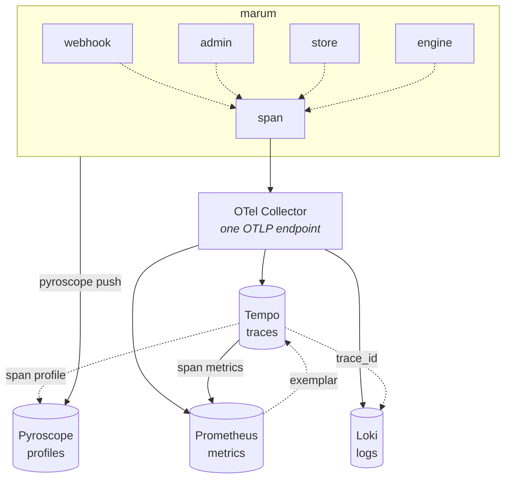

# Observability

Traces, metrics, logs and continuous profiles are wired by
[internal/obs](../../internal/obs). The local Compose stack includes the OTel
Collector, Grafana, Tempo, Loki, Prometheus and Pyroscope. Export destinations
are configurable; **there is no production deployment** and this document does
not claim production parity or measured capacity.

## Local endpoints

| Service | Address |
| --- | --- |
| Grafana | <http://127.0.0.1:3000> — no login, provisioned |
| Prometheus | `:9090` · Loki `:3100` · Tempo `:3200` · Pyroscope `:4040` |
| OTLP in | `:4318` |

## Correlation, in practice

| Starting from | Path |
| --- | --- |
| A latency spike | Exemplar on the panel → the exact trace → its spans → each span's logs |
| A traced error | Follow its correlation ID to the trace and failing span; aggregate alerts do not inherently identify one request |
| A user quotes a correlation ID | Loki filter on structured metadata → `trace_id` → full trace |
| CPU high, no slow trace | Pyroscope directly — the case traces cannot answer |

Span → logs works because the log handler stamps `trace_id` and `span_id` onto
records with a valid span context, and the Tempo datasource queries Loki on
that metadata field. The built-in `filterByTraceID` greps the log *line*, which
never contains the ID.

## Seeing inside the monolith

Marum is one deployable but several independent pieces of work. A single
shared `service.name` would collapse those pieces into one graph node.

Component tracing uses one provider per logical component with
`service.name=marum-<component>`, `service.namespace=marum` and
`marum.component`. `Enter` and `Call` create server/client boundaries, allowing
the service graph to show logical edges inside the monolith. These names do not
mean the components are separately deployed services.

| Component | Work |
| --- | --- |
| `webhook` | authenticate, normalize, persist and attempt immediate handling |
| `worker` | lease a command and apply its effect |
| `scheduler` | tick: inbox, reminders and shadow work |
| `sender` | outbound Telegram calls |
| `engine` | calculation spans around the pure engine |
| `store` | database access |
| `admin` | private operator interface |

See [component tracing](../../internal/obs/component.go) and
[provider configuration](../../internal/obs/obs.go). The pure core does not
export telemetry or perform network I/O itself.

## What never reaches a sink

The [redacting `slog` handler](../../internal/obs/redact.go) replaces
`money.Amount` values by type and attributes whose keys contain denied terms
(amount, balance, principal, payment, instalment, interest, fee, penalty, chat,
telegram, token, secret, password, payload, body, phone or card). It recursively
scrubs groups, reduces error values to their concrete type and truncates long
attribute strings after 512 bytes. It does not make arbitrary free-text logging
safe.

**No amount or personal identifier belongs in logs or metric labels.** Use a
request correlation ID, bounded labels and non-personal diagnostics. Restricted
admin access/security audit records are distinct from ordinary telemetry; do
not route financial evidence into logs or traces as a substitute for authorized
audit access.

`service.version` is deliberately **not** a resource attribute: resource
attributes become metric labels, and a label that changes every deploy
multiplies the catalogue by the number of releases. The version is reported
once by `marum_build_info`.

## Profiling

`pyroscope-go` uploads CPU, allocation-object/space and in-use-object/space
profiles at a configured **60-second** interval. Grafana provisions a
trace-to-profile link by service. That link alone does not prove attribution
of samples to an individual span or guarantee matching profiles for every
logical component service name.

## Deployment and capacity claims

An empty OTLP endpoint disables export and leaves stdout logging; profile
startup also depends on reaching the configured telemetry setup and having a
Pyroscope address. Configuration and pricing assumptions are not measured
capacity or a guaranteed free-tier fit. Local dashboard provisioning is in
[deploy/observability](../../deploy/observability); development acceptance and
remaining field evidence are in
[development acceptance](../design/v3/development-acceptance.md).
