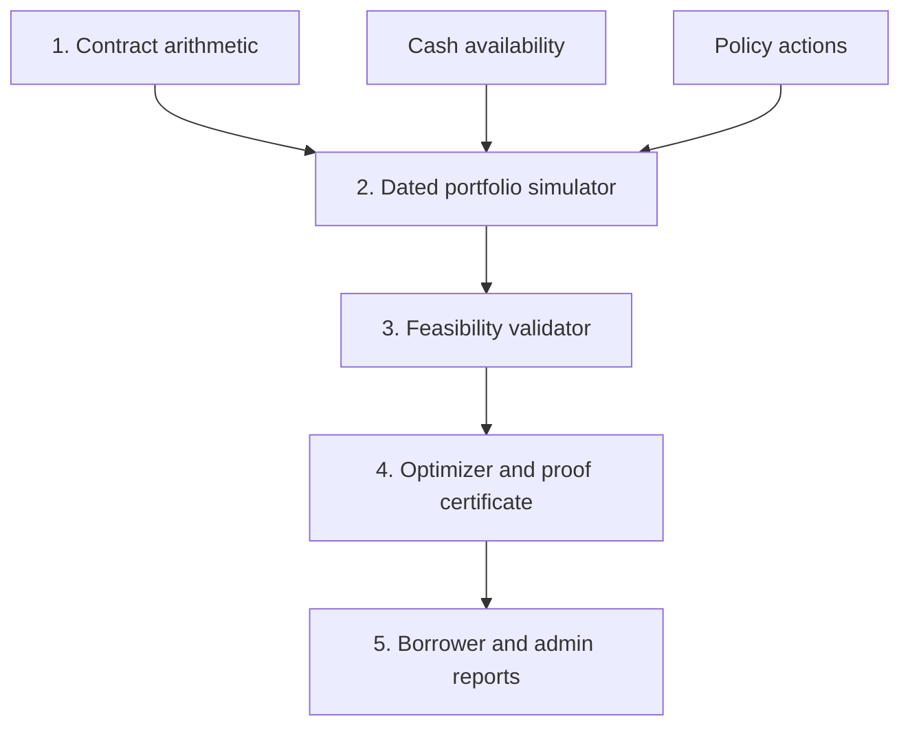

# Marum Decision Engine Review and Definition of Done v2

**Date:** 27 August 2026  
**Scope reviewed:** `advice.go`, `plan.Search`, goal ranking, monthly simulator, `stepCache`, amortization engine, inverse budget solver, report output, and the proposed 25-point acceptance checklist.  
**Desired product claim:** calculate the best possible repayment scenario without AI, using the lender's arithmetic and clearly stated assumptions.

---

## Executive verdict

The engine is already materially better than a normal avalanche/snowball calculator. The dated ACT/365 schedule, exact lender rounding, mid-life anchoring, mandatory-payment reservation, real schedule corpus, row explanations, and deterministic integer arithmetic are the correct foundations.

However, I would **not yet describe the result as “the best possible scenario.”** The current implementation can honestly claim:

> Best result found among tested static loan-priority orders, tested timing modes, and tested global prepayment effects, under the supported contract assumptions.

It cannot yet claim global optimality because:

1. The simulation advances one synthetic “month” at a time instead of processing one shared chronological portfolio timeline.
2. Exhaustive search covers static loan permutations, not dynamic monthly allocations.
3. Timing is selected globally, not independently per loan/action.
4. Prepayment effect is selected globally, not independently for every loan that allows a choice.
5. Fees exist in the model but are missing from search and ranking.
6. Unused cash, minimum-prepayment accumulation, fee-free windows, and liquidity reserves are not search state.
7. The monthly-relief goal is not mathematically well-defined enough to rank reliably.
8. Several errors in the entry path are discarded with `_`, which is unacceptable in a financial calculation path.

The right move is **not a complete rewrite of the amortization engine**. Keep that engine. Remake the portfolio simulator and optimizer boundary around an event-driven timeline, explicit feasibility constraints, independent per-loan actions, and an optimization certificate.

---

## 1. Immediate release blockers

### 1.1 Never discard errors on the advice path

The reviewed entry code contains patterns such as:

```go
loans, _ := w.Loans.LoansForUser(ctx, userID, 25)
positions, owed, required, cur, _ := w.positions(ctx, loans)
budget, _ := w.Budgets.Budget(ctx, userID)
rep, _ := plan.Search(positions, cash, goal)
```

This can transform database, currency, schedule, or optimizer failures into plausible-looking zero/default values.

Required rule:

```text
No ignored error is permitted from data retrieval through report rendering.
```

Use typed errors and map them deliberately:

| Error class | User behavior | Operational behavior |
|---|---|---|
| Missing user input | Ask for the missing field | No alert |
| Unsupported contract | Refuse planning and name the unsupported feature | Product telemetry |
| Inconsistent financial state | Refuse planning and request reconciliation | Warning/admin row |
| Arithmetic invariant failure | Show generic calculation failure | Page immediately |
| Database/network failure | Show temporary failure | Error alert |
| Search horizon exceeded | Say the plan could not be completed within supported horizon | Warning with input fingerprint |

### 1.2 Never silently omit loans

`LoansForUser(..., 25)` is dangerous if 25 is a query limit rather than an enforced product limit. A user with 26 live loans could receive a plan that ignores one obligation.

Required behavior:

- Enforce a documented maximum active-loan count at write time; or
- Fetch all active loans; or
- Return `{loans, has_more}` and refuse planning when truncated.

The report must never be built from an incomplete portfolio.

### 1.3 Rename the current exhaustive mode

For five loans, `permutations(5)` exhausts 120 **static priority orders**. It does not exhaust all possible policies.

A dynamic policy may:

- Pay loan A this month, B next month, then return to A.
- Accumulate cash until a minimum prepayment is reached.
- Use `shorten_term` for A and `reduce_instalment` for B.
- Pay A on receipt but B only in a fee-free window.
- Split surplus across loans at a payoff or fee breakpoint.

Rename the current class:

```text
EXHAUSTIVE_STATIC_ORDER
```

Do not call it `EXACT` or `PROVEN_OPTIMAL`.

### 1.4 Search prepayment effects per loan

Current logic tests one global effect:

```go
effects := []PrepaymentEffect{ShortenTerm, ReduceInstalment}
```

If two loans independently allow borrower choice, the valid effect vectors are:

```text
[shorten, shorten]
[shorten, reduce]
[reduce, shorten]
[reduce, reduce]
```

The current implementation tests only the first and last.

Generate the Cartesian product for choice-enabled loans. If the combination count is capped, return a heuristic label.

### 1.5 Move from monthly parallel loops to one global dated timeline

Each loan can have a different:

- Snapshot date
- Due date
- Payday relationship
- Business-day shift
- Credit/value date
- Reissued schedule date

The current simulator builds one cycle per loan inside a synthetic month and then settles them together. That can allocate money before it exists or after an earlier obligation was already due.

The simulator must process exact dated events across the whole portfolio.

### 1.6 Integrate fees before calling anything “cheapest”

`TotalInterest` is not total cost. A policy with lower interest can be more expensive after:

- Prepayment penalties
- Fixed per-prepayment charges
- Transfer commissions
- Account-service fees
- Mandatory insurance affected by outstanding balance or term

Until fees participate in action feasibility and ranking, call the goal `least_interest`, not `cheapest` or `least_cost`.

---

## 2. What should remain unchanged

Keep these decisions:

- Pure deterministic core with no clock, network, database, randomness, or floating-point money.
- Dated interest rather than `annual_rate / 12` shortcuts.
- Bank schedule as the arithmetic authority.
- Integer money with lender-specific rounding.
- Mid-life planning from a trusted anchor rather than reconstructing the entire historical loan.
- Required installments reserved before optional prepayments.
- Explicit excess behavior: principal reduction, advance installment, request required, or unknown.
- Separate `shorten_term` and `reduce_instalment` effects.
- Minimum-only baseline.
- Row-level explanation.
- Golden schedule corpus.
- Deterministic tie-breaking.
- Budget ladder and inverse budget solver, after their domains are tightened.
- Honest tie explanation.

These are strong foundations. The problem is chiefly the portfolio/time/search layer around them.

---

## 3. Required engine architecture

Split the decision engine into five explicit layers.



### 3.1 Layer 1 - Contract arithmetic

Responsibility: reproduce one lender's loan exactly.

Inputs:

- Contract version
- Trusted state anchor
- Exact dated loan events
- Requested projection horizon

Outputs:

- Next contractual obligations
- Accrued interest
- Allocation of credited payments
- New state
- Reissued future obligation schedule
- Explanation trace

It should know nothing about other loans or the user's portfolio goal.

### 3.2 Layer 2 - Dated portfolio simulator

Responsibility: execute all loans and cash flows on one chronological timeline.

It must separate:

- **Debt budget:** maximum the user wants to devote to debt during a period.
- **Available cash:** money actually available at an instant.
- **Reserve floor:** money that must remain untouched.
- **Income events:** salary, one-time income, or recurring cash.
- **Debt events:** due installments, fees, rate changes, and credited prepayments.

`MonthlyBudget + PayDay` is not sufficient to model all of these safely.

### 3.3 Layer 3 - Feasibility validator

Before comparing a policy, validate:

- Every required payment is made by its required credit date.
- Cash never falls below the reserve floor.
- Currency matches.
- Prepayment minimums, maximums, windows, and request requirements are met.
- Fees fit inside the budget.
- An extra payment is not accidentally counted as the required installment unless that lender policy explicitly does so.
- Unsupported events cause refusal, not silent simplification.

### 3.4 Layer 4 - Optimizer

Responsibility: generate policies, simulate them, rank them under one declared objective, and return a certificate describing how strong the result is.

### 3.5 Layer 5 - Reports

Responsibility: distinguish:

- Bank arithmetic
- User cash movement
- Marum policy choice
- Exact results
- Estimated or heuristic results
- Unsupported assumptions

---

## 4. Recommended core input model

All loans must be normalized to one common `ValuationDate` before portfolio search begins.

```go
type PlanningInput struct {
    ValuationDate Date
    Currency      Currency
    Cash          CashPlan
    Loans         []LoanPosition
    Horizon       Date
    Goal          Goal
}

type CashPlan struct {
    OpeningCash      Amount
    ReserveFloor     Amount
    DebtBudgetByPeriod []BudgetLimit
    IncomeEvents     []CashEvent
    OneTimeFunds     []CashEvent
}

type LoanPosition struct {
    ID                  ID
    Contract            ContractVersion
    State               LoanState
    StateAsOf           Date
    NextDue             Date
    NextRequired        Amount
    AccruedInterest     Amount
    FeesDue             Amount
    Policy              LenderPolicyVersion
    Reliability         ReliabilityState
}
```

Do not enter search with loans anchored on unrelated dates. First replay every loan from its anchor to `ValuationDate`. If a loan cannot be advanced reliably, exclude the entire portfolio from confident optimization and name the reason.

### 4.1 Contract arithmetic needs more than a day-count name

`ACT/ACT` and `30/360` are families, not single conventions.

Use an explicit definition:

```go
type AccrualConvention struct {
    DayCountVariant      DayCountVariant // ACT365F, ACT360, ACTACT_ISDA, 30U360, 30E360, ...
    IncludeStartDate     bool
    IncludeEndDate       bool
    AccrualRoundingStage RoundingStage   // daily, event, installment
    InterestRounding     RoundingPolicy
}
```

Also model:

- Business-day adjustment: none, following, modified following, preceding.
- Holiday calendar and calendar version.
- Same-day cutoff/value-date rule.
- Final-row residual rule.
- Installment rounding separately from interest rounding.
- Fee rounding separately from both.

A single `quantum + mode` is necessary but not always sufficient.

### 4.2 Lender policy must be versioned

```go
type LenderPolicyVersion struct {
    ID                    PolicyID
    EffectiveFrom         Date
    RegulatoryClass       RegulatoryClass
    AllocationWaterfall   []BalanceBucket
    ExcessRule            ExcessRule
    SameDayOrdering       SameDayOrdering
    Prepayment            PrepaymentPolicy
    ScheduleReissue       ReissuePolicy
    SourceDocumentHash    Hash
}
```

The support unit is not merely `Inecobank`. It is:

```text
lender + product family + contract version/range + currency + arithmetic profile
```

Two products from the same bank may use different rules.

---

## 5. Event-driven simulator

### 5.1 Replace the synthetic month loop

Use a priority queue of exact dated events:

```text
income credited
required installment due
recurring fee due
prepayment request becomes effective
prepayment credited
rate changes
grace period starts/ends
schedule reissued
planning horizon ends
```

Conceptual algorithm:

```go
for !allClosed && nextEventDate <= horizon {
    event := timeline.Pop()

    accrueAllAffectedLoans(to: event.CreditInstant)
    applyCashInflows(event)
    applyMandatoryFees(event)
    applyRequiredPayments(event)

    actions := policy.ActionsAt(state, event)
    validate(actions, cash, reserve, lenderRules)

    for _, action := range actions {
        allocation := lender.Apply(action, state)
        state.Apply(allocation)
        cash.Apply(action.CashOutflow)
        timeline.Add(lender.ResultingEvents(allocation))
    }

    trace.Append(state, cash, event, actions)
}
```

### 5.2 Same-day ordering is contractual

“Payment on payday” is not enough. Define:

- When cash becomes available.
- When the bank accepts the instruction.
- Which value date the bank uses.
- Whether accrued interest is settled before principal.
- Whether a required installment and prepayment on the same date are two operations or one allocation.

The engine should use a `CreditInstant` or `(Date, OrderBucket)`, not only a date.

### 5.3 Replace the early-interest shortcut with event allocation

Current shortcut:

```text
early saving = early amount × rate × early days / basis
cycle interest -= early saving
```

This is exact only when all are true:

- The full amount reduces principal immediately.
- The lender does not first allocate part to accrued interest or fees.
- No prepayment fee changes cash available.
- Interest rounding occurs at the same stage assumed by the formula.
- No intervening event changes the balance.
- The lender credits the requested value date.

Safer implementation:

1. Accrue from the prior state date to the prepayment credit instant.
2. Apply the lender allocation waterfall.
3. Reduce the appropriate buckets.
4. Accrue the resulting state to the due date.

The report can still derive and show the timing saving by comparing the two complete simulations.

### 5.4 Redistribute unused surplus

The current policy calculates each loan's `room` before early-interest adjustment. If actual payoff becomes smaller after timing savings, payment capping can leave unused cash.

Any unused amount must return to the portfolio cash pool and be considered for the next eligible loan or carried forward. It must not disappear.

Assert every event:

```text
opening cash + inflows = required outflows + optional outflows + fees + closing cash
```

### 5.5 Minimum-only is a contractual baseline, not a fixed budget

Verify the current `minimum()` implementation carefully. Minimum-only should:

- Pay exactly each loan's required amount on each due date.
- Permit required payments to change by month.
- Include mandatory fees.
- Use no optional prepayments.
- Continue until all loans close contractually.

It should not set one fixed budget equal to today's required total, because future required totals can change.

---

## 6. Timing policy

### 6.1 The earliest-payment dominance theorem must be scoped

Paying extra at the earliest legal credit instant weakly dominates paying it later only under this eligibility predicate:

```text
immediate principal credit
AND no prepayment fee
AND no minimum/maximum threshold
AND no restricted payment window
AND no liquidity/reserve violation
AND no alternative cash return considered
AND fixed non-negative rate over the compared period
AND same downstream prepayment effect
AND same required-payment compliance
```

Under those conditions, `SplitHalf` is useful as an explanation/counterfactual but not as a serious optimum candidate: it is dominated by paying the same available amount earlier.

### 6.2 Timing must be per action, not one global enum

One loan may accept same-day principal credit; another may require a request; another may credit only on its due date.

Represent actions directly:

```go
type PaymentAction struct {
    LoanID          ID
    RequestedAt     CreditInstant
    ExpectedCreditAt CreditInstant
    Amount          Amount
    Intent          PaymentIntent
    Effect          PrepaymentEffect
}
```

### 6.3 Candidate dates in the general search

When the simple dominance rule does not apply, candidate dates must include:

- Earliest legal credit date
- Required due date
- Next fee-free date/window
- Date accumulated cash reaches a minimum prepayment
- Rate reset boundary
- End of grace period
- User-provided one-time cash date

Arbitrary half-splitting is less useful than these contractual breakpoints.

---

## 7. Fees and Armenian regulatory classification

Do not attach one generic `0.6% ACBA-style fee` to all loans.

The Armenian Law on Consumer Credits gives covered consumers an early-settlement right and says total credit cost is reduced proportionally; it also prohibits sanctions for exercising that right. But the same law excludes categories including certain very small/large agreements and real-property acquisition or renovation loans. [Official CBA English text, Articles 3 and 10](https://old.cba.am/EN/lalaws/Law_on_consumer_credit.pdf).

Residential mortgage credit has a different statutory regime. Its early-repayment provisions can allow capped penalties such as 0.6%, 0.4%, and 0.2% in specified early contract years and circumstances. [Official Armenian Legal Information System - Residential Mortgage Credit Law](https://www.arlis.am/hy/acts/117334).

The engine therefore needs `RegulatoryClass` and dated fee rules, not only a lender name.

This is an engineering classification requirement, not legal advice. Have the supported policy profiles reviewed against the current Armenian text before presenting fee-sensitive recommendations.

### 7.1 Fee model

```go
type PrepaymentChargeRule struct {
    EffectivePeriod      DateRange
    FreeAllowance        AllowanceRule
    PercentageBP         int64
    FixedCharge          Amount
    MinimumCharge        Amount
    MaximumCharge        Amount
    Basis                ChargeBasis
    FrequencyScope       FrequencyScope
    Rounding             RoundingPolicy
}
```

The decision engine must distinguish:

- Fee paid in addition to principal.
- Fee deducted from the submitted amount.
- Fee charged only above a free allowance.
- Fee changing by contract year.
- Fixed per-event fee, which creates a batching incentive.
- Transfer/service charge unrelated to legal prepayment penalty.

“Pay early only if this month's saving exceeds the fee” is too local. Compare the full remaining-policy cost, including future interest and future fees.

### 7.2 Reissued schedule as evidence

Armenian rules require financial institutions, on consumer request, to provide an updated repayment schedule after changes such as early repayment or rate changes, generally within one business day for the specified delivery methods. [Official ARLIS regulation](https://www.arlis.am/hy/acts/104603).

That makes reissued schedules the correct golden source for validating `shorten_term` and `reduce_instalment` behavior.

---

## 8. Optimizer design and honesty contract

### 8.1 Define search-strength classes

Every report must contain one:

```go
type SearchStrength string

const (
    ProvenOptimal          SearchStrength = "proven_optimal"
    ExactFiniteDomain      SearchStrength = "exact_finite_domain"
    ExhaustiveStaticOrder  SearchStrength = "exhaustive_static_order"
    BoundedHeuristic       SearchStrength = "bounded_heuristic"
    NamedStrategiesOnly    SearchStrength = "named_strategies_only"
)
```

Meanings:

| Class | Permitted claim |
|---|---|
| `proven_optimal` | Best policy under the explicitly printed mathematical assumptions. |
| `exact_finite_domain` | Best policy over every action in a printed finite date/amount/action domain. |
| `exhaustive_static_order` | Best static priority order tested; dynamic switching was not explored. |
| `bounded_heuristic` | Best found; include lower bound or optimality gap when available. |
| `named_strategies_only` | Comparison of named strategies; no optimality claim. |

### 8.2 Return a proof/search certificate

```go
type SearchCertificate struct {
    Strength              SearchStrength
    EligibilityRule       string
    PoliciesEvaluated     int
    StatesExplored        int
    StatesPruned          int
    AmountQuantum         Amount
    CandidateDates        []Date
    LowerBoundCost        *Amount
    BestCost              Amount
    OptimalityGap         *Amount
    TruncationReason      string
    ContractFingerprints  []Hash
    EngineVersion         string
}
```

The borrower sees a simple sentence. Admin/debug output exposes the full certificate.

### 8.3 Use an independent oracle

Do not validate the optimizer only with itself.

Build a deliberately slow exhaustive oracle for reduced cases:

- 1-3 loans
- 2-6 decision dates
- Small balances
- Coarse amount quantum
- All feasible per-date allocations
- All per-loan effect combinations
- Cash carry enabled

Compare the production optimizer against this oracle in thousands of generated cases. This catches static-order assumptions, pruning bugs, and tie-breaking errors.

### 8.4 General search state

For fee-aware or threshold-aware optimization, state must include:

```text
event date/instant
all loan balance buckets
current contractual installment per loan
remaining term/rate regime
cash available
cash reserved
cash carried from previous periods
prepayment allowance already used
pending lender requests
selected effect per loan
```

Without carried cash, the optimizer cannot discover “wait two months, cross the minimum, then prepay once.”

### 8.5 Static order is still useful

Keep static permutations as a fast, explainable search family. They are valuable candidate policies and a good upper bound. Just label them accurately.

### 8.6 Search once where possible

`compareGoals` currently runs `Search` three times. Build one policy universe where policies share the same feasibility assumptions, simulate each policy once, then rank the results under different objective functions.

If a goal changes policy semantics—such as whether freed cash remains available—model that as an explicit policy dimension rather than hiding it inside the goal comparator.

---

## 9. Goal definitions must be mathematical contracts

There is no universal “best.” The user selects an objective; safety and reserve rules remain hard constraints.

### 9.1 Least total cost

Recommended default:

```text
Primary: minimize total future interest + avoidable lender fees + payment transaction fees
Secondary: earliest final payoff date
Tertiary: fewer prepayment operations
Final tie: canonical policy ID
```

Principal is excluded from cost because it is an existing obligation common to all complete policies. If policies end with unpaid balance, add terminal balance and never compare them as complete.

Until fee modeling is active, name this goal `least_interest`.

### 9.2 Fastest debt-free

```text
Primary: earliest exact final credited payoff date, not integer month count
Secondary: least total cost
Tertiary: lower peak required cash
```

Two policies that finish in “month 18” can differ by several weeks.

### 9.3 Monthly relief - replace the current goal

Current `FreeUpMonthly` ranking by earliest `ReliefMonth`, then `FinalMonthly`, is underdefined and can prefer a negligible one-quantum reduction over a meaningful reduction one month later.

Also, `PeakMonthly` and `FinalMonthly` must not use actual total paid if that includes optional extra payments or a small final partial payment. Relief concerns **future contractual required payments**, not voluntary spending.

Replace it with one of these explicit goals:

#### Reach a required-payment cap

User provides a target:

```text
“Reduce required loan payments to at most 120,000 AMD/month.”
```

Ranking:

```text
Primary: earliest date required total is permanently <= cap
Secondary: least total cost
```

#### Free a requested amount

User provides:

```text
“Free 50,000 AMD/month.”
```

Ranking:

```text
Primary: earliest date baseline required total - planned required total >= target relief
Secondary: least total cost
```

This is much more honest and useful than an unqualified `FreeUpMonthly` goal.

### 9.4 First win

Define whether the goal means:

- Close any loan as soon as possible; or
- Close a user-selected loan.

Ranking should use exact payoff date, then cost.

### 9.5 Freed-payment behavior is a policy, not a hidden goal switch

`KeepBudget` versus `DropBudget` should be explicit:

- `roll_freed_payment`: continue the same debt budget.
- `keep_freed_cash`: reduce future debt spending after a target is achieved.
- `partial_rollover`: keep a user-selected portion.

For relief goals, stop or reduce spending only after the requested relief condition is reached.

---

## 10. Specific code risks to review

### 10.1 `stepCache` key completeness

Current conceptual key:

```text
loan index + balance + from + installment if fixed
```

Cache correctness must not depend on an implicit assumption that index uniquely fixes every semantic input.

Include a contract/policy fingerprint and every state value that affects the next step:

```text
contract version hash
lender policy version hash
balance buckets
from date
next due index/date
effect
fixed/re-solved mode
carried installment
rate regime
fee state
calendar version
```

A cache miss costs performance. A false cache hit silently corrupts money.

### 10.2 `room` must include real payoff and charges

This approximation is insufficient once timing and fees exist:

```text
room = balance + interest - required
```

The maximum valid optional action must come from the lender operation:

```go
quote := lender.QuotePrepayment(state, creditInstant, requestedAmount, effect)
```

The quote returns:

- Principal credited
- Interest settled
- Fee charged
- Cash outflow
- Remaining required installment
- Excess/unused amount

### 10.3 `maxMonths = 600`

Keep a horizon guard, but return a typed `ErrHorizonExceeded`; never return a normal-looking partial result.

### 10.4 Mixed currencies

A USD golden loan is valuable for money/rounding validation. It does not make an AMD+USD portfolio optimizable.

For MVP:

- Run separate plans per currency; or
- Refuse mixed-currency optimization.

Cross-currency optimization requires an explicit FX conversion policy, conversion fees, dates, and risk assumptions.

### 10.5 Current required check is only a first-cycle check

`budget.Monthly >= requiredNow` does not prove future feasibility. The simulator correctly needs to detect a later shortfall, but the returned report must not contain a partial recommendation if month N fails.

Return the earliest infeasible date and exact shortfall.

---

## 11. Property tests - revise the scopes

Properties must declare their preconditions. Otherwise correct new fee behavior will appear to break them.

### P1 - Timing monotonicity

Under immediate principal credit, no fees, no thresholds, same cash availability, same effect, and fixed non-negative rate:

```text
interest(on_receipt) <= interest(split) <= interest(on_due)
```

With rounding, equality is valid.

### P2 - Candidate containment

For `least_interest`, when avalanche and snowball are included in the candidate set:

```text
best_found <= avalanche
best_found <= snowball
```

Do not assert `avalanche <= snowball` for every arbitrary contract model unless the exact supporting assumptions are present.

### P3 - Budget monotonicity

With unused cash allowed and no rule forcing a harmful fee-bearing payment:

```text
larger budget cannot worsen the best attainable objective
```

### P4 - `BudgetFor`

Only run inverse bisection when feasibility is monotone in budget for the selected policy/domain.

At the returned settlement-quantum budget `B`:

```text
clears(B, targetDate) == true
clears(B - settlementQuantum, targetDate) == false
```

Use settlement quantum, not raw minor-unit one, where the lender cannot accept smaller payments.

### P5 - Lump sum

Under fee-free immediate principal credit:

```text
interest(with lump) <= interest(without lump)
payoffDate(with lump) <= payoffDate(without lump)
```

Strict shortening is not guaranteed because rounding or payment dates may leave the payoff date unchanged.

### P6 - Conservation

For every event and complete run:

```text
cash opening + cash inflows
= required payments + optional payments + fees + cash closing

loan opening buckets + accrued charges
= credited principal + settled interest/fees + loan closing buckets
```

### P7 - Replay segmentation

Projecting from date A to C directly must equal projecting A to B, taking the exact resulting state, then B to C.

### P8 - Permutation symmetry

Reordering input loans without changing IDs or contracts must not change the selected policy or totals.

### P9 - Dominated action removal

If the optimizer prunes an action as dominated, the reduced exhaustive oracle must confirm that removing it cannot improve the objective under the same preconditions.

---

## 12. Golden corpus design

### 12.1 Change the coverage unit

Track golden support by arithmetic profile, not only lender:

```text
Inecobank / consumer annuity / AMD / ACT365F / contract family X
Unibank / consumer annuity / AMD / profile Y
ACBA / residential mortgage / AMD / profile Z
```

### 12.2 Exact-row ratchet

Keep the ratchet, but prevent gaming:

- Fixture count cannot decrease.
- Exact row count cannot decrease.
- Existing fixture source hashes cannot change silently.
- Expected rows cannot be rewritten to match a regression without reviewed evidence.
- Duplicating rows does not increase coverage.
- Known mismatches remain visible until explained.
- Every fixture records source type and redaction provenance.

### 12.3 Support states

| State | Meaning |
|---|---|
| `verified` | All rows exact for the required fixture matrix; mid-life and boundary tests pass. |
| `provisional` | At least one full real schedule exact, but boundary coverage incomplete. |
| `experimental` | Partial match or inferred policy. No confident plan. |
| `unsupported` | Explicit refusal. |

Under this definition:

- Inecobank 59/59 can be provisional or verified depending on boundary coverage.
- Unibank 8/11 is experimental, not supported.
- A CBA example is a regulatory/formula fixture, not a lender-production fixture.

### 12.4 Required fixture matrix

The long-term corpus should include:

- Start-of-loan full schedule.
- Mid-life anchor.
- Leap-year crossing.
- Due dates on 28, 29, 30, and 31 where applicable.
- Irregular first period.
- Irregular final period.
- Final balancing payment.
- Real partial-prepayment reissue for each supported effect.
- Fee-bearing mortgage case where legally/contractually applicable.
- One declining-principal profile before enabling that type.
- One USD profile before enabling USD schedules.
- Business-day/holiday shift.

Do not block an Inecobank-only beta on Ameriabank/ACBA/Ardshinbank. Instead, enable only verified profiles. Reliability is stronger when support is narrow and truthful.

---

## 13. Revised Definition of Done

The following replaces the original 25-item checklist.

### Gate 0 - Supported-domain contract

- [ ] **D0.1** Every loan maps to a versioned arithmetic profile and regulatory class.
- [ ] **D0.2** Support is decided per lender/product/profile, not lender name.
- [ ] **D0.3** Unknown profile produces an explicit refusal, never a generic default.
- [ ] **D0.4** Mixed-currency portfolios are separated or refused.
- [ ] **D0.5** Rate reset, grace period, balloon, delinquency, penalty accrual, payment holiday, and restructuring each have either an implementation or a typed refusal reason.
- [ ] **D0.6** No database/core/search error is ignored.
- [ ] **D0.7** No query limit can silently omit an active loan.

### Gate A - Bank arithmetic

- [ ] **DA.1** Exact-row ratchet is enforced with immutable source/fixture hashes.
- [ ] **DA.2** At least three real lender/product profiles have one full exact schedule before claiming broad Armenian-bank coverage.
- [ ] **DA.3** A profile is enabled independently; partial Unibank matching does not block verified Inecobank or imply Unibank support.
- [ ] **DA.4** Mid-life anchor reproduces all remaining rows exactly.
- [ ] **DA.5** Anchor includes principal, accrued/unpaid interest, fees, next due date, next required amount, and `as_of` boundary where the bank exposes them.
- [ ] **DA.6** Day-count variants are named precisely: ACT365F, ACT360, ACTACT variant, and 30/360 variant.
- [ ] **DA.7** Leap-year and accrual-boundary inclusion rules have golden rows.
- [ ] **DA.8** Interest, installment, fee, and final-residual rounding stages are independently modeled and tested.
- [ ] **DA.9** Business-day adjustment and holiday-calendar version are tested where applicable.
- [ ] **DA.10** Every row explanation reproduces the lender row from exact stored inputs.

### Gate B - State anchoring and reconciliation

- [ ] **DB.1** All positions are projected to one common valuation date before portfolio search.
- [ ] **DB.2** A stale or unreliable anchor blocks confident optimization.
- [ ] **DB.3** Bank-confirmed snapshots produce zero **unexplained** drift; source-display precision may have an explicit tolerance.
- [ ] **DB.4** Any drift creates an admin row with bucket, amount, policy version, engine version, and explanation status.
- [ ] **DB.5** Late-entered payments cannot be double-applied across a snapshot boundary.
- [ ] **DB.6** Replay from the same anchor and events is byte deterministic.

### Gate C - Event-driven simulator

- [ ] **DC.1** All loans, income, required payments, fees, and optional actions execute on one globally ordered timeline.
- [ ] **DC.2** Same-day ordering and value-date/cutoff rules are explicit.
- [ ] **DC.3** Interest accrues between every balance-changing event, not merely once per synthetic month.
- [ ] **DC.4** Required payments are met before deadline under the lender's allocation policy.
- [ ] **DC.5** Cash never falls below the configured reserve floor.
- [ ] **DC.6** Unused/capped payment cash is redistributed or carried; it never disappears.
- [ ] **DC.7** Cash and loan-bucket conservation properties hold for every event.
- [ ] **DC.8** Future infeasibility returns the first exact failing date and shortfall; no partial normal report is returned.
- [ ] **DC.9** Horizon exhaustion is a typed error.
- [ ] **DC.10** Minimum-only pays changing contractual requirements and mandatory fees without optional prepayment.

### Gate D - Prepayment behavior and timing

- [ ] **DD.1** Early payment is processed as a dated lender allocation, not only as a cycle-interest subtraction shortcut.
- [ ] **DD.2** Immediate-principal, advance-installment, request-required, and unknown behaviors are distinct.
- [ ] **DD.3** “Required installment remains due” is asserted only for policy profiles where it is true.
- [ ] **DD.4** `shorten_term` matches a real reissued schedule.
- [ ] **DD.5** `reduce_instalment` matches a real reissued schedule.
- [ ] **DD.6** Borrower-choice effect is selected independently per eligible loan.
- [ ] **DD.7** Timing is selected per action/loan.
- [ ] **DD.8** Earliest-payment dominance is used only when its printed preconditions hold.
- [ ] **DD.9** Restricted windows, minimums, maximums, and pending requests affect feasibility.

### Gate E - Fees and total cost

- [ ] **DE.1** Goal is named `least_interest` until fee coverage is complete.
- [ ] **DE.2** Percentage, fixed, minimum, maximum, allowance, frequency, and dated fee tiers are modeled.
- [ ] **DE.3** Fee cash outflow and principal credit are separate.
- [ ] **DE.4** Fixed per-event fees create test cases where waiting and batching wins.
- [ ] **DE.5** Percentage fee creates cases where immediate prepayment wins and cases where it loses.
- [ ] **DE.6** Mortgage 0.6/0.4/0.2-style rules, if supported, are tied to the correct legal/contractual profile and effective year.
- [ ] **DE.7** Full remaining-policy cost determines the decision, not only current-cycle saving versus fee.

### Gate F - Optimizer correctness

- [ ] **DF.1** Current permutation search is labeled `exhaustive_static_order`.
- [ ] **DF.2** Avalanche, snowball, and user-visible baselines are always included in the candidate set.
- [ ] **DF.3** Per-loan effect combinations are searched or explicitly capped/labeled.
- [ ] **DF.4** Dynamic switching is searched when claiming anything stronger than static-order optimality.
- [ ] **DF.5** Carried cash is part of state for thresholds and fixed fees.
- [ ] **DF.6** A reduced independent exhaustive oracle verifies the production optimizer.
- [ ] **DF.7** Every result carries a `SearchCertificate`.
- [ ] **DF.8** `proven_optimal` is emitted only by an eligibility-checked proof path or zero-gap exact finite search.
- [ ] **DF.9** Heuristic truncation prints the reason, evaluated count, and gap/lower bound where available.
- [ ] **DF.10** Pruning rules are individually property-tested against the oracle.

### Gate G - Goals

- [ ] **DG.1** Least cost, fastest payoff, payment relief, and first closure each have a written lexicographic comparator.
- [ ] **DG.2** Fastest payoff compares exact dates, not only integer months.
- [ ] **DG.3** Payment relief uses contractual required amounts, excluding voluntary extra payments and final partial-payment artifacts.
- [ ] **DG.4** Relief requires a target amount or target payment cap.
- [ ] **DG.5** Freed-payment behavior is explicit policy input.
- [ ] **DG.6** Discriminating fixtures prove goals can differ; legitimate coincidences remain acceptable and explained.
- [ ] **DG.7** Minimum-only baseline is shown for every complete policy.

### Gate H - Properties and determinism

- [ ] **DH.1** Timing monotonicity is scoped to its eligibility assumptions.
- [ ] **DH.2** Best-found candidate containment is tested.
- [ ] **DH.3** Ladder/budget monotonicity is tested only in monotone domains.
- [ ] **DH.4** `BudgetFor` returns the minimum settlement-quantum budget.
- [ ] **DH.5** Lump sums weakly reduce interest/payoff date under fee-free immediate credit; strict improvement is not required.
- [ ] **DH.6** Input loan-order permutation cannot change results.
- [ ] **DH.7** Same input produces identical canonical report JSON across repeated runs.
- [ ] **DH.8** Canonical report hashes match on Linux amd64 and arm64.
- [ ] **DH.9** Engine, calendar, contract, lender-policy, and fixture versions are printed in admin output.
- [ ] **DH.10** No map iteration, local timezone, unversioned holiday data, or floating point can reach output.

### Gate I - Explainability

- [ ] **DI.1** Every schedule row explains opening buckets, rate, days, basis, rounding stage, payment allocation, and closing buckets.
- [ ] **DI.2** Every early payment explains requested date, credited date, fee, principal credited, and future effect.
- [ ] **DI.3** Portfolio report separates required cash, optional cash, fees, and carried cash.
- [ ] **DI.4** This-month checklist is chronologically ordered across all loans.
- [ ] **DI.5** Report prints objective, constraints, reserve, cash dates, lender rules, effects, and unsupported assumptions.
- [ ] **DI.6** Report prints search strength in borrower language.
- [ ] **DI.7** Admin report contains the full search certificate and input fingerprint.
- [ ] **DI.8** Diff-vs-bank identifies the first divergent row and exact component causing it.

### Gate J - Performance and operations

- [ ] **DJ.1** Search benchmark uses representative target-container CPU and production build flags.
- [ ] **DJ.2** Five-loan single-goal target is measured at p50/p95/p99, not one local run.
- [ ] **DJ.3** Release target: p95 under 1 second for supported exact/static-order domain; compare p95 under 3 seconds.
- [ ] **DJ.4** CI uses regression thresholds or benchmark ratios; noisy shared-runner timing alone does not fail correctness builds.
- [ ] **DJ.5** A hard user-request deadline cancels search safely and returns no partial result as optimal.
- [ ] **DJ.6** Cache key semantic completeness has a dedicated collision test.
- [ ] **DJ.7** Search metrics include states, policies, cache hit rate, pruning, strength, and truncation—but no user financial labels.

### Gate K - Real-world validation

- [ ] **DK.1** Run recommendations in shadow mode before users act on them.
- [ ] **DK.2** At least five users have two consecutive bank cycles checked row-by-row.
- [ ] **DK.3** At least one real partial-prepayment reissue matches for each enabled effect.
- [ ] **DK.4** At least one user follows a plan for three months.
- [ ] **DK.5** Projected versus bank state stays within source rounding/display tolerance, with zero unexplained drift.
- [ ] **DK.6** Every discrepancy is classified: input, posting/value date, unsupported policy, bank correction, or engine defect.
- [ ] **DK.7** Every engine defect becomes a fixture before the fix.
- [ ] **DK.8** Complaint rate is measured with a denominator and severity; “zero complaints” alone is not sufficient evidence.
- [ ] **DK.9** Public wording is enabled per verified profile only.

---

## 14. Disposition of the original 25 points

| Original | Decision |
|---|---|
| 1 Golden corpus | Keep, but track lender/product profiles, immutable provenance, and coverage—not raw row count alone. |
| 2 Mid-life anchor | Keep and strengthen anchor state and common portfolio valuation date. |
| 3 Day-count coverage | Strengthen variants, boundary inclusion, business-day rules, and golden—not only unit—coverage. |
| 4 Rounding | Keep; expand from quantum/mode to rounding stages and residual behavior. |
| 5 Drift = 0 | Replace with zero unexplained drift and explicit source precision tolerance. |
| 6 Interest monthly | Replace wording with interest accrues between every dated balance-changing event. |
| 7 Prepayment effects | Keep; real reissued schedules are mandatory. |
| 8 Excess rules | Keep; execute via allocation events rather than only interest shortcut. |
| 9 Required not replaced | Make lender-policy-specific, not global. |
| 10 Fees | Promote to release blocker for `least_cost`; add legal/regulatory profile and full fee schedule. |
| 11 Resets/grace/balloon | Require typed explicit refusal paths. |
| 12 Property tests | Keep but scope every property to preconditions and add conservation/oracle properties. |
| 13 Exhaustive <=5 | Replace with `exhaustive_static_order`; add independent dynamic oracle. |
| 14 Latency | Keep; use target hardware percentiles and non-flaky regression gates. |
| 15 Determinism | Strengthen to canonical cross-architecture report hashes and versioned calendars. |
| 16 Goals differ | Replace. Goals need discriminating fixtures, but legitimate results may coincide. |
| 17 Ties | Keep. |
| 18 Assumptions printed | Keep; add cash, reserve, versions, search strength, and legal/policy class. |
| 19 Minimum baseline | Keep; ensure it is contractual changing-minimum simulation, not current required fixed forever. |
| 20 Row Explain | Keep; add allocation buckets, credit instant, and rounding stage. |
| 21 Admin playground | Keep; add first divergence and component cause. |
| 22 First-month checklist | Keep; order globally by exact date across loans. |
| 23 Five users/two months | Keep as initial field gate, preceded by shadow mode. |
| 24 One user/three months | Keep; use zero unexplained drift, not an unconditional literal tolerance claim. |
| 25 Zero complaints | Replace with discrepancy and complaint rate by severity and denominator. |

---

## 15. Recommended implementation order

### Phase 1 - Safety fixes

1. Remove ignored errors.
2. Prevent loan-list truncation.
3. Rename search strength.
4. Fix cache fingerprint.
5. Make unsupported features typed refusals.
6. Correct relief metrics to use contractual required payments.

### Phase 2 - Timeline correctness

1. Normalize all loans to common valuation date.
2. Introduce cash/income/reserve state.
3. Replace month loop with dated event queue.
4. Apply early payment through lender allocation.
5. Add cash conservation and surplus redistribution.
6. Rebuild minimum-only as a contractual baseline.

### Phase 3 - Search honesty and proof

1. Generate per-loan effect vectors.
2. Add per-action timing.
3. Add search certificate.
4. Build reduced exhaustive oracle.
5. Test static-order optimizer against oracle.
6. Emit `proven_optimal` only for a rigorously eligible domain.

### Phase 4 - Fees and dynamic decisions

1. Add regulatory class and dated fee schedules.
2. Add carried cash.
3. Add breakpoint candidate dates/amounts.
4. Add branch-and-bound or dynamic programming with lower bounds.
5. Report heuristic gap when proof is unavailable.

### Phase 5 - Field validation

1. Import real prepayment reissue schedules.
2. Run shadow recommendations.
3. Conduct five-user/two-cycle validation.
4. Conduct one-user/three-month followed-plan validation.
5. Enable profiles individually.

---

## Final recommendation

Do **not** remake the exact bank amortization core that already produces Inecobank 59/59. Make it the trusted single-loan transition function.

Remake these parts:

- Portfolio simulator: synthetic months -> globally ordered dated events.
- Search representation: static global policy fields -> per-loan, per-event actions.
- Search claim: “exhaustive” -> explicit strength certificate.
- Relief goal: vague earliest relief -> user-specified payment cap or relief target.
- Cost goal: interest only -> interest plus verified fees.
- Cash input: monthly budget/payday -> available cash, income events, reserve, and budget limits.

The defensible product promise should be:

> For verified lender profiles, Marum reproduces the bank's arithmetic. It then evaluates repayment policies under the user's exact cash dates and constraints. When the mathematical domain permits proof, it reports the proven best policy; otherwise it reports the best policy found, the strategies evaluated, and the limits of the search.

That is more reliable than claiming universal optimality, and—because it includes a proof class—it is also more technically impressive.


---

## 16. Implementation status (28 August 2026, engine `plan/2`)

Legend: ✅ done · 🟡 partial · ⬜ not started · 🚫 out of code (field work)

### Gate 0 - Supported-domain contract
- 🟡 D0.1 Contract fingerprint covers every arithmetic term; regulatory class not yet a field.
- 🟡 D0.2 Support is per fixture profile in `testdata/golden/MANIFEST.json`; not yet per lender/product at write time.
- ✅ D0.3 Unknown/unsupported terms return `UnsupportedError`; never a default.
- ✅ D0.4 Mixed currency returns `MixedCurrencyError`.
- 🟡 D0.5 Rate reset, grace, balloon, delinquency, holiday, restructuring: refused implicitly (no field exists); explicit typed refusal pending fields.
- ✅ D0.6 No ignored error on the advice path; typed refusals mapped to messages; invariant failures logged as errors.
- ✅ D0.7 `plan.MaxLoans` enforced at `CreateLoan` (SQL guard → `ErrTooManyLoans`); planner refuses >MaxLoans with `TruncatedError`.

### Gate A - Bank arithmetic
- ✅ DA.1 Manifest with sha256, row counts, support state; counts and exact rows may not decrease (`TestCorpusProvenance`).
- ⬜ DA.2 Three real profiles exact — one (Inecobank consumer) today.
- ✅ DA.3 Profiles enabled independently via manifest state.
- 🟡 DA.4 Mid-life anchor projects from the next instalment (`RemainingDates`); no golden mid-life fixture yet.
- 🟡 DA.5 Anchor carries principal and as-of; accrued/unpaid interest and fees not yet part of the planner anchor.
- ⬜ DA.6 Day-count variants named as families, not variants.
- ⬜ DA.7 Leap-year/boundary golden rows.
- 🟡 DA.8 Interest and instalment rounding modelled; fee rounding via settlement unit; residual rule on final date.
- ⬜ DA.9 Business-day adjustment.
- ✅ DA.10 Row explanation from stored inputs (`amortisation.Explain`).

### Gate B - State anchoring
- ✅ DB.1 `Normalize` advances every position to the valuation date; assumed instalments reported.
- ⬜ DB.2 Reliability state does not yet block optimisation.
- 🟡 DB.3-5 Reconciliation rows exist; explanation status not modelled.
- ✅ DB.6 Deterministic replay.

### Gate C - Event-driven simulator
- ✅ DC.1 One ordered timeline (lump, income, due) across loans.
- 🟡 DC.2 Same-day order fixed (lump → income → due by loan index); value-date/cutoff not modelled.
- ✅ DC.3 Interest accrues between balance-changing events.
- ✅ DC.4 Required payments reserved and paid on their dates.
- ✅ DC.5 Reserve floor never spent.
- ✅ DC.6 Unused cash carries forward; nothing disappears.
- ✅ DC.7 Cash identity asserted every run (`ErrInvariant`).
- ✅ DC.8 `InfeasibleError{On, Required, Available, Shortfall}`; no partial report.
- ✅ DC.9 `ErrHorizon` typed.
- ✅ DC.10 Minimum-only pays changing contractual instalments with no optional payment.

### Gate D - Prepayment and timing
- ✅ DD.1 Early payment applied as a dated quote/allocation with accrual to the credit date.
- ✅ DD.2 Excess behaviours distinct; only `reduce_principal` credits early.
- 🟡 DD.3 Required-remains-due is global (true for the consumer-credit profile).
- ⬜ DD.4/5 Reissued-schedule fixtures for each effect.
- ✅ DD.6 Effect vectors per free-choice loan (≤4 free loans, else uniform + label).
- ✅ DD.7 Timing per loan (enumerated when fees make it matter; dominated otherwise, stated in code).
- ✅ DD.8 Dominance used only under the printed preconditions; proof path checks them.
- 🟡 DD.9 Minimum prepayment honoured; windows/maximums/pending requests not modelled.

### Gate E - Fees and total cost
- ✅ DE.1 Goal named `least_interest`; comparator minimises interest + fees.
- 🟡 DE.2 Percent, fixed, min, max, free allowance, contract-year tiers modelled; frequency scope not.
- ✅ DE.3 Fee outflow separate from principal credit.
- ✅ DE.4 Fixed-fee batching via `MinPrepay` thresholds at contract breakpoints; tested.
- ✅ DE.5 Percentage fee redirects the surplus; tested.
- 🟡 DE.6 0.6/0.4/0.2 rules expressible as dated charges; regulatory class not enforced.
- 🟡 DE.7 Decision made on full-run cost; batching thresholds sampled, not solved.

### Gate F - Optimiser
- ✅ DF.1 `exhaustive_static_order` label.
- ✅ DF.2 Avalanche, snowball, minimum always reported.
- ✅ DF.3 Per-loan effect combinations searched or capped with a label.
- ⬜ DF.4 Dynamic switching search.
- ✅ DF.5 Carried cash is state (batching, reserve).
- 🟡 DF.6 Independent oracle exists (`-tags oracle`), reduced case, minutes to run.
- ✅ DF.7 `Certificate` on every report.
- ✅ DF.8 `proven_optimal` only from an eligibility-checked path.
- ✅ DF.9 Truncation reason, counts, lower bound and gap under fees.
- 🟡 DF.10 Timing-dominance pruning covered by P1; oracle covers static order.

### Gate G - Goals
- ✅ DG.1 Written comparators in `better()`.
- ✅ DG.2 Fastest compares exact payoff dates.
- ✅ DG.3 Relief uses contractual required amounts only.
- ✅ DG.4 Relief requires cap or freed amount; the bot asks for it.
- ✅ DG.5 `Rollover` is an explicit policy input.
- ✅ DG.6 Discriminating fixture (`TestGoalsAreDifferentQuestions`).
- ✅ DG.7 Minimum baseline on every report.

### Gate H - Properties and determinism
- ✅ DH.1-6 Scoped properties P1-P5, P7, P8 in `pkg/core/plan/plan_test.go`.
- 🟡 DH.7/8 Same-process determinism tested; canonical cross-architecture hashes not yet in CI.
- ✅ DH.9 Engine version and contract fingerprints in the certificate.
- ✅ DH.10 No clock, floating money or map order reaches output (lint-enforced).

### Gate I - Explainability
- ✅ DI.1/2/4 Row explanations; dated actions with fee and saving; chronologically ordered across loans.
- 🟡 DI.3 Timeline separates required/extra/fees/cash; report shows required, extra, fees.
- ✅ DI.5/6 Assumptions, effect, ties and search strength in borrower language.
- ✅ DI.7 Admin plan panel shows strength, proof rule, truncation, fees.
- 🟡 DI.8 Diff-vs-bank per row exists; first-divergence component not isolated.

### Gate J - Performance and operations
- 🟡 DJ.1-4 `BenchmarkSearchFive` exists; container percentiles not yet measured in CI.
- ⬜ DJ.5 Request deadline cancellation.
- ✅ DJ.6 Cache key fingerprints the contract and every state input.
- ⬜ DJ.7 Search metrics.

### Gate K - Real-world validation
- 🚫 DK.1-9 Field work: shadow mode, five users × two cycles, reissue fixtures, followed plan.

Next in order: DA.2/DA.7/DD.4 (fixtures: mid-life, leap year, reissue, second lender), DB.2 (reliability blocks), D0.5 (explicit refusal fields), DF.4 (dynamic switching with the oracle as the check), DJ (container benchmarks).
