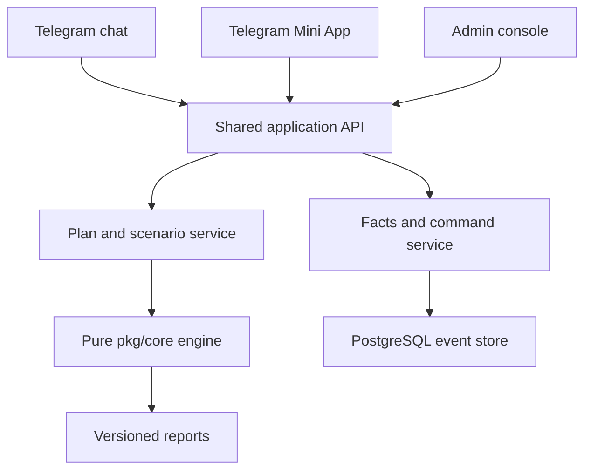
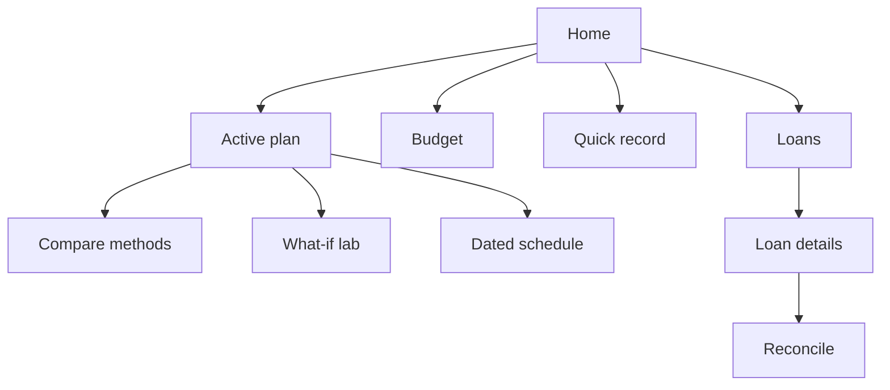

# Marum v3 — Undebt.it-Informed Product, UX, Budget, and Engine Specification

> **Original v3 product specification, preserved as proposed.** Statements below describe their original baseline,
> not the current deployed feature set or remaining release gates. Original
> content is retained for traceability. See [current state](../../current-state.md) for v2.0.3
> and links to current acceptance and release evidence.

**Status:** proposed implementation specification  
**Date:** 2 September 2026  
**Scope:** Telegram bot chat, Telegram Mini App, administrator interface, budget semantics, planning engine, data/API contracts, and delivery plan  
**Baseline:** Marum `pkg/core` engine `plan/2`, the reliable MVP design, and the existing Telegram conversation specification

---

## 1. Executive decision

Marum should adopt Undebt.it's strongest product patterns without copying its financial simplifications.

Adopt:

- A one-screen “Easy Mode” home experience
- A fixed total debt budget with visible required-versus-extra split
- Strategy comparison without re-entering loan data
- One-time and temporary budget adjustments
- What-if scenarios
- Reverse calculation: budget needed to be debt-free by a date
- Quick payment recording
- Payment history and progress snapshots
- Custom payoff order and excluded-but-tracked loans
- A progressive budget option

Do not adopt:

- Generic `APR ÷ 12` monthly interest for Armenian bank loans
- Silent automatic budget increases when required payments rise
- Treating a future planned payment as an actual balance-changing payment
- Treating a negative monthly adjustment as permission to miss required instalments
- Allocating every one-time payment automatically to the first static target
- Changing due dates to simulate skipping a contractual instalment
- Claiming avalanche is universally optimal when fees, dated cash, rate changes, and lender rules exist

The product position should be:

> Undebt.it-style planning clarity, but with Armenian-bank arithmetic, exact dated cash flow, bank reconciliation, explicit uncertainty, and an honest optimality certificate.

The current `plan/2` architecture should remain. The recommended work is an extension around five areas:

1. First-class budget and scenario versions
2. Plan-versus-actual tracking
3. Named strategy baselines in addition to optimiser output
4. Richer Mini App and admin surfaces
5. Safer treatment of future payments, temporary shortages, and changing minimums

---

## 2. What Undebt.it currently does

Undebt.it's public product uses a simple three-step loop: enter debts, choose a strategy and extra monthly payment, then record payments as the plan updates. Its public calculator shows debt-free date, months to payoff, total interest, first debt cleared, payoff order, a balance-over-time chart, and a month-by-month schedule. It also compares snowball and avalanche side by side using the same input data. [Undebt.it home](https://undebt.it/) and [public calculator](https://undebt.it/debt-snowball-calculator.php).

Its account product supports eight advertised payoff methods:

1. Smallest balance first — snowball
2. Highest interest rate first — avalanche
3. Debt-to-interest ratio hybrid
4. Highest monthly payment
5. Highest credit utilisation
6. Highest monthly interest paid
7. Cash Flow Index
8. Custom order

It also supports one-time or future “snowflake” adjustments, including negative adjustments to reduce optional payoff spending in a month; strategy switching; payment history; partial and multiple payments; export; progress displays; promo rates; excluded accounts; and premium what-if scenarios. [How Undebt.it works](https://undebt.it/how-undebt.it-works.php).

The 2026 redesign is especially relevant to Marum. Undebt.it now emphasises:

- A sticky high-level debt-free date
- Compact navigation
- Global search
- Light/dark/system themes
- A visible alert/status area
- “Easy Mode,” where budget, payoff method, payment recording, account creation, and plan export are accessible from one screen
- A method-comparison page
- Multi-variable what-if scenarios
- A reverse solver for the budget needed to reach a target date

[Undebt.it 2026 redesign](https://undebt.it/blog/undebt-it-redesign-launch-2026/).

### 2.1 Undebt.it budget behavior

Undebt.it defines total monthly budget as all money available for debt in the month:

```text
total debt budget = sum of minimum payments + snowball amount
snowball amount = total debt budget - sum of minimum payments
```

If a new account causes minimum payments to exceed the configured budget, Undebt.it can automatically increase the budget to the new minimum total. It exposes a setting to disable that behavior. [Budget FAQ](https://undebt.it/faq-article.php?article_id=41&faq=how-to-change-the-debt-snowball-amount) and [automatic budget adjustment FAQ](https://undebt.it/faq-article.php?article_id=20&faq=why-did-my-monthly-budget-go-up).

“Snowflakes” are positive or negative month-specific adjustments on top of the normal budget. Multiple snowflakes in a month are summed and allocated to the first debt in the selected order. [Snowflake FAQ](https://undebt.it/faq-article.php?article_id=18&faq=how-to-use-debt-snowflakes).

### 2.2 Undebt.it calculation limitation

The public calculator uses standard monthly accrual and explicitly describes its approximation as `APR ÷ 12`; it warns that daily interest, due-date timing, and rate changes can shift real results. Its FAQ states that interest is added monthly on the due-date day and that balances may need manual correction when lender arithmetic differs. [Calculator accuracy explanation](https://undebt.it/debt-snowball-calculator.php) and [interest FAQ](https://undebt.it/faq-article.php?article_id=17&faq=how-monthly-interest-is-accrued).

That approximation is acceptable for a generic educational calculator. It is not acceptable for Marum's bank-matching promise.

---

## 3. Adopt, adapt, or reject

| Undebt.it pattern | Marum decision | Reason |
| --- | --- | --- |
| Fixed total debt budget | Adopt | Easy to understand and compatible with rollover plans |
| Required payments plus extra amount | Adopt, but show both | Prevents users confusing contractual and optional money |
| Automatic minimum rollover after payoff | Adopt as an explicit choice | Some users want speed; others need released cash flow |
| Positive snowflakes | Adopt as dated one-time cash events | Bonuses and irregular income are common |
| Negative snowflakes | Adapt as optional-budget reductions | Must never imply a required payment can be skipped |
| Strategy switching | Adopt | Same facts should support multiple goals and baselines |
| Side-by-side comparison | Adopt | Makes trade-offs visible |
| Custom order | Adopt as a named baseline | User control is valuable, but does not prove optimality |
| What-if scenarios | Adopt | Core planning need |
| Budget-needed-by-date | Adopt and strengthen | Existing Marum inverse solver supports it |
| Progressive monthly budget | Adopt later | Useful for salary increases, but must be capped and versioned |
| Quick Pay | Adopt as Quick Record | Marum records a fact; it does not execute a payment |
| Future-dated payment transaction | Reject | A plan or intent cannot change actual balance |
| Excluded-but-tracked debt | Adopt | Preserves history and total exposure while keeping eligibility honest |
| Promo/deferred interest | Implement explicitly or refuse | Deadline risk can dominate every normal strategy |
| Monthly APR/12 accrual | Reject | Marum uses dated lender-specific arithmetic |
| Silent balance recalculation from user payment | Reject | Bank snapshot remains authoritative |
| Silent auto budget increase | Reject | Affordability cannot be invented by software |
| Skip minimum by moving due date | Reject | Contractual due date is a bank fact |
| Avalanche “always optimal” claim | Reject | Only valid under checked theorem preconditions |
| Credit-utilisation strategy | Product-specific | Only meaningful for revolving credit with a verified limit |

---

## 4. Product surfaces and ownership



### 4.1 Telegram chat owns

- Reminders and alerts
- The next exact action
- Fast balance/payment capture
- Short setup questions
- Recovery from stale or unsupported data
- Deep links to a specific Mini App screen
- Trial and entitlement messages

Chat must not become a full schedule browser.

### 4.2 Mini App owns

- Dashboard and progress
- Loan creation and editing
- Budget configuration
- Strategy and goal comparison
- What-if scenarios
- Detailed plan and schedule
- Activity history
- Reconciliation workflow
- Settings, export, and privacy

### 4.3 Admin console owns

- User/support case review
- Lender arithmetic policies
- Golden corpus and verification state
- Reconciliation differences
- Calculation reports and search certificates
- Notification delivery
- Trial/billing operations
- Feature flags and staged rollout
- Audit, security, and operational health

The admin console must never contain hidden business logic. It edits versioned data and issues commands through the same domain service used by user surfaces.

---

## 5. Shared UX principles

### 5.1 Three outcome types

Every money-related screen or message must be one of:

1. **Act** — exact amount, exact date, exact loan, required/optional label, expected lender effect.
2. **Review** — calculated result, comparison, assumptions, freshness, and search strength.
3. **Resolve** — exact blocker, financial impact, and corrective action.

### 5.2 Plan versus actual

Never merge these concepts:

| State | Meaning | Changes actual loan state? |
| --- | --- | --- |
| Scheduled required payment | Contract says it will be due | No |
| Planned extra payment | User intends to pay | No |
| Reminder acknowledged | User saw or snoozed reminder | No |
| User-reported payment | User says it happened | Provisional event |
| Bank-posted payment | Posting/value date and amount confirmed | Yes |
| Bank-confirmed snapshot | Bank states the resulting balance | Authoritative anchor |

### 5.3 Data freshness is part of every result

Use a visible state chip:

- `Verified • today`
- `Verified • 8 days old`
- `Needs update`
- `Tracking only`
- `Unsupported for planning`

Do not use color alone.

### 5.4 Required and optional money never share one unlabeled number

Always show:

```text
Required this period
Planned extra
Fees
Total planned outflow
Protected reserve
Unused or carried cash
```

### 5.5 Optimisation language

The surface renders the engine certificate:

| Certificate | User label |
| --- | --- |
| `proven_optimal` | Proven best under shown conditions |
| `exact_finite_domain` | Best of all allowed options tested |
| `exhaustive_static_order` | Best fixed-priority plan tested |
| `bounded_heuristic` | Best plan found within search limit |
| `named_strategies_only` | Best of standard strategies compared |

### 5.6 Visual design system

Proposed neutral financial palette:

| Token | Light | Dark | Use |
| --- | --- | --- | --- |
| Primary | `#167C5A` | `#4CCB9A` | Main actions, progress |
| Primary strong | `#0F5F46` | `#77E0B8` | Active navigation |
| Background | `#F6F8F7` | `#101614` | App background |
| Surface | `#FFFFFF` | `#17201D` | Cards |
| Text | `#17201D` | `#F4F7F5` | Primary text |
| Muted | `#66736E` | `#A8B5B0` | Secondary text |
| Warning | `#B7791F` | `#F3B64A` | Uncertainty/action needed |
| Danger | `#B42318` | `#FF7B72` | Infeasible/failed/destructive |
| Information | `#2563EB` | `#79A7FF` | Neutral explanation |

Typography:

- Inter for Latin and numeric content
- Noto Sans Armenian or a tested Armenian system fallback
- Tabular numerals for schedules
- Minimum 16 px body text
- Minimum 44 × 44 px touch targets
- Maximum two decimal positions unless lender quantum requires more

---

## 6. Mini App information architecture

### 6.1 Bottom navigation

| Tab | Purpose |
| --- | --- |
| Home | Next action, budget status, progress, alerts |
| Plan | Active plan, comparison, schedule, what-if |
| Loans | Loan list, add/update, bank state |
| Activity | Payments, snapshots, fees, plan changes |
| More | Reminders, settings, export, privacy, support |

Do not put Budget in the bottom navigation. It is a first-class card on Home and a section inside Plan.

### 6.2 Global layout

- Telegram-safe top padding and back behavior
- Sticky compact header containing debt-free date and current plan status
- Bottom navigation visible on root screens only
- Full-screen sheets for loan and budget forms
- Unsaved-change guard on financial forms
- Light/dark/system theme follows Telegram by default
- Deep links open the exact entity and preserve a return path to chat

### 6.3 Core navigation



---

## 7. Mini App screen specifications

### MA-01 — Launch and integrity check

**Purpose:** establish Telegram identity, load current state, and prevent stale cached UI.

**Layout:**

1. Marum mark
2. `Loading your latest loan state…`
3. Small build/version label only after five seconds

**Behavior:**

- Validate Telegram init data server-side.
- Fetch `/bootstrap` with user version, feature flags, locale, theme, and active-plan version.
- If the client build is stale, force asset refresh once and show a clear recovery action.
- Never show cached money values without `As of <date/time>`.

### MA-02 — First-run onboarding

**Steps:**

1. Language
2. Product boundary and privacy
3. Timezone confirmation
4. Add first loan
5. Confirm bank balance/date
6. Configure reminder preference
7. Optional first budget

Use a progress indicator such as `Step 2 of 6`; allow exit after the first loan is saved.

### MA-03 — Home / Easy Mode

This is Marum's version of Undebt.it Easy Mode.

**Sticky header:**

- Projected debt-free date
- Plan status: Active / Needs update / Paused
- Data freshness chip

**Content order:**

1. **Next action card**
   - Required or optional badge
   - Loan
   - Amount
   - Due/value date
   - `Record payment` or `Review bank request`
2. **This period's debt budget**
   - Total budget
   - Required reserved
   - Optional available
   - Fees
   - Remaining/carry
3. **Progress**
   - Original tracked principal
   - Current bank-confirmed principal
   - Principal repaid
   - Plan-versus-actual line
4. **Loans requiring attention**
5. **Active plan summary**
   - Goal
   - Savings versus minimum-only
   - Search strength
6. **Quick actions**
   - Record payment
   - Update balance
   - Add extra cash
   - Try what-if

**Do not show:** eight large charts, full schedules, or promotional content before the next action.

### MA-04 — Loan list

Each loan card shows:

- Nickname and bank/product
- Currency
- Bank-confirmed balance and as-of date
- Next required payment/date
- Nominal rate
- Planning state
- Current plan priority number
- Small balance trend

Filters:

- Active
- Needs update
- Tracking only
- Paid off
- Excluded from plan

Sort options:

- Plan order
- Next due date
- Balance
- Rate
- Required payment
- Data freshness

### MA-05 — Loan details

Tabs:

1. **Summary** — bank anchor, current projected state, next payment, policy status
2. **Schedule** — bank/Marum row comparison and future projection
3. **Activity** — payments, fees, snapshots, voids
4. **Rules** — day count, allocation, prepayment effect, fee rule, source/version

Primary actions:

- Record payment
- Update bank balance
- Enter reissued schedule
- Exclude/include in plan
- Edit future contract terms

Never offer a direct mutable `Current balance` field. Updating balance creates a dated snapshot.

### MA-06 — Add/edit loan wizard

Form groups:

1. Bank and product
2. Currency and repayment type
3. Balance and exact balance date
4. Rate and rate periods
5. Required instalment and due-date anchor
6. Maturity and remaining schedule
7. Prepayment allocation/effect/fees
8. Verification summary

UX behavior:

- Reveal advanced fields only when product policy requires them.
- Show `Verified`, `Provisional`, or `Tracking only` immediately after bank/product selection.
- Detect duplicate loans.
- Validate one section before advancing.
- Preserve a draft without making it planning-eligible.
- If editing a contractual fact, create a new effective-dated contract version.

### MA-07 — Budget

Header:

```text
Debt budget for September
500,000 ֏ total
320,000 ֏ required • 180,000 ֏ optional
```

Sections:

1. Normal recurring debt budget
2. Income/cash-availability dates
3. Protected reserve
4. This-period override
5. One-time extra cash
6. Released-payment behavior
7. Carry behavior
8. Future changes
9. Budget health

Budget health states:

- **Healthy:** required payments covered with configured safety margin
- **Tight:** required payments covered, but one posting delay or small change causes failure
- **Infeasible:** required payments cannot be covered on exact due dates
- **Incomplete:** cash dates or required amounts are missing

### MA-08 — Plan builder

Steps:

1. Choose objective
2. Select included loans/currency group
3. Confirm budget version
4. Confirm cash dates and reserve
5. Choose rollover behavior
6. Review lender actions and unknowns
7. Calculate

Objectives:

- Lowest total supported cost
- Earliest exact debt-free date
- Reach required-payment cap
- Free a chosen monthly amount
- First loan closed
- Close selected loan
- Custom order

Advanced option: `Also compare standard strategies` defaults on.

### MA-09 — Method comparison

Borrow the clarity of Undebt.it's side-by-side screen, but compare more than order.

Columns on mobile become horizontally paged cards. Rows:

- Debt-free date
- Total future interest
- Verified fees
- Total supported cost
- First loan closed/date
- Date required payments fall below target
- Peak required outflow
- Number of bank-request events
- Search strength
- Assumption differences

Default compared cards:

1. Marum recommendation
2. Highest-rate-first
3. Smallest-balance-first
4. Current active plan

Additional named strategies are available under `Add comparison`.

### MA-10 — Active plan

Sections:

1. Result summary
2. Next three actions
3. This-period allocation
4. Balance-over-time chart: plan, actual, minimum-only
5. Payoff milestones
6. Per-loan order
7. Search certificate in borrower language
8. Assumptions and excluded loans
9. Plan history

Primary action: `Activate reminders` or `Update plan`.

An old plan remains readable but receives a visible `Outdated` banner and cannot create new optional-payment reminders.

### MA-11 — Dated payment schedule

Default view is event-based, not month-only.

Each row:

- Due/value date
- Loan
- Required payment
- Extra payment
- Fee
- Principal credited
- Interest settled/accrued
- Closing principal
- Bank action required
- Actual status

Filters:

- All / required / extra / fees / milestones
- Planned / completed / changed
- Loan
- Date range

Allow CSV and readable report export.

### MA-12 — What-if Lab

Scenario controls:

- Monthly debt budget increase/decrease
- Change effective date
- One-time cash amount and availability date
- Repeating temporary adjustment
- Payday shift
- Reserve change
- Rollover choice
- Target payoff date
- Target required-payment cap
- Strategy restriction

Result delta card:

```text
Debt-free: 14 Feb 2028 → 03 Oct 2027  (-134 days)
Supported cost: 1,240,500 ֏ → 1,131,800 ֏  (-108,700 ֏)
Peak monthly outflow: unchanged
First payoff: 2 months sooner
```

Scenarios are immutable drafts. `Use this scenario` creates a new budget and plan version after confirmation.

### MA-13 — Budget-needed-by-date

Inputs:

- Target exact payoff date
- Earliest effective date for new budget
- Cash arrival pattern
- Reserve
- Maximum acceptable period budget, optional

Outputs:

- Minimum payable recurring budget quantum found
- Required total now
- Additional amount needed
- First failing date if target is impossible
- Sensitivity: one quantum less and one ladder step more
- Search certificate

The UI must not imply income is available merely because a budget target was solved.

### MA-14 — Quick Record

Rename Undebt.it's “Quick Pay” to **Quick Record** because Marum does not execute payments.

Fields:

- Loan
- User-paid amount
- Transaction date
- Bank posting/value date: known / pending
- Required versus extra intent
- New bank balance, optional
- Bank allocation, optional

After saving:

- `Pending bank posting` if value date is unknown
- `Matched` if within lender quantum
- `Needs reconciliation` if outside quantum or allocation is unknown

### MA-15 — Activity

Chronological immutable feed:

- Bank snapshots
- Payments
- Prepayment requests
- Fees
- Schedule reissues
- Contract versions
- Plan activations/invalidations
- Reminder outcomes
- Voids/corrections

Filters and export are required. A correction creates a void event plus a replacement; it never edits history.

### MA-16 — Progress

Cards:

- Principal repaid
- Supported cost paid
- Loans bank-confirmed closed
- Current versus original required payments
- Days ahead/behind the active plan
- Next milestone

Charts:

1. Bank-confirmed actual versus active plan versus minimum-only
2. Principal reduction by loan
3. Interest and fees by period
4. Required payment released over time

Do not treat planned future payments as progress.

### MA-17 — Alerts and resolution center

Prioritised list:

1. Required payment at risk
2. Bank mismatch
3. Unsupported rate reset or balloon approaching
4. Stale balance
5. Missing schedule reissue
6. Unknown fee or prepayment rule
7. Trial/entitlement state

Every alert has one primary resolution action and an explanation of which plans/reminders are affected.

### MA-18 — Settings and privacy

- Language
- Timezone
- Quiet hours
- Notification detail/privacy
- Default budget cycle
- Default reserve
- Plan comparison defaults
- Export
- Delete all data
- App version and calculation-engine version

---

## 8. Telegram bot chat interface

### 8.1 Chat's role

The chat is an action and notification interface. The Mini App is the analysis interface.

Persistent commands:

```text
/home       Next action and current status
/loans      Loan list
/plan       Open active plan or create one
/budget     Show this period's budget
/record     Record a payment or bank balance
/reminders  Upcoming reminders and settings
/help       Help and limitations
```

Persistent keyboard:

```text
Home | Record payment
Open plan | Update balance
Budget | Help
```

### 8.2 Chat-to-Mini-App deep links

| Chat event | Deep-link target |
| --- | --- |
| Required payment reminder | Quick Record prefilled for loan/action |
| Plan ready | Active plan result |
| Budget at risk | Exact failing period in Budget screen |
| Bank mismatch | Reconciliation case |
| Balance stale | Update Balance form |
| Rate reset approaching | Loan Rules section |
| What-if result saved | Scenario comparison |

### 8.3 Core chat messages

#### Next action

```text
Payment due tomorrow

Inecobank consumer loan
Required: 120,000 ֏
Due: 3 September 2026

Planned extra: 35,000 ֏ after the required payment
```

Buttons: `Record payment`, `Open action`, `Remind later`.

#### Budget summary

```text
September debt budget

Total limit: 500,000 ֏
Required reserved: 320,000 ֏
Optional planned: 155,000 ֏
Fees: 5,000 ֏
Unassigned: 20,000 ֏

Status: Healthy
```

Buttons: `Open budget`, `Add one-time cash`, `Change this month`.

#### Positive one-time cash

```text
Extra cash added

Amount: 100,000 ֏
Available: 15 September 2026

This is a plan input, not a recorded payment. The active plan must be recalculated before it is allocated.
```

#### Temporary short month

```text
September optional budget reduced by 80,000 ֏

Required instalments are still fully covered. The projected debt-free date moves 19 days later.
```

If required payments are not covered, refuse the change as an executable plan and show the first exact shortfall.

#### Plan comparison

```text
Three plans compared

Marum recommendation: 14 Feb 2028 • 1,240,500 ֏ cost
Highest rate first: 21 Feb 2028 • 1,251,900 ֏ cost
Smallest balance first: 05 Mar 2028 • 1,278,400 ֏ cost

Marum saves 11,400 ֏ versus highest-rate-first under the shown lender rules and cash dates.
```

#### Best-found warning

```text
Best plan found within the search limit

4,096 valid policies were tested. A better dynamic plan may exist; global optimality was not proven.
```

#### Balance mismatch

```text
Bank balance does not match Marum

Bank: 1,240,700 ֏
Marum: 1,240,600 ֏
Difference: 100 ֏
Allowed quantum: 10 ֏

Optional-payment planning is paused until this is reconciled.
```

Buttons: `Review difference`, `Use bank balance as new anchor`, `Support`.

### 8.4 Notification policy

- Aggregate reminders that fall within the same morning window.
- Never send more than one unresolved optional-payment reminder per action.
- Required-payment reminders remain distinct from Marum subscription notices.
- Default notification preview hides debt balance and bank name.
- Snoozing changes notification time, not contractual due date.
- `I paid` opens amount and posting-date capture; it does not instantly mark the bank balance confirmed.
- Group chats receive no financial details.

The complete Armenian and English sentence catalogue remains in `Marum-Telegram-UX-and-Conversation-Spec.md`; this v3 specification governs the navigation and newly added budget/scenario concepts.

---

## 9. Administrator interface

### 9.1 Admin navigation

```text
Overview
Users
Loans and portfolios
Reconciliation
Lender policies
Golden corpus
Calculations
Notifications
Support cases
Entitlements
Audit and security
System health
Feature flags
```

### 9.2 Roles

| Role | Capabilities |
| --- | --- |
| Support reader | View redacted user state, reports, and cases |
| Support operator | Add support notes, request user confirmation, trigger safe replay |
| Financial verifier | Review fixtures, reconciliation, and lender-policy evidence |
| Policy publisher | Publish a signed/versioned lender policy after approval |
| Operations | Notification, worker, queue, and service health |
| Billing operator | Trial and entitlement state only |
| Security auditor | Audit events, access reports, export/deletion verification |
| Administrator | Role management and feature flags; no power to rewrite financial history |

Require strong authentication and step-up confirmation for exports, deletion, policy publication, and role changes.

### AD-01 — Overview

Top cards:

- Active users and active plans
- Required reminders due today
- Failed or delayed reminder deliveries
- Planning success/refusal rate
- Reconciliation drift cases
- Stale-profile count
- Engine runtime p50/p95/p99
- Calculation error rate by engine version

Queues:

1. Financial correctness requiring attention
2. User-impacting operational incidents
3. Policy verification work
4. Support cases

Never rank the dashboard by revenue before financial correctness.

### AD-02 — User support view

Header:

- Internal user ID
- Telegram identity, minimally displayed
- Locale/timezone
- Trial/entitlement state
- Data export/deletion status
- Current risk flags

Tabs:

- Portfolio
- Activity
- Plans
- Reminders
- Reconciliation
- Support notes
- Audit access

Rules:

- Mask unnecessary personal data.
- No “login as user.”
- Support may create a proposed correction but cannot silently alter facts.
- Every viewed financial report logs purpose and operator.

### AD-03 — Portfolio inspector

Show:

- Included, excluded, unsupported, and paid-off loans
- Common valuation date
- Contract and policy versions
- Anchor trust grade and age
- Next required payment
- Currency groups
- Replay eligibility
- Plans affected by each loan

Primary action: open a loan's audit trail, not edit its balance.

### AD-04 — Reconciliation workbench

Table columns:

- Case age/severity
- User/loan
- Lender profile
- Comparison date
- Bank balance
- Marum balance
- Drift and quantum
- First differing row/event
- Suspected category
- Affected active plan

Case categories:

- Input error
- Posting/value-date difference
- Allocation-policy mismatch
- Fee mismatch
- Day-count/rounding mismatch
- Schedule reissue
- Bank correction
- Engine defect
- Unknown

Resolution actions:

- Accept bank snapshot as new anchor
- Correct via void plus replacement event
- Link to known policy issue
- Escalate profile to provisional/disabled
- Create golden regression fixture after consent/redaction

### AD-05 — Lender policy registry

Policy identity:

```text
lender + product family + contract range + currency + arithmetic profile + effective dates
```

Tabs:

- Arithmetic
- Payment allocation
- Prepayment behavior
- Fees
- Business-day/value-date rules
- Regulatory class
- Evidence
- Fixture coverage
- Change history

States:

- Draft
- Experimental
- Provisional
- Verified
- Disabled
- Superseded

Publishing requires two-person review: author and verifier.

### AD-06 — Golden corpus

Dashboard by profile:

- Exact rows / total rows
- Full schedules
- Mid-life anchors
- Leap-year/day-count cases
- Declining-principal coverage
- Currency coverage
- Prepayment/reissue coverage
- Last verified engine version
- Ratchet regression status

Diff viewer shows bank row, Marum row, difference, quantum, formula explanation, and first cause.

### AD-07 — Calculation inspector

Input:

- Report ID and canonical input hash
- Engine/policy/calendar versions
- Budget version
- Scenario version
- Loan trust grades
- Assumed-payment count

Search:

- Candidate count
- Pruned count
- Cap hit
- Lower bound
- Best cost
- Gap
- Certificate
- Deterministic policy ID

Output:

- Full event/cash ledger
- Conservation checks
- Baseline comparison
- User-facing rendered text

Provide `Replay exact report`; never “recalculate using latest rules” without making it a separate comparison.

### AD-08 — Notification operations

- Upcoming occurrences
- Delivery attempts
- Deduplication key
- Quiet-hours adjustment
- Retry state
- Telegram response class
- User-facing template/version
- Plan/version guard

Operators may retry a failed delivery only through an idempotent command.

### AD-09 — Support cases

Each case includes:

- Typed reason
- Financial impact
- Affected plan/reminder IDs
- User-visible status
- Internal notes
- Reproduction package
- Resolution and user notification

Do not allow support to close a bank mismatch as “resolved” without an anchor, corrected event, or documented policy conclusion.

### AD-10 — Entitlements

- Trial start/end/grace
- Current feature access
- Billing provider status when enabled
- Paused reminder/calculation behavior
- Export/deletion availability

No loan data is needed on this screen.

### AD-11 — Audit and security

- Admin logins and role changes
- User financial record access
- Export/deletion operations
- Policy publication
- Manual command issuance
- Feature-flag changes
- Failed authorization attempts

Audit records are append-only and exportable.

### AD-12 — System health

Signals:

- Telegram webhook lag/deduplication
- Command inbox age and lease failures
- Outbox age and delivery failures
- Plan runtime and timeout rate
- Replay/cache divergence
- Golden-corpus CI status
- Database pool/saturation
- Backup age and restore-test age
- Engine version distribution

### AD-13 — Feature flags

Scope flags by:

- Environment
- User cohort
- Lender profile
- Product type
- Currency
- Engine version
- Surface

Critical flags:

- Planning enabled per profile
- Prepayment planning enabled
- Fee-aware optimisation enabled
- Dynamic optimiser enabled
- Progressive budget enabled
- Mini App screen version
- Reminder template version

Disabling a feature must produce a typed user state, not a missing button or generic error.

---

## 10. Full budget model

### 10.1 Terms

| Term | Definition |
| --- | --- |
| Debt budget | User-approved maximum debt outflow for a defined period |
| Required payments | Contractual amounts due within the period |
| Optional capacity | Budget remaining after required payments and supported fees |
| Cash availability | Actual dated pool from opening cash and income events |
| Reserve floor | Cash that optional payments may not consume |
| Due reserve | Cash protected for required payments before the next income event |
| One-time cash | Extra dated cash available once |
| Period override | Replacement or delta for a specific budget period |
| Carry | Unused optional cash intentionally retained for later debt action |
| Released payment | Contractual required payment removed after a bank-confirmed payoff/reissue |
| Planned outflow | Required + extra + fees scheduled by the active plan |
| Actual outflow | Bank-posted payments and fees |

### 10.2 Default budget mode

Default to a **fixed total debt budget**, not “extra payment.”

```text
period optional ceiling
  = max(0, approved debt budget
           - contractual required payments
           - known mandatory fees)
```

This adopts Undebt.it's understandable budget model while keeping required, optional, and fees separately visible.

### 10.3 Budget is not cash

A budget grants permission to spend up to a limit. It does not prove the money exists on a specific date.

The engine must enforce both:

```text
period outflow <= approved period budget
```

and, at every event time:

```text
cash pool after action >= reserve floor + due reserve + earmarked required cash
```

### 10.4 Dated optional capacity

At event time `t`:

```text
free_cash(t)
  = cash_pool(t)
  - reserve_floor(t)
  - required_before_next_income(t)
  - pending_fees_before_next_income(t)
  - explicit_earmarks(t)

optional_payment_capacity(t)
  = max(0,
      min(free_cash(t),
          remaining_period_budget(t),
          lender_action_limit(t)))
```

The next action can use only this amount.

### 10.5 Budget periods

Support:

- Calendar month
- User-defined monthly cycle anchored to a day
- Pay-cycle periods as a later feature

The UI may group results monthly, but calculation remains event-dated. Do not use an ambiguous “billing month” as the accounting primitive.

### 10.6 Recurring budget

```go
type BudgetPolicy struct {
    ID                  BudgetPolicyID
    Currency            Currency
    EffectiveFrom       Date
    EffectiveTo         *Date
    PeriodRule          BudgetPeriodRule
    TotalLimit          Amount
    FundingSchedule     []RecurringCashRule
    ReserveRule         ReserveRule
    CarryRule           CarryRule
    ReleasedPaymentRule ReleasedPaymentRule
    GrowthRule          *BudgetGrowthRule
    Version             int64
}
```

Editing the normal budget creates a new effective-dated version. Historical plans retain their original version.

### 10.7 Month/period adjustments

Model two types explicitly:

1. **Replacement:** “September debt budget is 420,000 ֏ instead of 500,000 ֏.”
2. **Delta:** “Add 100,000 ֏ in September.”

The UI must not mix them. Store normalized replacement limits in the engine input and retain the user's original intent for explanation.

Negative deltas reduce optional capacity first. They cannot reduce required payments unless the plan returns infeasible.

### 10.8 One-time cash events

```go
type CashEvent struct {
    ID            CashEventID
    Amount        Amount
    AvailableOn   Date
    Kind          CashEventKind // bonus, refund, sale, opening_cash, other
    Certainty     Certainty     // confirmed, expected
    Earmark       *LoanID
    ExpiresOn     *Date
}
```

Rules:

- Confirmed and expected events run as separate scenarios by default.
- An expected bonus cannot make the base plan feasible.
- Multiple events on the same date are summed deterministically.
- A user's earmark is a constraint, not a suggestion.
- Without an earmark, the optimiser may split the amount between loans and dates.
- Unused amounts follow the carry rule.

This improves on Undebt.it, where snowflakes normally go to the first loan in the chosen order.

### 10.9 Carry rules

Options:

- `no_carry`: unused optional budget expires as planning permission; cash remains outside the debt plan.
- `carry_cash`: unused funded cash remains available in the cash pool.
- `batch_until`: carry until a minimum prepayment or fee-efficient threshold is reached.
- `carry_to_date`: earmark for a known fee-expiry or bank-request date.

Budget permission and real cash carry are distinct. If the user did not actually set aside the money, do not assume it remains available next period.

### 10.10 Released-payment behavior

After bank-confirmed payoff or instalment reduction:

- `roll_all`: keep the original total debt budget.
- `release_all`: reduce future budget by the released required payment.
- `roll_amount`: continue a fixed chosen portion.
- `roll_percent`: continue a chosen percentage.
- `until_goal_then_release`: roll until payoff/relief target, then release.

Do not release money when Marum merely projects a payoff. Trigger on a bank-confirmed zero balance or new schedule.

### 10.11 Progressive budget

Inspired by Undebt.it Debt Blaster, but safer:

```go
type BudgetGrowthRule struct {
    Frequency     PeriodFrequency
    FixedIncrease *Amount
    PercentPPB    *int64
    StartsOn      Date
    EndsOn        *Date
    MaximumLimit  *Amount
}
```

Examples:

- Increase debt budget by 20,000 ֏ every January.
- Increase by 3% every six months, capped at 700,000 ֏.

Every future increase is an assumption. The result includes a fallback scenario where growth does not happen.

### 10.12 Minimum-only baseline

The baseline is not a fixed sum forever. It simulates the contractual required schedule as it changes by date, maturity, rate event, and final partial payment. It must not roll optional amounts because none exist; whether freed required payments remain household cash is irrelevant to the baseline's contractual cost.

### 10.13 New-loan or increased-minimum behavior

Never silently increase the user's budget.

If required payments rise above the active limit:

```text
Required payments increased to 530,000 ֏.
Current approved budget is 500,000 ֏.
First shortfall: 30,000 ֏ on 18 September.
```

Actions:

- Approve a new budget
- Add a dated cash source
- Exclude an eligible-but-noncontractual planning item
- Pause optional planning and show required obligations

Excluding a real contractual debt cannot make the household affordable; the UI must say only that it is excluded from Marum's allocation plan.

### 10.14 Mid-period onboarding

Undebt.it notes that a new account may show excessively high payment suggestions when current-month payments were not recorded. Marum should solve this explicitly:

1. Ask which required payments have already been made in the current period.
2. Record user-reported payment facts with posting state.
3. Anchor from a bank balance date.
4. Reserve only still-unpaid required events.
5. Print every assumed intervening payment in the certificate.

### 10.15 Budget scenarios

Every saved scenario contains:

- Base budget version
- Scenario adjustments
- Included cash-event certainty classes
- Loan and policy fingerprints
- Goal and constraints
- Created date
- Engine version
- Result report ID

Scenarios never mutate the active plan. Activation creates a new plan version.

### 10.16 Budget health and stress test

Base stress cases:

- Income arrives three days late
- One expected cash event does not arrive
- A required payment rises by one configured stress percentage
- Bank credits an extra payment on the next business day
- A fee reaches its verified maximum

Classify:

- Healthy: all required events remain feasible
- Tight: base feasible, at least one stress case fails
- Infeasible: base case fails
- Unknown: a required rule/input is missing

Do not optimise against stress cases unless the user selects a conservative objective; show them as risk information.

### 10.17 Worked budget example

Assume:

- Opening usable cash: 100,000 ֏
- Salary: 500,000 ֏ on the 5th
- Reserve floor: 150,000 ֏
- Required instalments: 180,000 ֏ on the 10th and 120,000 ֏ on the 25th
- Approved monthly debt budget: 400,000 ֏
- One-time confirmed cash: 80,000 ֏ on the 18th

Monthly totals:

```text
Required = 300,000 ֏
Normal optional ceiling = 400,000 - 300,000 = 100,000 ֏
One-time cash = separate dated event, not automatic budget increase
```

On the 5th, the simulator protects:

```text
reserve floor + 10th instalment + 25th instalment
= 150,000 + 180,000 + 120,000
= 450,000 ֏
```

Cash after salary is 600,000 ֏, so only 150,000 ֏ is free cash. The normal period budget allows only 100,000 ֏ optional spending. Therefore the maximum normal extra on the 5th is 100,000 ֏, further capped by lender rules. The 80,000 ֏ arriving on the 18th may be tested as a separate action only after that date.

---

## 11. Core-engine improvements

### 11.1 Keep the current layers

Keep:

```text
money → date → model → amortisation → allocation → ledger → plan
```

The latest design already fixes the earlier structural defects:

- Dated global event loop
- Real cash pool and reserve protection
- Exact required-payment failures
- Per-loan timing and prepayment effects
- Fee quotes and batching thresholds
- Cash conservation
- Named baseline reports
- Search certificates
- Cross-platform determinism

The next version should be `plan/3`, not a fresh architecture.

### 11.2 Add first-class scenario and budget versions

```go
type PlanningInput struct {
    ValuationDate Date
    Currency      Currency
    Budget        BudgetVersion
    Scenario      ScenarioVersion
    Positions     []LoanPosition
    Goal          Goal
    Horizon       Date
}
```

Separate normal recurring rules from scenario changes. Canonical hashes include both IDs and their full normalized content.

### 11.3 Add named strategy baselines

Implement these as deterministic priority generators, not “optimal” algorithms:

| Strategy | Priority key | Eligibility |
| --- | --- | --- |
| Snowball | Lowest current payoff amount | Supported loans |
| Avalanche | Highest verified marginal cost | Fee-free theorem case or named baseline |
| Highest rate | Highest current nominal/effective rate | Named baseline |
| Hybrid | Lowest `balance / current annual rate` | Rate must be positive |
| Highest required payment | Highest next contractual required amount | Supported loans |
| Highest monthly interest | Highest projected interest over next contractual period | Exact schedule available |
| Cash Flow Index | Lowest `payoff amount / released required payment` | Payoff/reissue must release known payment |
| Highest utilisation | Highest `balance / verified limit` | Revolving credit only |
| Custom | User-defined stable order | Validate all eligible loans exactly once |

For Marum, “avalanche” should prefer verified marginal future cost rather than blindly nominal rate when lender fees or rate windows make the latter misleading. Retain a pure highest-nominal-rate baseline for recognisability.

### 11.4 Make strategy comparison one engine operation

```go
type ComparisonRequest struct {
    Input          PlanningInput
    StrategyIDs    []StrategyID
    OptimizedGoals []Goal
}

type ComparisonReport struct {
    SharedInputHash Hash
    Results         []PolicyResult
    PairwiseDeltas  []ResultDelta
}
```

Simulate a canonical policy once, then rank it under every compatible goal. Do not recompute identical plans per screen.

### 11.5 Extra cash allocation

Unlike Undebt.it snowflakes, a Marum cash event can be:

- Optimiser allocated
- User earmarked to a loan
- Split across loans
- Held for a threshold/date
- Ignored in the conservative scenario if uncertain

Candidate action dates include cash arrival, due dates, fee boundaries, request completion, rate changes, and business-day posting boundaries.

### 11.6 Future action versus actual event

Add different types:

```go
type PaymentIntent struct {
    PlannedOn Date
    Amount    Amount
    LoanID    LoanID
    PlanID    PlanID
}

type PaymentFact struct {
    TransactionDate Date
    ValueDate       *Date
    Amount          Amount
    Trust           TrustGrade
}
```

`PaymentIntent` affects only plan display and reminders. `PaymentFact` participates in replay. Never store a future payment as an active ledger fact.

### 11.7 Promo, deferred-interest, grace, and reset events

Undebt.it supports promo-rate expiry and prioritises deferred-interest accounts. Marum must model them as dated contract events:

```go
type RatePeriod struct {
    From Date
    To   *Date
    Rate RatePPB
}

type DeferredInterestClause struct {
    Deadline        Date
    RetroactiveRate RatePPB
    TriggerRule     TriggerRule
}
```

If the engine cannot reproduce the trigger and retroactive charge, refuse full-horizon planning. Do not approximate it by moving the loan to the top.

### 11.8 Progressive budget scenarios

The engine expands a `BudgetGrowthRule` into dated funding limits before simulation. Reports print the full assumption sequence and a no-growth comparison.

### 11.9 Dynamic optimiser extension

The current policy universe of priority orders × timing vectors × effect vectors × batching thresholds, capped at 4,096, is a strong bounded static search. Add an optional exact/dynamic search for small portfolios:

State:

```text
event index
cash bucket
loan balances and schedule states
fee allowances
pending bank actions
period budget remaining
carry/earmark state
```

Actions:

- Allocate zero or a settlement-quantum bundle to each eligible loan
- Split among loans
- Hold cash
- Submit bank request
- Select allowed prepayment effect

Use:

- Dominance pruning
- Admissible lower bound
- Canonical state hashing
- Exact oracle for reduced quantums/problems
- Time/state limit
- Returned optimality gap

Never downgrade from a full cash/date state to a balance-only cache key.

### 11.10 Safe dominance rules

Prune state A by state B only if, at the same event and contract state:

- B has at least as much free cash
- B has no greater principal in every comparable loan, or a proven cost lower bound dominates
- B has no fewer unused fee allowances
- B has no additional pending request delay
- B has not spent more period budget
- B is no worse on every hard goal constraint

If proof is uncertain, do not prune.

### 11.11 Inverse solver

For target date `D`, `BudgetFor(D)` finds the smallest payable budget quantum whose chosen exact/bounded search produces final credited payoff `<= D`.

Requirements:

- Verify monotonicity for the supported domain.
- Return typed non-monotone refusal if budget growth, fees, or discrete thresholds violate the solver assumption.
- Confirm result budget succeeds.
- Confirm one quantum less fails or misses the target.
- Show the first exact shortfall if infeasible.
- Run sensitivity at useful display increments.

### 11.12 Plan-versus-actual engine

After each bank-posted event:

1. Replay actual state.
2. Compare with the active plan at the same value date.
3. Attribute variance to amount, date, fee, allocation, schedule, or missing event.
4. Mark plan current, deviated-but-valid, outdated, or blocked.
5. Recalculate only after user confirmation unless the change is explicitly configured as automatic.

### 11.13 Excluded loans

Track three independent flags:

```text
included_in_total_exposure
included_in_required_cash_guard
eligible_for_optional_allocation
```

A contractual loan normally remains in total exposure and required-cash guard even if excluded from optional allocation. This is safer than a single `included` boolean.

### 11.14 Purchases and additional draws

Undebt.it tracks purchases. Marum should expose additional-draw events only for supported revolving products:

- Purchase/draw date
- Posting date
- Amount
- Rate bucket/promo bucket
- Fee

Do not add generic “purchase” events to amortising loans.

### 11.15 Report output additions

Add:

- Budget version and scenario version
- Required/extra/fee/carry totals by period
- Expected versus confirmed cash events
- Plan-versus-actual variance
- Strategy baseline table
- Stress-test summary
- Progressive-budget assumptions
- Excluded-loan guard behavior

---

## 12. Data model additions

Recommended tables:

```text
budget_policies
budget_policy_versions
budget_period_overrides
cash_events
cash_event_occurrences
scenarios
scenario_adjustments
payment_intents
plan_versions
plan_actions
plan_variances
strategy_definitions
admin_cases
policy_reviews
feature_flag_scopes
```

Important constraints:

- Every version is immutable after publication/activation.
- User changes create a new version.
- One active budget and one active plan per currency group.
- Cash-event occurrence IDs are idempotent.
- Plan action links to exact report, loan contract, policy, and budget versions.
- Future intent cannot reference a ledger allocation result.
- Actual payment cannot be created from a reminder acknowledgement alone.
- All admin corrections are commands producing events.

---

## 13. API surface

### 13.1 User API

```text
GET    /v1/bootstrap
GET    /v1/dashboard
GET    /v1/loans
POST   /v1/loans
GET    /v1/loans/{id}
POST   /v1/loans/{id}/contract-versions
POST   /v1/loans/{id}/snapshots
POST   /v1/loans/{id}/payments
POST   /v1/loans/{id}/voids

GET    /v1/budgets/active
POST   /v1/budgets/versions
POST   /v1/budgets/overrides
POST   /v1/cash-events

POST   /v1/plans/compare
POST   /v1/plans/search
POST   /v1/plans/budget-for-date
POST   /v1/plans/{id}/activate
POST   /v1/plans/{id}/stop
GET    /v1/plans/{id}/schedule
GET    /v1/plans/{id}/certificate

POST   /v1/scenarios
POST   /v1/scenarios/{id}/calculate
POST   /v1/scenarios/{id}/activate

GET    /v1/activity
GET    /v1/alerts
POST   /v1/alerts/{id}/resolve
POST   /v1/exports
DELETE /v1/user-data
```

Every mutation accepts:

- Idempotency key
- Expected aggregate version
- Locale/timezone context where relevant

Every response containing money includes:

- Currency
- Settlement quantum
- As-of/value date
- Reliability state
- Source type

### 13.2 Admin API

Admin endpoints are separate, role-scoped, and always audited:

```text
/admin/v1/users
/admin/v1/reconciliation-cases
/admin/v1/lender-policies
/admin/v1/golden-fixtures
/admin/v1/calculation-reports
/admin/v1/notifications
/admin/v1/support-cases
/admin/v1/entitlements
/admin/v1/audit
/admin/v1/health
/admin/v1/feature-flags
```

---

## 14. Calculation and UX acceptance criteria

### Undebt.it-inspired capability

- [ ] User can change strategy without re-entering loan facts.
- [ ] Side-by-side comparison uses the same normalized input hash.
- [ ] Positive and negative period adjustments are supported.
- [ ] Multiple one-time cash events are supported in one period.
- [ ] A one-time event can be optimiser-allocated, split, held, or earmarked.
- [ ] Reverse budget-by-date is available.
- [ ] Progressive budgets have fixed/percentage forms and caps.
- [ ] Excluded loans retain history and remain visible.
- [ ] Quick Record captures amount and posting state.
- [ ] Actual-versus-plan progress updates after confirmed events.

### Budget correctness

- [ ] Budget and cash availability are separate constraints.
- [ ] Required, extra, fee, reserve, carry, and unused amounts reconcile exactly.
- [ ] Required payments are protected before optional allocation.
- [ ] Negative overrides never silently reduce required payments.
- [ ] Increased required payments never silently increase user budget.
- [ ] Released payments roll only according to an explicit policy.
- [ ] Expected cash cannot make the base plan feasible.
- [ ] Mid-period setup asks about already-paid instalments.
- [ ] One quantum below inverse budget misses the target.
- [ ] Budget changes create effective-dated versions.

### Engine reliability

- [ ] Undebt-style named methods are baselines, not optimality claims.
- [ ] Public `APR ÷ 12` arithmetic is never used for verified Armenian profiles.
- [ ] Future intent never changes actual ledger state.
- [ ] Deferred-interest/promo clauses are exact or explicitly refused.
- [ ] Dynamic search is checked against an independent reduced oracle.
- [ ] Every bounded result exposes cap, lower bound, and gap.
- [ ] Every scenario/report has canonical input and version hashes.
- [ ] Plan-versus-actual variance has a typed cause.
- [ ] Stress cases never replace the user's base assumptions silently.

### Mini App

- [ ] Home exposes next action within the first viewport.
- [ ] Required and optional amounts are visually distinct.
- [ ] Every balance has a visible as-of date.
- [ ] Every plan shows search strength and excluded loans.
- [ ] What-if scenarios do not mutate the active plan.
- [ ] Old plans remain readable and visibly outdated.
- [ ] Deep links return to the originating Telegram chat context.
- [ ] Cached bundles cannot display unlabelled stale financial values.

### Bot chat

- [ ] Reminders distinguish required payment from extra payment.
- [ ] `I paid` collects amount and posting status.
- [ ] Snooze does not alter due date.
- [ ] Optional reminders stop when a plan is outdated.
- [ ] Group chats never receive financial details.
- [ ] Every alert links to one exact resolution screen.

### Admin

- [ ] No administrator can directly overwrite a financial fact.
- [ ] Policy publication requires independent verification.
- [ ] Support access is purpose-logged.
- [ ] Reconciliation cases cannot close without a classified resolution.
- [ ] Exact historical reports can be replayed with original versions.
- [ ] Feature flags can disable one lender profile independently.

---

## 15. Delivery plan

### Phase 1 — Budget foundation

1. Budget/version model
2. Period overrides and dated cash events
3. Required/extra/fee/carry ledger
4. Mid-period onboarding
5. Increased-minimum refusal
6. Budget API and tests

### Phase 2 — Mini App Easy Mode

1. Bootstrap/version handling
2. Home
3. Loan list/details
4. Budget
5. Quick Record
6. Alerts/resolution

### Phase 3 — Comparison and scenarios

1. Named strategy generators
2. Shared comparison operation
3. What-if Lab
4. Budget-needed-by-date
5. Progress and plan-versus-actual

### Phase 4 — Admin correctness console

1. Reconciliation workbench
2. Policy registry
3. Golden corpus
4. Calculation inspector
5. Support and audit
6. Feature flags

### Phase 5 — Advanced engine

1. Progressive budget
2. Promo/rate-period support
3. Deferred-interest exact model or refusal
4. Small-portfolio dynamic optimiser
5. Stress scenarios and optimality-gap UI

### Phase 6 — Field validation

1. Five users complete setup without help.
2. Five users correctly explain total budget versus optional capacity.
3. Users can record a mid-period payment without double budgeting.
4. Bank balances match for two consecutive months.
5. Users can distinguish planned, user-reported, and bank-confirmed payment states.
6. No user believes Marum executes payments.
7. Zero unexplained calculation discrepancies in the trial cohort.

---

## 16. Repository verification status

The connected GitHub integration was selected, but this session exposed no repository read actions, and the workspace contains no MarumBot checkout. Therefore this document is grounded in the latest available Marum `plan/2` engine description and the current Marum design artifacts, not a file-by-file code audit.

Before implementation, verify these items against the repository:

1. Actual `Budget` and `CashPlan` types
2. Whether overrides are replacements or deltas
3. How `PaymentIntent` and actual events are currently separated
4. Whether expected one-time funds can make a plan feasible
5. Whether excluded loans remain in required-cash protection
6. Current 4,096-policy truncation order
7. `BudgetFor` monotonicity preconditions
8. Search cache key completeness
9. Report JSON/version fields
10. Mini App routes and current Telegram deep-link handlers
11. Admin roles and existing operational pages
12. Current Cloudflare asset/cache versioning for Mini App deployments

These checks may change implementation sequencing, but they do not change the domain model or UX decisions above.

---

## Final recommendation

Marum should become easier to use in the same way Undebt.it became easier to use: one clear home screen, quick recording, visible progress, method comparison, and powerful what-if planning.

It should not become simpler in the calculation layer.

The decisive product advantage is:

> Undebt.it helps a user understand a generic debt strategy. Marum should help an Armenian borrower execute a bank-reconciled, dated plan and know exactly how reliable every number is.

The recommended v3 core is therefore:

```text
bank-exact contract arithmetic
+ bank-anchored actual ledger
+ dated cash and budget constraints
+ named strategy baselines
+ exact/bounded optimiser
+ immutable what-if scenarios
+ plan-versus-actual reconciliation
+ three coordinated surfaces: chat, Mini App, admin
```
