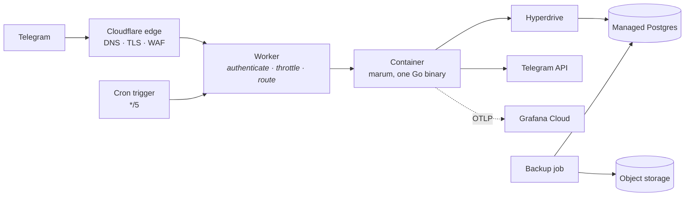

# Deploying to Cloudflare



The Worker is deliberately thin: it verifies the secret token, throttles a
noisy chat, and routes. It holds **no business logic and no database access**,
because a rule that needs loan data to evaluate belongs in Go where it can be
tested without a socket.

The container runs the same image as `make up`. Nothing about the application
is Cloudflare-shaped, so the self-hosting path stays real.

## Two environments

Everything below is done **twice**, once per environment, with different values:

| | dev | production |
| --- | --- | --- |
| Worker | `marum-dev` | `marum` |
| Domain | `dev.marum.loan` | `marum.loan` |
| Bot | a separate @BotFather bot | the real one |
| Database | its own Neon project | its own Neon project |
| Hyperdrive | `marum-dev-postgres` | `marum-postgres` |
| Query cache | 5 s, to exercise the path | **off** — a stale balance is a correctness bug |

Nothing is deployed to the top-level wrangler config: every deploy names an
environment explicitly, so a stray `wrangler deploy` cannot reach production.

## One-time setup

```bash
cd deploy/cloudflare
npm install
npx wrangler login
```

**1. The database and Hyperdrive.**

Cloudflare does not sell a managed PostgreSQL — D1 is SQLite, and the design
rejected it because the ledger's arithmetic must be identical everywhere and
there is no faithful local twin of D1. So Postgres is hosted at Neon and
**Hyperdrive** pools in front of it, which is what makes Postgres usable from a
Worker that has no persistent connections and can start anywhere.

Create the Neon project by hand, then let Terraform create the Hyperdrive
config:

```bash
make tf-init  ENV=dev     # once per environment; re-run when switching
make tf-plan  ENV=dev
make tf-apply ENV=dev
make tf-output ENV=dev    # the [[env.dev.hyperdrive]] block to paste in
```

Terraform also owns the backup bucket and the zone's TLS settings. Full
bootstrap, including the API token scopes: [deploy/terraform/README.md](../../deploy/terraform/README.md).

**2. Secrets.** Never committed, never on a command line:

```bash
for s in MARUM_BOT_TOKEN MARUM_WEBHOOK_SECRET MARUM_SERVICE_TOKEN \
         MARUM_ADMIN_PASSWORD_HASH MARUM_IDENTITY_KEY OTEL_EXPORTER_OTLP_HEADERS; do
  npx wrangler secret put "$s" --env dev
  npx wrangler secret put "$s" --env production
done
```

`MARUM_WEBHOOK_SECRET` and the bot token are the same class of credential:
leaking either lets an attacker impersonate Telegram or the bot.

**3. Register the webhook** with a high-entropy path *and* the secret token —
both are checked before anything is parsed:

```bash
curl -X POST "https://api.telegram.org/bot$TOKEN/setWebhook" \
  -d "url=https://$DOMAIN/tg/$WEBHOOK_PATH" \
  -d "secret_token=$WEBHOOK_SECRET" \
  -d "allowed_updates=[\"message\",\"callback_query\",\"pre_checkout_query\"]"
```

**4. GitHub repository configuration**

Secrets and variables are set **per environment**, so dev credentials can never
reach production by accident.

| Scope | Kind | Name |
| --- | --- | --- |
| `dev` and `production` | Secret | `CLOUDFLARE_API_TOKEN`, `CLOUDFLARE_ACCOUNT_ID`, `DATABASE_URL`, `GRAFANA_TOKEN` |
| Repository, not per environment | Secret | `TF_CLOUDFLARE_API_TOKEN`, `TF_CLOUDFLARE_ACCOUNT_ID`, `TF_CLOUDFLARE_ZONE_ID`, `TF_R2_ACCESS_KEY_ID`, `TF_R2_SECRET_ACCESS_KEY`, `TF_DATABASE_DEV`, `TF_DATABASE_PRODUCTION` — infrastructure only |
| `dev` and `production` | Variable | `PUBLIC_URL`, `GRAFANA_URL` |

`production` carries a **required reviewer**; `dev` has none, because a dev
deploy that needs a human is a dev deploy that stops happening.

## Deploying

Publishing a GitHub Release triggers it. For staging, run the **Deploy**
workflow manually.

The order is not negotiable:

1. **Expand** the migration — additive, compatible with the binary still running
2. **Deploy** code that reads both schemas
3. **Smoke** — liveness, readiness, schema version, status, and a **cold
   request after a forced idle**, because that is the path a borrower hits
   first thing in the morning
4. **Roll back the binary** if the smoke fails. The schema stays expanded,
   which is safe precisely because it is backward compatible.

## The admin interface is never public

The Worker returns 404 for `/admin`. Reach it over a private path — an SSH
tunnel to the container, or Cloudflare Access in front of a separate hostname.
A public admin login is an invitation regardless of how good the password is.

## What this costs

Roughly **$5–8/month** at MVP scale: the Workers paid floor, a `basic`
container that sleeps when idle, a free-tier managed Postgres, and object
storage measured in pennies. Grafana Cloud's free tier covers observability.

The database is the line that grows. Point-in-time recovery forces a paid tier
from the moment beta holds real financial history — budget it at Phase 2 rather
than discovering it at Phase 4.

## Self-hosting instead

Nothing here is required. `docker compose up` with a Postgres and a bot token
is a complete Marum. The Cloudflare path buys free DDoS protection, no servers
to patch, and scale-to-zero; a small VPS with the same compose file is cheaper
and equally correct.
