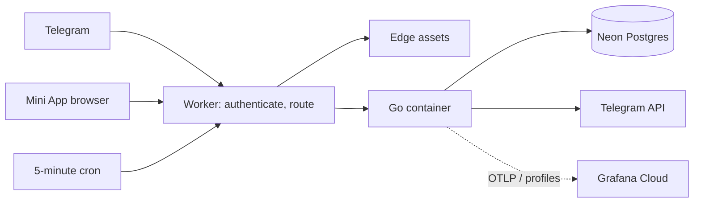

# Deploying to Cloudflare

Dev is live at `https://dev.marum.loan`; no production exists. Current verified
release evidence is in [releases.md](releases.md). Configuration and secret names
are listed in [environments.md](environments.md).



The Worker holds no loan business logic or database access. Terraform still
creates and binds Hyperdrive, but its connection string cannot resolve inside
the container sandbox. The container uses the `MARUM_DATABASE_URL` secret
instead. Local Compose and Cloudflare build from `deploy/Dockerfile`; Cloudflare
also passes the runtime version to the container.

## Setup and deployment

Create the database, state bucket and infrastructure credentials following
[Terraform bootstrap](../../deploy/terraform/README.md). Configure the GitHub
dev environment's secrets and variables before dispatching CD. The deployment
installs Worker dependencies with `npm ci`; manual Worker tooling runs from
`deploy/cloudflare` after the same install.

Main pushes deploy automatically except documentation-only and other ignored
paths. For the verified release stamp, when `main` and `v2.0.4` still resolve to
the same commit:

```bash
gh workflow run cd-dev.yml --ref main -f version=2.0.4
```

Do not dispatch dev with `--ref v2.0.4`: environment protection rejects tag
refs. Do not weaken that protection. `deploy.yml` is reusable (`workflow_call`),
not directly dispatchable. Tags trigger Release builds and artifacts only.
`cd-prod.yml` is a dormant manual workflow for a future `prod` environment.

The reusable deploy runs in this order:

1. Apply dev Terraform and substitute its Hyperdrive ID in the runner checkout.
2. Apply expand-only migrations using `DATABASE_URL` (default `run_migrations=true`).
3. Install Worker dependencies and **capture the deployed Worker version ID**
   before deploying or syncing secrets; both operations create revisions.
4. Deploy Worker/container with the requested version, then bulk-sync runtime
   secrets once. `MARUM_MINIAPP_URL` must be nonempty.
5. Run the smoke test with the expected version and bot token.
6. If smoke fails and a prior version ID exists, roll back to that **explicit
   pre-release Worker version**. The expanded schema stays in place. Other
   failures do not trigger this smoke-specific rollback step.
7. Attempt a Grafana annotation on success; annotation failure is nonfatal.

Do not move secret sync before deployment. After a rollback Cloudflare can
reject edits to an undeployed latest version with error `10215`. Deployment
before secret sync avoids that ordering problem.

## Registering the webhook

Webhook registration is an operator step; CD does not call `setWebhook`. Use
`MARUM_BOT_TOKEN`, `MARUM_WEBHOOK_SECRET`, `WEBHOOK_PATH`, and `PUBLIC_URL` from
the same dev configuration. Register the URL
`${PUBLIC_URL}/tg/${WEBHOOK_PATH}` with `secret_token` equal to
`MARUM_WEBHOOK_SECRET` and allowed updates `message`, `callback_query`,
`pre_checkout_query`. The Worker checks the exact path and secret header, then
forwards to `/tg/update` with `X-Marum-Service-Token`.

Use a credential-aware client for the Telegram API request; keep tokens and
request data out of shell history and shared output. Verify registration via
Telegram's `getWebhookInfo` separately from application smoke.

## Proving the new version is live

From the repository root, with Bash, curl and jq installed and `PUBLIC_URL` set:

```bash
./deploy/cloudflare/smoke.sh "$PUBLIC_URL" 2.0.4
```

Supply `MARUM_BOT_TOKEN` through the environment to include the bot menu check;
CD does this. Without it, that check is skipped. `SMOKE_DEADLINE_S` defaults to
240 seconds for liveness and, separately, menu publication.

Smoke checks the exact `/healthz` version, database readiness and schema at
least 22, `/status`, the versioned Mini App shell, `/app/version`, modules,
styles, unsigned API rejection, and the Telegram global menu URL's
`v=2.0.4` query parameter. GET/HEAD probes send **no request body**; mutation
probes send JSON. Requests retry across deployment/secret-sync restarts.

The final wake measurement pauses 20 seconds and retries health. It does not
force the 10-minute container idle timeout, and a slow response only warns.
It is not proof of a forced cold start.

For a quick version comparison:

```bash
curl -fsS "$PUBLIC_URL/healthz"
curl -fsS "$PUBLIC_URL/readyz"
curl -fsS "$PUBLIC_URL/app/version"
curl -fsS "$PUBLIC_URL/app/" | grep -F 'a/2.0.4/js/main.js'
```

Shell/version responses use `no-store`; versioned assets are immutable. A
version mismatch is a rollout problem, not an expected cache delay. Menu
publication is asynchronous, so a healthy container alone does not prove the
bot opens the new app.

## Admin access

Dev serves the authenticated admin UI at `https://admin-dev.marum.loan`,
forwarded to container port 8081. The hostname is public; the application login
and role/capability checks protect it. An unset `MARUM_ADMIN_PASSWORD_HASH`
disables the listener. `/admin` on the main hostname returns 404. The dormant
`prod` branch rejects admin-host requests; no production access path is active.

## Self-hosting

Use [local-development.md](local-development.md) for Compose, identity-key
setup, migrations and polling. A bot token alone is insufficient. Terraform
creates a backup bucket, but this repository has no scheduled dump/upload job;
see [runbooks.md](runbooks.md) before treating the bucket as a backup system.
