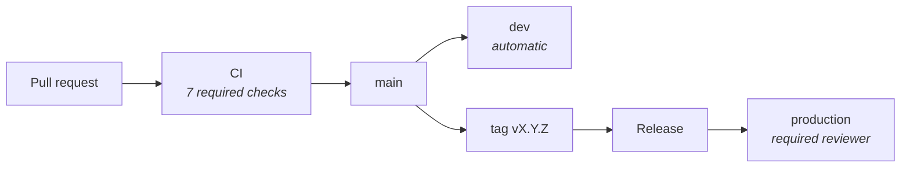

# Environments

Two of them, and they are genuinely separate: separate bots, separate domains,
separate databases, separate secrets. Nothing is shared except the code.



| | dev | production |
| --- | --- | --- |
| Deploys on | every merge to `main` | a published release |
| Approval | none | required reviewer |
| Allowed refs | `main` | `main` and `v*` tags |
| Worker | `marum-dev` | `marum` |
| Domain | `dev.marum.am` | `marum.am` |
| Bot | its own | its own |
| Database | its own | its own |
| Instances | 1 | 2 |
| Version | `0.2.1-dev.a1b2c3d` | `0.2.1` |

**A separate bot per environment, always.** Sharing one would mean a dev deploy
silently taking the webhook away from the bot real people are talking to.

**dev has no approval gate on purpose.** A dev deploy that needs a human is a
dev deploy that stops happening, and then dev stops being a rehearsal.

## What is configured

- **Branch protection on `main`**: linear history, no force pushes, no
  deletions, conversation resolution required, and all seven CI checks must
  pass and be up to date with the base.
- **`production`**: required reviewer, and deployable only from `main` or a
  `v*` tag.
- **`dev`**: deployable only from `main`.

## Secrets and variables

Set **per environment** in the repository settings, so a dev credential can
never reach production by accident.

| Kind | Name | What it is |
| --- | --- | --- |
| Secret | `CLOUDFLARE_API_TOKEN` | Scoped to Workers and Containers |
| Secret | `CLOUDFLARE_ACCOUNT_ID` | |
| Secret | `DATABASE_URL` | The migration runner's connection, not the app's |
| Secret | `GRAFANA_TOKEN` | Deploy annotations only |
| Variable | `PUBLIC_URL` | Where the smoke test points |
| Variable | `GRAFANA_URL` | Optional; no annotation without it |

The Infrastructure workflow needs four more, used by nothing else:

| Kind | Name | What it is |
| --- | --- | --- |
| Secret | `CLOUDFLARE_ZONE_ID` | Zone for the apex domain |
| Secret | `R2_ACCESS_KEY_ID` | Terraform state bucket, S3 API |
| Secret | `R2_SECRET_ACCESS_KEY` | |
| Secret | `TF_DATABASE` | Origin Postgres, as a JSON object |

Everything the application itself reads is a **Cloudflare** secret, set with
`wrangler secret put NAME --env dev|production`, never a GitHub one. GitHub only
needs what the pipeline uses.

## Infrastructure per environment

The two environments have separate Terraform state files, separate Hyperdrive
configs and separate Neon projects. They share **one** DNS zone, so the zone's
TLS and HSTS settings are managed by the production state alone — if both
managed them, each apply would revert the other and no plan would ever be empty.

See [deploy/terraform/README.md](../../deploy/terraform/README.md).

## Promotion

A release is a promotion of something already running. By the time a tag is
cut, that code has been serving on dev since it merged — so cutting a release
is a decision about readiness, not a leap into the unknown.

```bash
git switch main && git pull
git tag -a v0.2.0 -m "reminders and payment recording"
git push origin v0.2.0
```

Then approve the production deployment when the workflow asks.

The deploy is chained from the release pipeline rather than triggered by the
release event. A release published by `GITHUB_TOKEN` does not trigger further
workflows — GitHub's recursion guard — so `on: release: published` never fires
for a release the pipeline creates. Chaining keeps the approval gate: the
`production` environment requires a reviewer, so the job waits.
