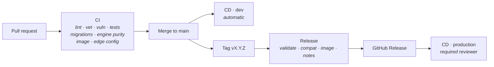

# Releasing

Tags are the trigger and the source of truth. Nothing else creates a release,
so what is running can always be traced back to a tag.



## Two environments

| | dev | production |
| --- | --- | --- |
| Deploys on | every merge to `main` | a published release |
| Approval | none | required reviewer |
| Bot | its own | its own |
| Domain | `dev.marum.loan` | `marum.loan` |
| Version | `0.2.1-dev.a1b2c3d` | `0.2.1` |
| Instances | 1 | 2 |

**A separate bot per environment, always.** Sharing one would mean a dev deploy
silently taking over the webhook of the bot real people are talking to.

dev is not a staging rehearsal that happens occasionally — it is where `main`
runs continuously. By the time a release is cut, the code has already been
serving on dev, so a release is a **promotion of something already running**
rather than a leap.

The dev version is a pre-release of the next patch, so it always sorts *before*
any real release and can never be mistaken for one.

## Versioning

Semantic versioning, `vMAJOR.MINOR.PATCH`.

| Change | Bump |
| --- | --- |
| A user-visible feature | MINOR |
| A fix with no interface change | PATCH |
| A breaking change to `pkg/core`'s public API | MAJOR |
| Anything at all, while below 1.0.0 | MINOR for features, PATCH for fixes |

**Below 1.0.0 nothing is promised to be stable**, and the release workflow
marks every `0.x` tag as a pre-release so that is visible rather than assumed.

`pkg/core` is importable on its own and carries its own compatibility promise.
A change that would break an external importer is a MAJOR bump even if the bot
is unaffected.

### The engine version

`EngineVersion` is stamped from the tag and recorded on every plan and every
allocation result. A number shown to a user can always be traced to the code
that produced it, which is what makes a discrepancy report answerable months
later.

## Cutting a release

```bash
git switch main && git pull
git tag -a v0.3.0 -m "reminders and payment recording"
git push origin v0.3.0
```

The workflow then:

1. **Validates the tag** — strict SemVer, and it must be an ancestor of `main`.
   A tag that is not a version is a mistake, and a mistake that reaches a
   registry is one somebody has to chase.
2. **Runs the full suite** with the race detector.
3. **Checks backward compatibility** — applies this tag's migrations, then runs
   the *previous* release's tests against them. Migrations expand first, so the
   binary being replaced must keep working. This matters more than up/down/up:
   rolling back a binary is routine, rolling back a migration is not.
4. **Builds** a multi-arch image with an SBOM and a provenance attestation, and
   pushes it to GHCR.
5. **Publishes** a GitHub Release with notes grouped by Conventional Commit
   type, and the image digest.

## Commits

Conventional Commits. The release notes are generated from them, so a lazy
subject line becomes a bad changelog entry.

```
feat(core): add payment allocation and ledger replay
fix(obs): correlate logs with the span that produced them
```

Subject ≤ 50 characters, imperative mood, no trailing period. The body explains
**why**, and only when the why is not obvious. Sign off with `git commit -s`.

## Deploying

Production follows a **published release**, never a branch. dev follows `main`.

```
expand migration → deploy dual-schema code → smoke → (rollback on failure)
```

Rolling back the binary never requires rolling back the schema, because the
schema only ever expanded. A destructive contract migration happens in a later
release, once nothing reads the old representation.

Both pipelines call the same reusable workflow, so dev genuinely rehearses
production: the same steps, the same order, the same smoke test. Re-run either
manually from **Actions → CD · dev** or **CD · production**.

## Hotfixes

Branch from the tag, fix, tag a PATCH, and merge back to `main`. Do not tag off
a branch that is not an ancestor of `main` — the workflow refuses it, on
purpose.
